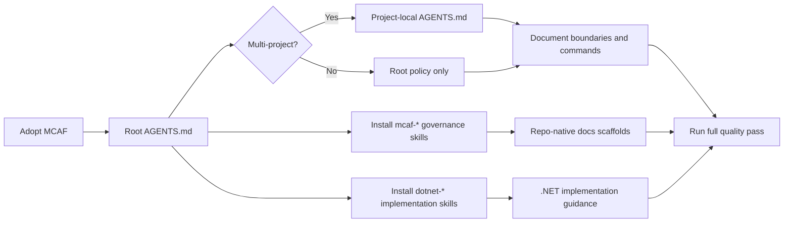

# MCAF Adoption

## Trigger On

- bootstrapping MCAF in a new or existing repository that also contains `.NET` work
- updating root or project-local `AGENTS.md` files to follow a durable repo workflow
- deciding which MCAF governance skills and `dotnet-*` implementation skills to install together
- organizing repo-native docs for architecture, features, ADRs, testing, development, and operations

## Workflow

1. Start from the canonical bootstrap surface:
   - tutorial: `https://mcaf.managed-code.com/tutorial`
   - concepts: `https://mcaf.managed-code.com/`
   - public MCAF skills: `https://mcaf.managed-code.com/skills`
2. Place root `AGENTS.md` at the repository or solution root.
3. Add project-local `AGENTS.md` only when the solution has multiple projects with genuinely different local rules.
4. Install MCAF governance skills (`dotnet-mcaf-*`) for process areas and `dotnet-*` implementation skills for framework work. Check `references/skill-map.md` for overlap before adding duplicate surfaces.
5. Route to the narrowest MCAF skill once the governance concern is clear:

   | Concern | Skill |
   |---------|-------|
   | Delivery workflow and feedback loops | `dotnet-mcaf-agile-delivery` |
   | Developer onboarding and local inner loop | `dotnet-mcaf-devex` |
   | Durable docs structure and source-of-truth placement | `dotnet-mcaf-documentation` |
   | Executable feature behaviour docs | `dotnet-mcaf-feature-spec` |
   | Human review for large AI-generated drops | `dotnet-mcaf-human-review-planning` |
   | ML/AI product delivery process | `dotnet-mcaf-ml-ai-delivery` |
   | Explicit quality attributes and trade-offs | `dotnet-mcaf-nfr` |
   | Branch, merge, and release hygiene | `dotnet-mcaf-source-control` |
   | Design-system, accessibility, front-end direction | `dotnet-mcaf-ui-ux` |

6. Scaffold repo-native documentation:
   ```
   docs/
   ├── Architecture.md
   ├── Features/
   ├── ADR/
   ├── Testing/
   ├── Development/
   └── Operations/
   ```
7. Encode the non-trivial task flow in `AGENTS.md`: `<slug>.brainstorm.md` then `<slug>.plan.md` then implementation and validation.
8. Treat verification as part of done: tests, analyzers, formatters, coverage, and any architecture or security gates the repo configured.



## Deliver

- repository-ready MCAF adoption with clear root and local `AGENTS.md` responsibilities
- correct split between `mcaf-*` governance and `dotnet-*` implementation skills
- repo-native docs and verification expectations instead of chat-only instructions

## Validate

- root `AGENTS.md` exists at the repository or solution root
- project-local `AGENTS.md` files exist only where genuinely needed
- repo documents exact build, test, format, analyze, and coverage commands
- durable docs exist for architecture and behavior, not only inline comments
- non-trivial work follows the brainstorm-to-plan flow before implementation
- the full quality pass is part of done, not only a narrow happy-path test run

## References

- references/adoption.md - canonical MCAF entry points, bootstrap rules, and the local-mirror boundary between governance and implementation skills
- references/skill-map.md - MCAF catalog map with overlap-vs-new split for precise routing
