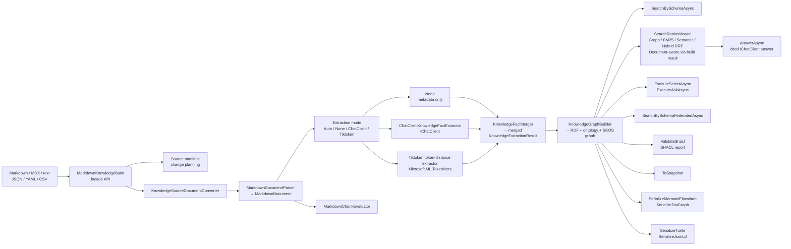
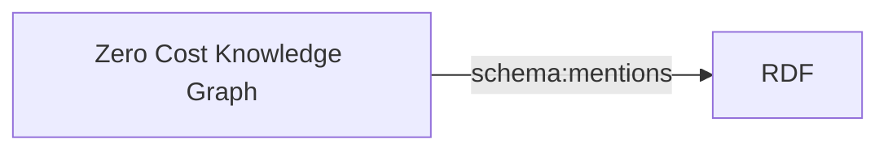
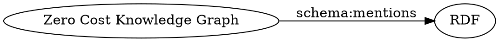

# Markdown-LD Knowledge Bank

[](https://github.com/managedcode/markdown-ld-kb/actions/workflows/validation.yml)
[](https://github.com/managedcode/markdown-ld-kb/actions/workflows/release.yml)
[](https://github.com/managedcode/markdown-ld-kb/actions/workflows/codeql-analysis.yml)
[](https://www.nuget.org/packages/ManagedCode.MarkdownLd.Kb)
[](https://www.nuget.org/packages/ManagedCode.MarkdownLd.Kb)
[](https://github.com/managedcode/markdown-ld-kb/releases)
[](https://dotnet.microsoft.com/)
[](https://opensource.org/licenses/MIT)

Markdown-LD Knowledge Bank is a .NET 10 library for turning Markdown knowledge-base files into an in-memory RDF graph that can be searched, queried with read-only SPARQL, validated with SHACL, exported as RDF, and rendered as a diagram.

The recommended entry point is `MarkdownKnowledgeBank`. It is a single facade for build, source-change planning, chunk evaluation, ranked search, optional semantic indexing, and cited answers. Lower-level pipeline and graph APIs remain available when a host needs more control.

The runtime is local and in-memory: no localhost server, no Azure Functions host, no database server, and no hosted graph service are required.

Use it when you want plain Markdown notes to become a queryable knowledge graph without making your application depend on a specific model provider, graph server, or hosted indexing service.

## What It Does



Extraction is explicit:

- `Auto` uses `IChatClient` when one is supplied, otherwise extracts no facts and reports a diagnostic.
- `None` builds document metadata only.
- `ChatClient` builds facts only from structured `Microsoft.Extensions.AI.IChatClient` output.
- `Tiktoken` builds a local corpus graph from Tiktoken token IDs, section/segment structure, explicit front matter entity hints, and local keyphrase topics using `Microsoft.ML.Tokenizers`.

Tiktoken mode is deterministic and network-free. It uses lexical token-distance search rather than semantic embedding search. Its default local weighting is subword TF-IDF; raw term frequency and binary presence are also available. Token-distance search can opt into fuzzy query correction over corpus words before Tiktoken encoding, which helps typo-heavy same-language queries without treating model-specific token IDs as editable text. It creates `schema:DefinedTerm` topic nodes, explicit front matter hint entities, and `schema:hasPart` / `schema:about` / `schema:mentions` edges.

**Graph outputs:**

- `MarkdownKnowledgeBank` — recommended facade for build, change planning, chunk evaluation, ranked search, optional semantic indexing, and cited answers
- `MarkdownKnowledgeBankBuild.SearchAsync(...)` — ranked graph search through one build object
- `MarkdownKnowledgeBankBuild.AnswerAsync(...)` — answer a question with citations from the built Markdown graph through `IChatClient`
- `MarkdownKnowledgeBankBuild.BuildSemanticIndexAsync(...)` — optional semantic index through `IEmbeddingGenerator<string, Embedding<float>>`
- `MarkdownKnowledgeBank.PlanChanges(...)` — compare source SHA256 fingerprints and return changed, unchanged, and removed paths before a build
- `MarkdownKnowledgeBank.EvaluateChunks(...)` — deterministic chunk-size, expected-answer coverage, and quality-sample report
- `ToSnapshot()` — stable `KnowledgeGraphSnapshot` with `Nodes` and `Edges`
- `SerializeMermaidFlowchart()` — Mermaid `graph LR` diagram
- `SerializeDotGraph()` — Graphviz DOT diagram
- `SerializeTurtle()` — Turtle RDF serialization
- `SerializeJsonLd()` — JSON-LD serialization
- `LoadJsonLd(jsonLd)` — load JSON-LD text into a searchable in-memory graph
- `SaveToStoreAsync(store, location, options)` — persist the graph through a graph-store abstraction
- `SaveToFileAsync(path, options)` — persist the graph as RDF
- `SaveJsonLdToStoreAsync(store, location)` / `SaveJsonLdToFileAsync(path)` — persist JSON-LD explicitly, including opaque storage keys
- `LoadFromStoreAsync(store, location, options)` — load a graph from a graph-store abstraction
- `LoadFromFileAsync(path, options)` — load a graph from one RDF file
- `LoadFromDirectoryAsync(path, options)` — load and merge RDF files from a directory
- `LoadJsonLdFromStoreAsync(store, location)` / `LoadJsonLdFromFileAsync(path)` — load JSON-LD explicitly, including opaque storage keys
- `MarkdownKnowledgeBuildResult.Contract` — self-describing graph contract with schema introspection and search-profile validation
- `KnowledgeGraphContract.SerializeJson()` / `SerializeYaml()` — portable contract artifacts for preprocessing and search handoff
- `KnowledgeGraphContract.LoadJson(json)` / `LoadYaml(yaml)` — reload contract artifacts alongside generated JSON-LD
- `KnowledgeGraphContract.GenerateShacl()` — generate SHACL Turtle from the contract search profile
- `LoadFromLinkedDataFragmentsAsync(endpoint, options)` — materialize a Linked Data Fragments source into a local graph
- `ExecuteSelectAsync(sparql)` — read-only SPARQL SELECT returning `SparqlQueryResult`
- `ExecuteAskAsync(sparql)` — read-only SPARQL ASK returning `bool`
- `ExecuteFederatedSelectAsync(sparql, options)` — explicit federated read-only SPARQL SELECT with endpoint diagnostics
- `ExecuteFederatedAskAsync(sparql, options)` — explicit federated read-only SPARQL ASK with endpoint diagnostics
- `ValidateShacl()` — SHACL validation against the built-in Markdown-LD Knowledge Bank shapes
- `ValidateShacl(shapesTurtle)` — SHACL validation against caller-supplied Turtle shapes
- `DescribeSchema(prefixes)` — inspect actual RDF types, predicates, literal predicates, and resource predicates in a graph
- `ValidateSchemaSearchProfile(profile)` — validate a schema-aware search profile against the actual graph shape
- `SearchBySchemaAsync(term, profile)` — recommended schema-aware SPARQL search over caller-defined predicates, relationships, type filters, and focused graph expansion
- `SearchBySchemaFederatedAsync(term, profile, options)` — schema-aware SPARQL search compiled into explicit `SERVICE` blocks for allowlisted federated endpoints
- `SearchFocusedAsync(term, options)` — sparse graph search that can use a schema-aware profile and returns primary, related, and next-step matches plus a bounded focused graph snapshot
- `SearchAsync(term)` — compatibility helper for simple `schema:name` / `schema:description` lookup; use schema-aware SPARQL search for application search
- `KnowledgeGraph.Diff(other)` — compare graph snapshots and report added, removed, and changed literal edges
- `BuildIncrementalAsync(...)` — rebuild deterministically while returning a source manifest, changed paths, unchanged paths, removed paths, and optional graph diff
- `MaterializeInferenceAsync(options)` — explicit RDFS / SKOS / N3-rule materialization
- `BuildFullTextIndexAsync(options)` — optional Lucene-backed graph full-text index
- `ToDynamicSnapshot()` — optional dynamic graph access over dotNetRDF dynamic types

All async methods accept an optional `CancellationToken`.

## What To Use When

| Goal | Use | Details |
| --- | --- | --- |
| Start from one library API | `MarkdownKnowledgeBank` | [Unified API](#unified-api) |
| Build a graph from Markdown files | `MarkdownKnowledgeBank.BuildFromDirectoryAsync(...)` | [Build From Files](#build-from-files) |
| Ask questions with source citations | `MarkdownKnowledgeBankBuild.AnswerAsync(...)` | [Unified API](#unified-api) |
| Search with graph, BM25, optional fuzzy BM25, semantic, or hybrid RRF ranking | `MarkdownKnowledgeBankBuild.SearchAsync(...)` | [Unified API](#unified-api) |
| Evaluate chunking quality | `MarkdownKnowledgeBank.EvaluateChunks(...)` | [Unified API](#unified-api) |
| Generate portable graph output | `SerializeJsonLd()`, `SaveJsonLdToFileAsync(...)`, `SerializeTurtle()` | [Generate JSON-LD Files](#generate-json-ld-files), [Export The Graph](#export-the-graph) |
| Load a preprocessed graph from another system | `KnowledgeGraph.LoadJsonLd(...)`, `LoadJsonLdFromFileAsync(...)` | [Generate JSON-LD Files](#generate-json-ld-files) |
| Keep graph creation and search rules together | `KnowledgeGraphBuildProfile`, `MarkdownKnowledgeBuildResult.Contract` | [Schema-Aware SPARQL Search](#schema-aware-sparql-search), [Graph Production Pipeline](docs/Features/GraphProductionPipeline.md) |
| Validate an externally generated graph | `KnowledgeGraphContract.GenerateShacl()`, `ValidateShacl(...)` | [Validate With SHACL](#validate-with-shacl) |
| Search custom JSON-LD/RDF shapes | `SearchBySchemaAsync(term, profile)` | [Schema-Aware SPARQL Search](#schema-aware-sparql-search) |
| Search across graph slices or endpoints | `SearchBySchemaFederatedAsync(...)`, `ExecuteFederatedSelectAsync(...)` | [Federated SPARQL Execution](docs/Features/FederatedSparqlExecution.md) |
| Explain why a result matched | `KnowledgeGraphSchemaSearchResult.Explain`, `Evidence`, `SourceContexts` | [Schema-Aware SPARQL Search](#schema-aware-sparql-search) |
| Compare graph versions | `KnowledgeGraph.Diff(other)` | [Graph Production Pipeline](docs/Features/GraphProductionPipeline.md) |
| Rebuild and know which source files changed | `MarkdownKnowledgeBank.PlanChanges(...)`, `BuildIncrementalAsync(...)` | [Graph Production Pipeline](docs/Features/GraphProductionPipeline.md) |
| Add AI extraction without provider lock-in | `IChatClient`, `MarkdownKnowledgeExtractionMode.ChatClient` | [Optional AI Extraction](#optional-ai-extraction) |
| Add optional semantic retrieval | `IEmbeddingGenerator<string, Embedding<float>>` | [Unified API](#unified-api) |
| Use deterministic local extraction | `MarkdownKnowledgeExtractionMode.Tiktoken` | [Local Tiktoken Extraction](#local-tiktoken-extraction) |

The most important split is local graph search versus federated graph search. `SearchBySchemaAsync` searches one in-memory graph. `SearchBySchemaFederatedAsync` and `ExecuteFederatedSelectAsync` are explicit opt-in federation paths that require allowlisted `SERVICE` endpoints.

## Install

```bash
dotnet add package ManagedCode.MarkdownLd.Kb --version 0.2.1
```

For local repository development:

```bash
dotnet add reference ./src/MarkdownLd.Kb/MarkdownLd.Kb.csproj
```

## Project Structure

The production source tree now follows feature-oriented slices instead of a mostly flat technical grouping:

- `src/MarkdownLd.Kb/Documents`
  `Models`, `Parsing`, and `Chunking`
- `src/MarkdownLd.Kb/MarkdownKnowledgeBank*`
  high-level facade for the common build/search/answer/evaluation flow
- `src/MarkdownLd.Kb/Extraction`
  `Chat`, `Cache`, and `Processing`
- `src/MarkdownLd.Kb/Pipeline`
  orchestration-only files such as `MarkdownKnowledgePipeline`
- `src/MarkdownLd.Kb/Graph`
  `Build` and `Runtime`
- `src/MarkdownLd.Kb/Tokenization`
  local Tiktoken graph extraction
- `src/MarkdownLd.Kb/Query`
  `Search`, `Sparql`, `NaturalLanguage`, and `Answering`
- `src/MarkdownLd.Kb/Rdf`
  low-level RDF helpers and serialization

This layout mirrors [docs/Architecture.md](docs/Architecture.md) and keeps orchestration separate from parsing, extraction, graph runtime, and query capabilities.

For production graph handoff, contract artifacts, generated SHACL, explainable SPARQL evidence, presets, diffing, and incremental rebuilds, see [docs/Features/GraphProductionPipeline.md](docs/Features/GraphProductionPipeline.md).

## Unified API

Use `MarkdownKnowledgeBank` when you want one object to own the normal knowledge-bank flow. It wraps the deterministic pipeline and keeps optional AI services behind `Microsoft.Extensions.AI` abstractions.

```csharp
using ManagedCode.MarkdownLd.Kb;
using ManagedCode.MarkdownLd.Kb.Pipeline;
using ManagedCode.MarkdownLd.Kb.Query;
using Microsoft.Extensions.AI;

internal static class KnowledgeBankDemo
{
    public static async Task RunAsync(
        IReadOnlyList<MarkdownSourceDocument> documents,
        IChatClient chatClient,
        IEmbeddingGenerator<string, Embedding<float>> embeddings,
        KnowledgeGraphSourceManifest? previousManifest = null)
    {
        var bank = new MarkdownKnowledgeBank(new MarkdownKnowledgeBankOptions
        {
            PipelineOptions = new MarkdownKnowledgePipelineOptions
            {
                BaseUri = new Uri("https://kb.example/"),
                ExtractionMode = MarkdownKnowledgeExtractionMode.None,
            },
            ChatClient = chatClient,
            EmbeddingGenerator = embeddings,
        });

        var changeSet = bank.PlanChanges(documents, previousManifest);
        var chunkReport = bank.EvaluateChunks(
            documents[0].Content,
            documents[0].Path,
            [new MarkdownChunkCoverageExpectation("How do I restore cache?", "cache restore verification")]);

        var build = await bank.BuildAsync(documents);
        await build.BuildSemanticIndexAsync();

        var matches = await build.SearchAsync(
            "restore cache manifest",
            new KnowledgeGraphRankedSearchOptions
            {
                Mode = KnowledgeGraphSearchMode.Hybrid,
                HybridFusionStrategy = KnowledgeGraphHybridFusionStrategy.ReciprocalRank,
                MaxResults = 5,
            });

        var answer = await build.AnswerAsync(
            "What should I use to restore cache?",
            new KnowledgeGraphRankedSearchOptions
            {
                Mode = KnowledgeGraphSearchMode.Bm25,
                EnableFuzzyTokenMatching = true,
                MaxResults = 3,
            });

        Console.WriteLine(changeSet.ChangedPaths.Count);
        Console.WriteLine(chunkReport.CoverageRate);
        Console.WriteLine(matches[0].Label);
        Console.WriteLine(answer.Answer);
        Console.WriteLine(answer.Citations[0].SourcePath);
    }
}
```

The facade does not hide missing optional services. `AnswerAsync` requires an `IChatClient`; `BuildSemanticIndexAsync` requires an `IEmbeddingGenerator<string, Embedding<float>>`. If those services are absent, the call fails explicitly instead of silently falling back to a weaker path. Facade search and cited answers are document-aware: document node candidates include parsed Markdown body chunks, so BM25 and optional semantic search can retrieve evidence that is only present in body text. BM25 can also opt into bounded fuzzy token matching for typo-tolerant lexical retrieval; the default remains exact token matching. `EvaluateChunks` uses the facade pipeline chunking options by default, including the Han, Japanese kana, and Korean Hangul-aware token estimate, so build and evaluation share the same chunk budget unless a caller passes explicit evaluation options.

## Minimal Example

```csharp
using ManagedCode.MarkdownLd.Kb;
using ManagedCode.MarkdownLd.Kb.Pipeline;

internal static class MinimalGraphDemo
{
    private const string SearchTerm = "RDF SPARQL Markdown graph";

    private const string ArticleMarkdown = """
---
title: Zero Cost Knowledge Graph
description: Markdown notes can become a queryable graph.
tags:
  - markdown
  - rdf
author:
  - Ada Lovelace
---
# Zero Cost Knowledge Graph

Markdown-LD Knowledge Bank links [RDF](https://www.w3.org/RDF/) and [SPARQL](https://www.w3.org/TR/sparql11-query/).
""";

    public static async Task RunAsync()
    {
        var bank = new MarkdownKnowledgeBank(new MarkdownKnowledgeBankOptions
        {
            PipelineOptions = new MarkdownKnowledgePipelineOptions
            {
                ExtractionMode = MarkdownKnowledgeExtractionMode.None,
            },
        });

        var result = await bank.BuildFromMarkdownAsync(ArticleMarkdown);

        var search = await result.SearchAsync(
            SearchTerm,
            new KnowledgeGraphRankedSearchOptions
            {
                Mode = KnowledgeGraphSearchMode.Bm25,
            });

        Console.WriteLine(search[0].Label);
    }
}
```

## Build From Files

```csharp
using ManagedCode.MarkdownLd.Kb;
using ManagedCode.MarkdownLd.Kb.Pipeline;

internal static class FileGraphDemo
{
    private const string FilePath = "/absolute/path/to/content/article.md";
    private const string DirectoryPath = "/absolute/path/to/content";
    private const string MarkdownSearchPattern = "*.md";

    public static async Task RunAsync()
    {
        var bank = new MarkdownKnowledgeBank();

        var singleFile = await bank.BuildFromFileAsync(FilePath);
        var directory = await bank.BuildFromDirectoryAsync(
            DirectoryPath,
            searchPattern: MarkdownSearchPattern);

        Console.WriteLine(singleFile.Graph.TripleCount);
        Console.WriteLine(directory.Documents.Count);
    }
}
```

`KnowledgeSourceDocumentConverter` supports Markdown and other text-like knowledge inputs: `.md`, `.markdown`, `.mdx`, `.txt`, `.text`, `.log`, `.csv`, `.json`, `.jsonl`, `.yaml`, and `.yml`. Files with unknown or missing extensions are still accepted when their bytes decode as text, and they are treated as `text/plain`. Truly unreadable binary files are either skipped during directory loads or fail explicitly with `InvalidDataException` when the caller disables skipping.

Graph loading and persistence support RDF files in Turtle (`.ttl`), JSON-LD (`.jsonld`, `.json`), RDF/XML (`.rdf`, `.xml`), N-Triples (`.nt`), Notation3 (`.n3`), TriG (`.trig`), and N-Quads (`.nq`). Use the explicit JSON-LD helpers when a file path or storage key has no extension or uses an opaque name.

Relative Markdown links, image links, and same-document fragment links are resolved from the current source path before base URI composition. For example, a link from `content/guides/setup/intro.md` to `../runbooks/cache-restore.md#steps` resolves to `https://kb.example/guides/runbooks/cache-restore/#steps` when `https://kb.example/` is the base URI, and `[Steps](#steps)` in the same file resolves to `https://kb.example/guides/setup/intro/#steps`.

You do not need to pass a base URI for normal use. Document identity is resolved in this order:

- `KnowledgeDocumentConversionOptions.CanonicalUri` when you provide one
- the file path, normalized deterministically: `content/notes/rdf.md` becomes a stable document IRI
- the generated inline document path when `BuildFromMarkdownAsync` is called without a path

The library uses `urn:managedcode:markdown-ld-kb:/` as an internal default base URI only to create valid RDF IRIs when the source does not provide `KnowledgeDocumentConversionOptions.CanonicalUri`. Configure `MarkdownKnowledgeBankOptions.PipelineOptions.BaseUri` only when you want generated document/entity IRIs to live under your own domain.

## Capability Graph Rules

Markdown can include deterministic graph rules in front matter. These rules are useful for capability catalogs, tool catalogs, workflow graphs, and any corpus where related and next-step nodes matter more than broad top-N search.

```markdown
---
title: Story Delete Tool
summary: Delete a story after the caller identifies the exact story item.
graph_groups:
  - Story tools
  - Delete operation
graph_related:
  - https://kb.example/tools/story-feed-detail/
graph_next_steps:
  - https://kb.example/tools/story-comments/
---
# Story Delete Tool

Use this capability to remove an existing story.
```

`graph_groups` creates `kb:memberOf` edges. `graph_related` creates `kb:relatedTo` edges. `graph_next_steps` creates `kb:nextStep` edges. For advanced graphs, use `graph_entities` and `graph_edges` to add explicit nodes and predicates. Absolute IRIs are preserved; plain labels become stable entity IRIs under the pipeline base URI.

```csharp
using ManagedCode.MarkdownLd.Kb.Pipeline;

internal static class CapabilityGraphDemo
{
    public static async Task RunAsync(IReadOnlyList<MarkdownSourceDocument> documents)
    {
        var pipeline = new MarkdownKnowledgePipeline(
            new Uri("https://kb.example/"),
            extractionMode: MarkdownKnowledgeExtractionMode.Tiktoken);

        var result = await pipeline.BuildAsync(documents);
        var focused = await result.Graph.SearchFocusedAsync(
            "remove the selected story from the feed",
            new KnowledgeGraphFocusedSearchOptions
            {
                MaxPrimaryResults = 1,
                MaxRelatedResults = 3,
                MaxNextStepResults = 3,
            });

        var primary = focused.PrimaryMatches[0];
        var mermaid = KnowledgeGraph.SerializeMermaidFlowchart(focused.FocusedGraph);

        Console.WriteLine(primary.Label);
        Console.WriteLine(mermaid);
    }
}
```

Use `BuildAsync(documents, KnowledgeGraphBuildOptions)` when graph rules are assembled by the host application instead of authored in Markdown front matter.

Entities with the same `schema:sameAs` target are merged before assertions are emitted, including cases where a later entity uses that `sameAs` target as its direct ID. Assertion endpoints are rewritten to the chosen canonical entity IRI. Duplicate assertions keep all source provenance before graph materialization, so cited answers and SPARQL evidence can still point at the best Markdown source. This keeps the graph sparse without losing useful source attribution when callers provide multiple labels, IDs, or rule sources for the same outside resource.

## Ontology And SKOS Layers

`KnowledgeGraphBuilder` now builds one additive graph, not a flat triple dump:

- document and entity instance triples
- a SKOS concept scheme / concept layer for graph concepts
- repository-owned ontology declarations for `kb:` classes and properties

The implementation uses `dotNetRdf`, `dotNetRdf.Ontology`, and `dotNetRdf.Skos` as the semantic building blocks. Markdown remains the source of truth; the library owns the mapping from Markdown/front matter/rules into the RDF graph.

By default, semantic layers are enabled through `KnowledgeGraphBuildOptions.SemanticLayers`.

```csharp
using ManagedCode.MarkdownLd.Kb.Pipeline;

var result = await pipeline.BuildAsync(
    documents,
    new KnowledgeGraphBuildOptions
    {
        SemanticLayers = new KnowledgeGraphSemanticLayerOptions
        {
            IncludeOntologyLayer = true,
            IncludeSkosLayer = true,
            ConceptSchemeLabel = "Operations Capability Scheme",
        },
    });
```

## Graph Runtime Lifecycle

Once a Markdown file or directory has been built into a `KnowledgeGraph`, the same public runtime can persist it through a graph-store abstraction, reload it, materialize inference, expose a full-text index, expose a dynamic snapshot, or materialize a Linked Data Fragments source into the same local graph model.

The runtime now uses `dotNetRdf`, `dotNetRdf.Ontology`, `dotNetRdf.Skos`, `dotNetRdf.Inferencing`, `dotNetRdf.Dynamic`, `dotNetRdf.Query.FullText`, and `dotNetRdf.Ldf` through repository-owned adapters instead of a hand-rolled RDF stack. RDF serialization remains repository-owned; filesystem/blob access is delegated to `ManagedCode.Storage`.

```csharp
using ManagedCode.MarkdownLd.Kb.Pipeline;

internal static class GraphRuntimeLifecycleDemo
{
    private const string FilePath = "/absolute/path/to/content/query-federation-runbook.md";
    private const string TurtlePath = "/absolute/path/to/output/runtime-graph.ttl";
    private const string StorageLocation = "graphs/runtime/runtime-graph.ttl";
    private const string SchemaPath = "/absolute/path/to/runtime-schema.ttl";
    private const string RulesPath = "/absolute/path/to/runtime-rules.n3";

    public static async Task RunAsync()
    {
        var pipeline = new MarkdownKnowledgePipeline(new Uri("https://kb.example/"));
        var built = await pipeline.BuildFromFileAsync(FilePath);
        var memoryStore = new InMemoryKnowledgeGraphStore();

        await built.Graph.SaveToStoreAsync(memoryStore, StorageLocation);
        var fromMemory = await KnowledgeGraph.LoadFromStoreAsync(memoryStore, StorageLocation);
        await built.Graph.SaveToFileAsync(TurtlePath);
        var reloaded = await KnowledgeGraph.LoadFromFileAsync(TurtlePath);

        var inference = await fromMemory.MaterializeInferenceAsync(new KnowledgeGraphInferenceOptions
        {
            AdditionalSchemaFilePaths = [SchemaPath],
            AdditionalN3RuleFilePaths = [RulesPath],
        });

        using var fullText = await inference.Graph.BuildFullTextIndexAsync();
        var matches = await fullText.SearchAsync("federated wikidata workflow");

        dynamic dynamicGraph = inference.Graph.ToDynamicSnapshot();
        dynamic dynamicDocument = dynamicGraph["https://kb.example/query-federation-runbook/"];

        Console.WriteLine(inference.InferredTripleCount);
        Console.WriteLine(matches.Count);
        Console.WriteLine(dynamicDocument["https://schema.org/name"].Count);
        Console.WriteLine(reloaded.TripleCount);
    }
}
```

The built-in graph-store implementations are:

- `FileSystemKnowledgeGraphStore` — local file paths, internally backed by `ManagedCode.Storage.FileSystem`
- `StorageKnowledgeGraphStore` — any configured `ManagedCode.Storage.Core.IStorage` backend, including blob/object providers
- `InMemoryKnowledgeGraphStore` — process-local graph persistence without files

DI helpers are available for hosts that want one or more configured stores:

```csharp
using ManagedCode.MarkdownLd.Kb.Pipeline;
using ManagedCode.Storage.FileSystem;
using ManagedCode.Storage.FileSystem.Extensions;
using Microsoft.Extensions.DependencyInjection;

var services = new ServiceCollection();

services.AddFileSystemKnowledgeGraphStoreAsDefault(options =>
{
    options.BaseFolder = "/absolute/path/to/storage-root";
    options.CreateContainerIfNotExists = true;
});

services.AddFileSystemStorage("archive", options =>
{
    options.BaseFolder = "/absolute/path/to/archive-root";
    options.CreateContainerIfNotExists = true;
});
services.AddKeyedStorageBackedKnowledgeGraphStore<IFileSystemStorage>("archive");
```

Use `new InMemoryKnowledgeGraphStore()` for process-local persistence, or `AddVirtualFileSystemKnowledgeGraphStore()` after `AddVirtualFileSystem(...)` when the host already standardizes on a VFS overlay.

The same runtime can also materialize a read-only Triple Pattern Fragments source into a local graph:

```csharp
using ManagedCode.MarkdownLd.Kb.Pipeline;

var ldfGraph = await KnowledgeGraph.LoadFromLinkedDataFragmentsAsync(
    new Uri("https://example.org/tpf"));
```

If the host needs custom transport settings, pass a caller-owned `HttpClient` through `KnowledgeGraphLinkedDataFragmentsOptions`. Host apps may source that client from `IHttpClientFactory`; the core library intentionally accepts the configured client instance instead of depending on `IHttpClientFactory`.

After materialization, callers use the normal local `ExecuteSelectAsync`, `ExecuteAskAsync`, `SearchBySchemaAsync`, `ValidateShacl`, persistence, and inference APIs.

## Generate JSON-LD Files

JSON-LD is the portable RDF file format for exchanging a built graph with another process. The graph can be generated from deterministic Markdown metadata, from `IChatClient` extraction, or by an external preprocessing pipeline that writes JSON-LD for this library to load later.

```csharp
using ManagedCode.MarkdownLd.Kb.Pipeline;
using Microsoft.Extensions.AI;

internal static class JsonLdPreprocessingDemo
{
    private const string MarkdownRoot = "/absolute/path/to/content";
    private const string MarkdownPattern = "*.md";
    private const string OutputJsonLdPath = "/absolute/path/to/output/knowledge-bank.jsonld";
    private const string OpaqueJsonLdPath = "/absolute/path/to/output/knowledge-bank.payload";
    private const string ExternalJsonLdPath = "/absolute/path/to/external/preprocessed.jsonld";

    public static async Task GenerateFromMarkdownMetadataAsync()
    {
        var pipeline = new MarkdownKnowledgePipeline(
            new Uri("https://kb.example/"),
            extractionMode: MarkdownKnowledgeExtractionMode.None);

        var result = await pipeline.BuildFromDirectoryAsync(
            MarkdownRoot,
            searchPattern: MarkdownPattern);

        await result.Graph.SaveJsonLdToFileAsync(OutputJsonLdPath);
    }

    public static async Task GenerateAfterAiExtractionAsync(IChatClient chatClient)
    {
        var pipeline = new MarkdownKnowledgePipeline(new MarkdownKnowledgePipelineOptions
        {
            BaseUri = new Uri("https://kb.example/"),
            ChatClient = chatClient,
            ChatModelId = "host-selected-model",
            ExtractionMode = MarkdownKnowledgeExtractionMode.ChatClient,
            ExtractionCache = new FileKnowledgeExtractionCache("/absolute/path/to/extraction-cache"),
        });

        var result = await pipeline.BuildFromDirectoryAsync(
            MarkdownRoot,
            searchPattern: MarkdownPattern);

        await result.Graph.SaveJsonLdToFileAsync(OpaqueJsonLdPath);
    }

    public static async Task LoadExternalPreprocessedJsonLdAsync()
    {
        var graph = await KnowledgeGraph.LoadJsonLdFromFileAsync(ExternalJsonLdPath);
        var profile = new KnowledgeGraphSchemaSearchProfile
        {
            Prefixes = new Dictionary<string, string>(StringComparer.Ordinal)
            {
                ["ex"] = "https://kb.example/vocab/",
            },
            TypeFilters = ["ex:Capability"],
            TextPredicates =
            [
                new KnowledgeGraphSchemaTextPredicate("schema:name", Weight: 1.2d),
                new KnowledgeGraphSchemaTextPredicate("ex:intent", Weight: 1.5d),
                new KnowledgeGraphSchemaTextPredicate("skos:prefLabel", Weight: 1.1d),
            ],
            RelationshipPredicates =
            [
                new KnowledgeGraphSchemaRelationshipPredicate(
                    "ex:requires",
                    ["ex:symptom", "skos:prefLabel"],
                    Weight: 0.9d),
            ],
        };

        var matches = await graph.SearchBySchemaAsync("restore cache", profile);

        Console.WriteLine(matches.Matches.Count);
        Console.WriteLine(matches.GeneratedSparql);
    }
}
```

When another system performs preprocessing for you, its JSON-LD must be parseable RDF. SPARQL can query any RDF shape the file contains. For application search, define a `KnowledgeGraphSchemaSearchProfile` that names the exact RDF types, literal predicates, relationship predicates, and expansion predicates your JSON-LD emits. `SearchAsync` stays available as a compatibility helper, but it is intentionally sparse and should not be the main search strategy for custom schemas.

For directory imports, `LoadFromDirectoryAsync` can merge `.ttl`, `.jsonld`, `.json`, `.rdf`, `.xml`, `.nt`, `.n3`, `.trig`, and `.nq` files. For a single JSON-LD payload with an opaque file name or object-storage key, prefer `LoadJsonLdFromFileAsync` or `LoadJsonLdFromStoreAsync` so format selection does not depend on extension inference.

Loaded JSON-LD graphs can also participate in federated SPARQL as local service bindings. This is useful when each preprocessing job emits one JSON-LD file and the host wants to query across them without merging first:

```csharp
using ManagedCode.MarkdownLd.Kb.Pipeline;

var policyGraph = await KnowledgeGraph.LoadJsonLdFromFileAsync("/absolute/path/to/policy.payload");
var runbookGraph = await KnowledgeGraph.LoadJsonLdFromFileAsync("/absolute/path/to/runbook.payload");

var federation = new FederatedSparqlExecutionOptions
{
    AllowedServiceEndpoints =
    [
        new Uri("https://kb.example/services/policy"),
        new Uri("https://kb.example/services/runbook"),
    ],
    LocalServiceBindings =
    [
        new FederatedSparqlLocalServiceBinding(new Uri("https://kb.example/services/policy"), policyGraph),
        new FederatedSparqlLocalServiceBinding(new Uri("https://kb.example/services/runbook"), runbookGraph),
    ],
};

var rows = await policyGraph.ExecuteFederatedSelectAsync(
    """
    PREFIX schema: <https://schema.org/>
    SELECT ?policy ?runbook WHERE {
      SERVICE <https://kb.example/services/policy> {
        ?policy schema:name ?policyTitle .
      }
      SERVICE <https://kb.example/services/runbook> {
        ?runbook schema:name ?runbookTitle .
      }
    }
    """,
    federation);

Console.WriteLine(rows.Result.Rows.Count);
```

This local federation path is network-free. Remote federation still uses SPARQL `SERVICE` calls and must be explicitly allowlisted through `FederatedSparqlExecutionOptions` or a named profile.

## Optional AI Extraction

AI extraction builds graph facts from entities and assertions returned by an injected `Microsoft.Extensions.AI.IChatClient`. The package stays provider-neutral: it does not reference OpenAI, Azure OpenAI, Anthropic, or any other model-specific SDK. If no chat client is provided, `Auto` mode extracts no facts and reports a diagnostic; choose `Tiktoken` mode explicitly for local token-distance extraction.

Chat extraction is chunk-based. The pipeline parses Markdown into deterministic chunks, sends each chunk through the structured extractor in order, and merges the resulting facts into one canonical graph. Optional cache reuse can be enabled through `MarkdownKnowledgePipelineOptions.ExtractionCache`.

```csharp
using ManagedCode.MarkdownLd.Kb.Pipeline;
using Microsoft.Extensions.AI;

internal static class AiGraphDemo
{
    private const string ArticlePath = "content/entity-extraction.md";

    private const string ArticleMarkdown = """
---
title: Entity Extraction RDF Pipeline
---
# Entity Extraction RDF Pipeline

The article mentions Markdown-LD Knowledge Bank, SPARQL, RDF, and entity extraction.
""";

    private const string AskQuery = """
PREFIX schema: <https://schema.org/>
ASK WHERE {
  ?article a schema:Article ;
           schema:name "Entity Extraction RDF Pipeline" ;
           schema:mentions ?entity .
  ?entity schema:name ?name .
}
""";

    public static async Task RunAsync(IChatClient chatClient)
    {
        var pipeline = new MarkdownKnowledgePipeline(chatClient: chatClient);

        var result = await pipeline.BuildFromMarkdownAsync(
            ArticleMarkdown,
            path: ArticlePath);

        var hasAiFacts = await result.Graph.ExecuteAskAsync(AskQuery);
        Console.WriteLine(hasAiFacts);
    }
}
```

The built-in chat extractor requests structured output through `GetResponseAsync<T>()`, normalizes the returned entity/assertion payload, and then builds the same in-memory RDF graph used by search and SPARQL. Tests use one local non-network `IChatClient` implementation so the full extraction-to-graph flow is covered without a live model. When cache reuse is enabled, the cache key includes document identity, chunk fingerprints, chunker profile, prompt version, and model identity so stale reuse stays explicit and controllable.

## Ranked Search And Cited Answers

Ranked search has four modes:

- `Graph` — graph-native label, description, and related-label ranking
- `Bm25` — in-memory lexical ranking over graph candidate text
- `Semantic` — optional in-memory semantic index built through `IEmbeddingGenerator<string, Embedding<float>>`
- `Hybrid` — graph plus semantic ranking, with default canonical-first ordering or opt-in reciprocal-rank fusion

`KnowledgeGraph.SearchRankedAsync` works when callers only have an RDF graph, so it ranks graph-native labels, descriptions, and related labels. `MarkdownKnowledgeBuildResult.SearchRankedAsync`, `MarkdownKnowledgeBankBuild.SearchAsync`, and cited answers add parsed Markdown chunks to document candidates. Use the build-result or facade API when body-only evidence matters.

```csharp
var bank = new MarkdownKnowledgeBank(new MarkdownKnowledgeBankOptions
{
    PipelineOptions = new MarkdownKnowledgePipelineOptions
    {
        ExtractionMode = MarkdownKnowledgeExtractionMode.None,
    },
    ChatClient = chatClient,
});
var build = await bank.BuildFromDirectoryAsync("/absolute/path/to/content");

var bm25 = await build.SearchAsync(
    "cache restore manifest",
    new KnowledgeGraphRankedSearchOptions
    {
        Mode = KnowledgeGraphSearchMode.Bm25,
        MaxResults = 5,
    });

var answer = await build.AnswerAsync(
    "Which runbook restores cache manifests?",
    new KnowledgeGraphRankedSearchOptions
    {
        Mode = KnowledgeGraphSearchMode.Bm25,
        MaxResults = 3,
    });

Console.WriteLine(bm25[0].Label);
Console.WriteLine(answer.Answer);
Console.WriteLine(answer.Citations[0].SourcePath);
```

Cited answers use the built Markdown documents and graph matches to create citation snippets, then call `IChatClient` for the final grounded response. Snippets are bounded and focus around matched query text when evidence appears deep in a chunk. Source scopes intersect any existing candidate-node filter instead of widening it. Duplicate document URIs and graph nodes with multiple entity or assertion provenance sources are resolved by the best available Markdown evidence, so citations point at the useful source document instead of just the first provenance edge. Body snippets can support graph labels through shared description context, but a single weak overlap token is not enough to override stronger label evidence. Follow-up question rewriting is optional and uses caller-supplied conversation messages; the library does not store chat history or own session policy.

## Chunk Evaluation And Change Planning

`MarkdownKnowledgeBank.EvaluateChunks(...)` reports chunk size distribution, expected-answer coverage, and deterministic quality samples. Invalid threshold ranges and empty coverage expectations fail explicitly so evaluation reports do not silently overstate quality. `PlanChanges(...)` compares source fingerprints before a build so host adapters can skip expensive downstream work without adding an indexer, database, or background service to the core library. Chunk overlap is opt-in through `MarkdownChunkingOptions.ChunkOverlapTokenTarget`; overlap copies whole trailing blocks into the next chunk and leaves the default chunker non-overlapping. Chunk budgeting treats Han ideographs, Japanese kana, Korean Hangul, CJK symbols, and fullwidth forms as denser token ranges than Latin text.

```csharp
var bank = new MarkdownKnowledgeBank();
var report = bank.EvaluateChunks(
    markdown,
    "content/runbooks/cache-restore.md",
    [new MarkdownChunkCoverageExpectation("How do I restore cache?", "cache restore verification")]);

var overlapReport = bank.EvaluateChunks(
    markdown,
    "content/runbooks/cache-restore.md",
    options: new MarkdownChunkEvaluationOptions
    {
        ParsingOptions = new MarkdownParsingOptions
        {
            Chunking = new MarkdownChunkingOptions
            {
                ChunkTokenTarget = 512,
                ChunkOverlapTokenTarget = 50,
            },
        },
    });

var changeSet = bank.PlanChanges(documents, previousManifest);

Console.WriteLine(report.CoverageRate);
Console.WriteLine(overlapReport.SizeDistribution.Total);
Console.WriteLine(changeSet.ChangedPaths.Count);
Console.WriteLine(changeSet.UnchangedPaths.Count);
```

## Local Tiktoken Extraction

```csharp
using ManagedCode.MarkdownLd.Kb.Pipeline;

internal static class TiktokenGraphDemo
{
    private const string Markdown = """
The observatory stores telescope images in a cold archive near the mountain lab.
River sensors use cached forecasts to protect orchards from frost.
""";

    public static async Task RunAsync()
    {
        var pipeline = new MarkdownKnowledgePipeline(
            extractionMode: MarkdownKnowledgeExtractionMode.Tiktoken);

        var result = await pipeline.BuildFromMarkdownAsync(Markdown);
        var matches = await result.Graph.SearchByTokenDistanceAsync(
            "telescop image archive",
            new TokenDistanceSearchOptions
            {
                EnableFuzzyQueryCorrection = true,
            });

        Console.WriteLine(matches[0].Text);
    }
}
```

Tiktoken mode uses `Microsoft.ML.Tokenizers` to encode section/paragraph text into token IDs, builds normalized sparse vectors, and calculates Euclidean distance. The default weighting is `SubwordTfIdf`, fitted over the current build corpus and reused for query vectors. `TermFrequency` uses raw token counts, and `Binary` uses token presence/absence.

`SearchByTokenDistanceAsync` keeps exact token-distance behavior by default. Pass `TokenDistanceSearchOptions` with `EnableFuzzyQueryCorrection = true` when user queries may contain typos. The correction step checks words that are absent from the indexed corpus vocabulary, finds close corpus terms with the bounded edit-distance matcher, appends the best corrections to the query, and only then runs Tiktoken vector search. This improves recall for misspelled words in the query or corpus text while leaving the Tiktoken vector space as the ranking signal.

Tiktoken mode also builds a corpus graph:

- heading or loose document sections and paragraph/line segments become `schema:CreativeWork` nodes
- local Unicode word n-gram keyphrases become `schema:DefinedTerm` topic nodes
- explicit front matter `entity_hints` / `entityHints` become graph entities with stable hash IDs and preserved `sameAs` links
- containment uses `schema:hasPart`
- segment/topic membership uses `schema:about`
- document/entity-hint membership uses `schema:mentions`
- segment similarity uses `kb:relatedTo`

The local lexical design uses subword tokenization plus TF-IDF instead of manually curated tokenization, stop words, or stemming rules. It is designed for same-language lexical retrieval. Cross-language semantic retrieval requires a translation or embedding layer owned by the host application.

The current test corpus validates top-1 token-distance retrieval across English, Ukrainian, French, and German. Same-language queries hit the expected segment at `10/10` for each language in the test corpus. Sampled cross-language aligned hits stay low at `3/40`, which matches the lexical design.

## Query The Graph

```csharp
using ManagedCode.MarkdownLd.Kb.Pipeline;

internal static class QueryGraphDemo
{
    private const string SelectQuery = """
PREFIX schema: <https://schema.org/>
SELECT ?article ?title WHERE {
  ?article a schema:Article ;
           schema:name ?title ;
           schema:mentions ?entity .
  ?entity schema:name "RDF" .
}
LIMIT 100
""";

    private const string SearchTerm = "sparql";
    private const string ArticleKey = "article";
    private const string TitleKey = "title";

    public static async Task RunAsync(MarkdownKnowledgeBuildResult result)
    {
        var rows = await result.Graph.ExecuteSelectAsync(SelectQuery);
        var search = await result.Graph.SearchBySchemaAsync(SearchTerm);

        foreach (var row in rows.Rows)
        {
            Console.WriteLine(row.Values[ArticleKey]);
            Console.WriteLine(row.Values[TitleKey]);
        }

        Console.WriteLine(search.Matches.Count);
    }
}
```

SPARQL execution is intentionally read-only. `SELECT` and `ASK` are allowed; mutation forms such as `INSERT`, `DELETE`, `LOAD`, `CLEAR`, `DROP`, and `CREATE` are rejected before execution.

## Schema-Aware SPARQL Search

Use `SearchBySchemaAsync` when search must follow a caller-defined RDF/JSON-LD schema instead of the compatibility `SearchAsync` helper. The profile is compiled into SPARQL, so custom predicates, relationship evidence, type filters, and expansion rules stay explicit.

```csharp
using ManagedCode.MarkdownLd.Kb.Pipeline;

var graph = await KnowledgeGraph.LoadJsonLdFromFileAsync("/absolute/path/to/corpus.jsonld");

var profile = new KnowledgeGraphSchemaSearchProfile
{
    Prefixes = new Dictionary<string, string>(StringComparer.Ordinal)
    {
        ["ex"] = "https://kb.example/vocab/",
    },
    TypeFilters = ["ex:Capability"],
    TextPredicates =
    [
        new KnowledgeGraphSchemaTextPredicate("schema:name", Weight: 1.2d),
        new KnowledgeGraphSchemaTextPredicate("ex:intent", Weight: 1.5d),
        new KnowledgeGraphSchemaTextPredicate("skos:prefLabel", Weight: 1.1d),
    ],
    RelationshipPredicates =
    [
        new KnowledgeGraphSchemaRelationshipPredicate(
            "ex:requires",
            ["ex:symptom", "skos:prefLabel"],
            Weight: 0.9d),
    ],
    ExpansionPredicates =
    [
        new KnowledgeGraphSchemaExpansionPredicate("ex:requires", KnowledgeGraphSchemaSearchRole.Related, Score: 0.8d),
        new KnowledgeGraphSchemaExpansionPredicate("ex:next", KnowledgeGraphSchemaSearchRole.NextStep, Score: 0.7d),
    ],
};

var result = await graph.SearchBySchemaAsync("restore cache", profile);

Console.WriteLine(result.Matches[0].Label);
Console.WriteLine(result.Matches[0].Evidence[0].PredicateId);
Console.WriteLine(result.GeneratedSparql);
```

`RelationshipPredicates` let a source node match because a related node contains the evidence literal, for example `?capability ex:requires ?system` and `?system ex:symptom "stale shard checksum"`. `ExpansionPredicates` return related and next-step nodes with the local focused graph so the caller can show the smallest useful subgraph around the hit.

For federated schema search, put endpoint URIs in `FederatedServiceEndpoints` and execute with `SearchBySchemaFederatedAsync`. The generated query uses explicit SPARQL `SERVICE` blocks and the same `FederatedSparqlExecutionOptions` allowlist used by raw federated SPARQL:

```csharp
var federatedProfile = profile with
{
    FederatedServiceEndpoints =
    [
        new Uri("https://kb.example/services/policy"),
        new Uri("https://kb.example/services/runbook"),
    ],
};

var federationOptions = new FederatedSparqlExecutionOptions
{
    AllowedServiceEndpoints = federatedProfile.FederatedServiceEndpoints,
};

var federated = await graph.SearchBySchemaFederatedAsync(
    "restore cache",
    federatedProfile,
    federationOptions);

Console.WriteLine(federated.GeneratedSparql);
Console.WriteLine(federated.ServiceEndpointSpecifiers[0]);
```

Unknown prefixes and missing federated endpoints fail before query execution. See [Schema-Aware SPARQL Search](docs/Features/SchemaAwareSparqlSearch.md) for the full JSON-LD preprocessing and federation contract.

Build profiles let graph creation and search travel together:

```csharp
var pipeline = new MarkdownKnowledgePipeline(new MarkdownKnowledgePipelineOptions
{
    ExtractionMode = MarkdownKnowledgeExtractionMode.None,
    BuildProfile = new KnowledgeGraphBuildProfile
    {
        Name = "capability-workflow",
        BuildOptions = new KnowledgeGraphBuildOptions(),
        SearchProfile = profile,
    },
});

var build = await pipeline.BuildFromMarkdownAsync(markdown);

KnowledgeGraphContract contract = build.Contract;
KnowledgeGraphSchemaDescription schema = build.Graph.DescribeSchema(profile.Prefixes);
KnowledgeGraphSchemaSearchProfileValidation validation = build.Graph.ValidateSchemaSearchProfile(profile);
```

Use `contract.SearchProfile` for application search when the graph was built by the pipeline. Use `DescribeSchema` and `ValidateSchemaSearchProfile` when JSON-LD was produced by another preprocessing job and you need to verify what it contains before searching.

The supported query surface is intentionally narrow:

- local read-only queries: `ExecuteSelectAsync` for `SELECT` and `ExecuteAskAsync` for `ASK`
- explicit federated read-only queries: `ExecuteFederatedSelectAsync` for `SELECT` and `ExecuteFederatedAskAsync` for `ASK`
- unsupported query types: `CONSTRUCT`, `DESCRIBE`, and all mutation/update forms

The default public SPARQL contract remains local and in-memory. Local `ExecuteSelectAsync` / `ExecuteAskAsync` reject top-level `SERVICE` clauses. Federated queries are explicit through `ExecuteFederatedSelectAsync` / `ExecuteFederatedAskAsync`, require an allowlist or named profile, and currently ship caller-visible endpoint diagnostics through `FederatedSparqlSelectResult` / `FederatedSparqlAskResult`.

Cross-endpoint access is expressed with SPARQL `SERVICE` clauses and endpoint policy stays explicit at the caller boundary. The library ships ready-made profiles for the WDQS main/scholarly split introduced on 9 May 2025:

- `FederatedSparqlProfiles.WikidataMain` allowlists `https://query.wikidata.org/sparql`
- `FederatedSparqlProfiles.WikidataScholarly` allowlists `https://query-scholarly.wikidata.org/sparql`
- `FederatedSparqlProfiles.WikidataMainAndScholarly` allowlists both endpoints for multi-endpoint federated queries

```csharp
using ManagedCode.MarkdownLd.Kb.Pipeline;

var federated = await result.Graph.ExecuteFederatedSelectAsync(
    """
    SELECT ?item WHERE {
      SERVICE <https://query.wikidata.org/sparql> {
        ?item ?p ?o
      }
    }
    """,
    FederatedSparqlProfiles.WikidataMain);

Console.WriteLine(federated.ServiceEndpointSpecifiers[0]);
```

Use `ExecuteFederatedAskAsync` the same way when the caller needs a read-only federated `ASK` query instead of a result set.

For deterministic multi-graph federation inside the same process, bind allowlisted endpoint URIs to other in-memory `KnowledgeGraph` instances:

```csharp
using ManagedCode.MarkdownLd.Kb.Pipeline;

var localOptions = new FederatedSparqlExecutionOptions
{
    AllowedServiceEndpoints =
    [
        new Uri("https://kb.example/services/policy"),
        new Uri("https://kb.example/services/runbook"),
    ],
    LocalServiceBindings =
    [
        new FederatedSparqlLocalServiceBinding(
            new Uri("https://kb.example/services/policy"),
            policyGraph),
        new FederatedSparqlLocalServiceBinding(
            new Uri("https://kb.example/services/runbook"),
            runbookGraph),
    ],
};

var result = await rootGraph.ExecuteFederatedSelectAsync(
    """
    PREFIX schema: <https://schema.org/>
    SELECT ?policyTitle ?runbookTitle WHERE {
      SERVICE <https://kb.example/services/policy> {
        ?policy schema:name ?policyTitle .
      }
      SERVICE <https://kb.example/services/runbook> {
        ?runbook schema:name ?runbookTitle .
      }
    }
    """,
    localOptions);
```

This path still uses SPARQL `SERVICE` and the same allowlist checks, but it stays fully in-memory and network-free for test fixtures or host-managed multi-graph workflows.

For more complete federation examples, including schema-aware `SERVICE` generation, `ASK` checks, failure handling, local binding policy, and remote endpoint profiles, see [Federated SPARQL Execution](docs/Features/FederatedSparqlExecution.md).

## Validate With SHACL

```csharp
using ManagedCode.MarkdownLd.Kb.Pipeline;

internal static class ShaclValidationDemo
{
    public static void Run(MarkdownKnowledgeBuildResult result)
    {
        KnowledgeGraphShaclValidationReport report = result.ValidateShacl();

        if (!report.Conforms)
        {
            foreach (var issue in report.Results)
            {
                Console.WriteLine(issue.FocusNode);
                Console.WriteLine(issue.Message);
            }
        }

        Console.WriteLine(report.ReportTurtle);
    }
}
```

`ValidateShacl()` uses default Markdown-LD Knowledge Bank shapes backed by `dotNetRdf.Shacl`. The default shapes validate article names, entity names, `schema:sameAs` IRIs, provenance IRIs, and assertion confidence metadata when reified assertion metadata is present.

Graph assertions always remain direct RDF edges for existing SPARQL and search callers. Reified assertion metadata is now an explicit throughput trade-off:

- default builds keep only the direct RDF edges, which is the fast path for large Markdown corpora and tokenized graphs
- opt in to RDF reification when the caller needs `rdf:Statement` metadata with `rdf:subject`, `rdf:predicate`, `rdf:object`, `kb:confidence`, and optional `prov:wasDerivedFrom`

Use `KnowledgeGraphBuildOptions.IncludeAssertionReification = true` when assertion-level provenance and confidence triples must be queryable:

```csharp
var pipeline = new MarkdownKnowledgePipeline(new MarkdownKnowledgePipelineOptions
{
    BaseUri = new Uri("https://kb.example/"),
    BuildOptions = new KnowledgeGraphBuildOptions
    {
        IncludeAssertionReification = true,
    },
});
```

Pass custom Turtle shapes when the host application needs stricter rules:

```csharp
const string Shapes = """
@prefix sh: <http://www.w3.org/ns/shacl#> .
@prefix schema: <https://schema.org/> .

<urn:shape:ArticleDatePublished> a sh:NodeShape ;
  sh:targetClass schema:Article ;
  sh:property [
    sh:path schema:datePublished ;
    sh:minCount 1 ;
    sh:message "Every Article must have a schema:datePublished." ;
  ] .
""";

var report = result.Graph.ValidateShacl(Shapes);
```

Invalid caller-authored `sameAs` or provenance values are kept as RDF literals so the SHACL report can expose the exact violation instead of silently dropping the malformed fact.

## Export The Graph

```csharp
using ManagedCode.MarkdownLd.Kb.Pipeline;

internal static class ExportGraphDemo
{
    public static async Task RunAsync(MarkdownKnowledgeBuildResult result)
    {
        KnowledgeGraphSnapshot snapshot = result.Graph.ToSnapshot();
        string mermaid = result.Graph.SerializeMermaidFlowchart();
        string dot = result.Graph.SerializeDotGraph();
        string turtle = result.Graph.SerializeTurtle();
        string jsonLd = result.Graph.SerializeJsonLd();
        KnowledgeGraph loadedFromJsonLd = KnowledgeGraph.LoadJsonLd(jsonLd);

        await result.Graph.SaveJsonLdToFileAsync("knowledge-graph.payload");
        KnowledgeGraph loadedFromFile = await KnowledgeGraph.LoadJsonLdFromFileAsync("knowledge-graph.payload");
        var search = await loadedFromFile.SearchBySchemaAsync("rdf");

        Console.WriteLine(snapshot.Nodes.Count);
        Console.WriteLine(snapshot.Edges.Count);
        Console.WriteLine(mermaid);
        Console.WriteLine(dot);
        Console.WriteLine(turtle.Length);
        Console.WriteLine(jsonLd.Length);
        Console.WriteLine(loadedFromJsonLd.TripleCount);
        Console.WriteLine(search.Matches.Count);
    }
}
```

`ToSnapshot()` returns a stable object graph with `Nodes` and `Edges` so callers can build their own UI, JSON endpoint, or visualization layer without touching dotNetRDF internals. URI node labels are resolved from `schema:name` when available, so diagram output is readable by default.

`SerializeJsonLd()` generates JSON-LD text directly. The explicit `SaveJsonLdToFileAsync`, `SaveJsonLdToStoreAsync`, `LoadJsonLdFromFileAsync`, and `LoadJsonLdFromStoreAsync` helpers force JSON-LD format even when a storage key does not have a `.jsonld` extension. Loaded JSON-LD becomes a normal in-memory `KnowledgeGraph`, so SPARQL and search APIs work the same way as they do on the original graph.

Focused graph snapshots can also be exported directly:

```csharp
var search = await result.Graph.SearchBySchemaAsync("rdf", result.Contract.SearchProfile);

string focusedJsonLd = search.FocusedGraph.SerializeJsonLd();
string focusedTurtle = search.FocusedGraph.SerializeTurtle();
string focusedMermaid = search.FocusedGraph.SerializeMermaidFlowchart();
string focusedDot = search.FocusedGraph.SerializeDotGraph();
```

Example Mermaid output shape:



Example DOT output shape:



## Thread Safety

`KnowledgeGraph` is safe for shared in-memory read/write use through its public API. Search, read-only SPARQL, snapshot export, diagram serialization, and RDF serialization run under a read lock; `MergeAsync` snapshots a built graph and merges it under a write lock.

Use this when many workers convert Markdown independently and publish their results into one graph:

```csharp
var shared = await pipeline.BuildFromMarkdownAsync(string.Empty);
var next = await pipeline.BuildFromMarkdownAsync(markdown, path: "content/note.md");

await shared.Graph.MergeAsync(next.Graph);
var search = await shared.Graph.SearchBySchemaAsync("rdf");
```

## Key Types

| Type | Purpose |
|---|---|
| `MarkdownKnowledgeBank` | Recommended facade for build, change planning, chunk evaluation, ranked search, optional semantic indexing, and cited answers. |
| `MarkdownKnowledgeBankBuild` | Build-session wrapper with `Graph`, `SearchAsync(...)`, `AnswerAsync(...)`, and `BuildSemanticIndexAsync(...)`. |
| `MarkdownKnowledgePipeline` | Lower-level pipeline. Orchestrates parsing, extraction, merge, and graph build. |
| `MarkdownKnowledgeBuildResult` | Holds `Documents`, `Facts`, and the built `Graph`. |
| `KnowledgeGraph` | In-memory dotNetRDF graph with query, search, SHACL validation, export, and merge. |
| `KnowledgeGraphSnapshot` | Immutable view with `Nodes` (`KnowledgeGraphNode`) and `Edges` (`KnowledgeGraphEdge`). |
| `KnowledgeGraphContract` | Build-result contract with actual schema description, search profile, and validation diagnostics. |
| `KnowledgeGraphBuildProfile` | Pipeline-level bundle of build options, search profile, and optional SHACL shapes. |
| `KnowledgeGraphSchemaDescription` | RDF shape summary with types, predicates, literal predicates, and resource predicates. |
| `KnowledgeGraphShaclValidationReport` | SHACL conformance result with flattened issues and Turtle report output. |
| `KnowledgeGraphShaclValidationIssue` | Caller-readable SHACL result fields such as focus node, path, value, severity, and message. |
| `MarkdownDocument` | Pipeline parsed document: `FrontMatter`, `Body`, and `Sections`. |
| `MarkdownFrontMatter` | Typed front matter model used by the low-level Markdown parser. |
| `KnowledgeExtractionResult` | Merged collection of `KnowledgeEntityFact` and `KnowledgeAssertionFact`. |
| `SparqlQueryResult` | Query result with `Variables` and `Rows` of `SparqlRow`. |
| `KnowledgeGraphSchemaSearchProfile` | Schema-aware SPARQL search profile with prefixes, predicates, type filters, expansions, federation endpoints, and limits. |
| `KnowledgeGraphSchemaSearchResult` | Schema-aware search result with matches, evidence, focused graph, generated SPARQL, and optional federated endpoint diagnostics. |
| `KnowledgeGraphSchemaSearchEvidence` | Explanation record naming the predicate, matched text, related node, relationship predicate, score, and service endpoint. |
| `KnowledgeGraphRankedSearchOptions` | Ranked search options for graph, BM25, semantic, and hybrid reciprocal-rank retrieval. |
| `KnowledgeAnswerRequest` | Cited answer request with question, optional conversation history, ranked-search options, semantic index, and source filters. |
| `KnowledgeAnswerCitation` | Caller-visible citation with document URI, source path, heading path, snippet, match label, score, and search source. |
| `MarkdownChunkEvaluator` | Deterministic chunk-size, expected-answer coverage, and review-sample helper. |
| `KnowledgeGraphSourceManifest` | Source fingerprint manifest and changed/unchanged/removed path planner. |
| `KnowledgeSourceDocumentConverter` | Converts files and directories into pipeline-ready source documents. |
| `ChatClientKnowledgeFactExtractor` | AI extraction adapter behind `IChatClient`. |
| `TiktokenKnowledgeGraphOptions` | Options for explicit Tiktoken token-distance extraction. |
| `TokenVectorWeighting` | Local token weighting mode: `SubwordTfIdf`, `TermFrequency`, or `Binary`. |
| `TokenDistanceSearchOptions` | Token-distance search options, including opt-in fuzzy query correction. |
| `TokenDistanceSearchResult` | Search result returned by `SearchByTokenDistanceAsync`. |

## Markdown Conventions

```markdown
---
title: Markdown-LD Knowledge Bank
description: A Markdown knowledge graph note.
datePublished: 2026-04-11
tags:
  - markdown
  - rdf
author:
  - Ada Lovelace
about:
  - Knowledge Graph
---
# Markdown-LD Knowledge Bank

Use [RDF](https://www.w3.org/RDF/) and [SPARQL](https://www.w3.org/TR/sparql11-query/).
```

Recognized front matter keys:

| Key | RDF property | Type |
|---|---|---|
| `title` | `schema:name` | string |
| `description` / `summary` | `schema:description` | string |
| `datePublished` | `schema:datePublished` | string (ISO date) |
| `dateModified` | `schema:dateModified` | string (ISO date) |
| `author` | `schema:author` | string or list |
| `tags` / `keywords` | `schema:keywords` | list |
| `about` | `schema:about` | list |
| `entryType` / `entry_type` | compatibility metadata plus optional additional `schema.org` article subtype typing | string or list |
| `sourceProject` / `source_project` | `kb:sourceProject` | string or list |
| `canonicalUrl` / `canonical_url` | low-level Markdown parser document identity; use `KnowledgeDocumentConversionOptions.CanonicalUri` for pipeline identity | string (URL) |
| `entity_hints` / `entityHints` | explicit graph entities in `Tiktoken` mode; parsed as front matter metadata otherwise | list of `{label, type, sameAs}` |

Generic RDF front matter mapping is also supported for richer document metadata beyond article-only defaults:

| Key | Purpose | Type |
|---|---|---|
| `rdf_prefixes` / `rdfPrefixes` | additional vocabulary prefixes | object |
| `rdf_types` / `rdfTypes` | additional RDF types for the document node | string or list |
| `rdf_properties` / `rdfProperties` | arbitrary predicate/value mappings for the document node | object |

Example:

```yaml
rdf_prefixes:
  dcterms: http://purl.org/dc/terms/
  skos: http://www.w3.org/2004/02/skos/core#
rdf_types:
  - schema:HowTo
  - skos:ConceptScheme
rdf_properties:
  schema:isPartOf:
    id: https://example.com/projects/ai-memex
  dcterms:issued:
    value: 2026-04-21
    datatype: xsd:date
  skos:prefLabel: Flexible Graph Spec
```

Scalar values become literals by default. Object values may use `id` to emit a URI node or `value` plus optional `datatype` to emit a typed literal. Unknown prefixes fail explicitly instead of being silently guessed.

Predicate normalization for explicit chat/token facts:

- `mentions` becomes `schema:mentions`
- `about` becomes `schema:about`
- `author` becomes `schema:author`
- `creator` becomes `schema:creator`
- `sameas` becomes `schema:sameAs`
- `relatedTo` becomes `kb:relatedTo`
- prefixed predicates such as `schema:mentions`, `kb:relatedTo`, `prov:wasDerivedFrom`, and `rdf:type` are preserved
- absolute predicate URIs are preserved when valid

Markdown links, wikilinks, and arrow assertions are not implicitly converted into graph facts. Use `IChatClient` extraction or explicit `Tiktoken` mode when you want body content to produce graph nodes and edges.

## Architecture Choices

- `Markdig` parses Markdown structure.
- `YamlDotNet` parses front matter.
- `dotNetRDF` builds the RDF graph, runs local SPARQL, and serializes Turtle/JSON-LD.
- Schema-aware search compiles caller profiles into local or federated SPARQL and keeps generated queries/evidence visible to callers.
- Ranked search can use graph-native ranking, in-memory BM25, optional fuzzy BM25 token matching, optional semantic ranking, or hybrid reciprocal-rank fusion.
- Cited answers use `IChatClient` plus ranked graph retrieval and return source citations without storing conversation history.
- Chunk evaluation and source-change planning are deterministic local helpers, not hosted indexing services.
- `dotNetRdf.Shacl` validates built graphs with default or caller-supplied SHACL shapes.
- `Microsoft.Extensions.AI.IChatClient` is the only AI boundary in the core pipeline.
- The production source tree is organized by feature slices: Documents, Extraction, Pipeline, Graph, Tokenization, Query, and Rdf.
- `Microsoft.ML.Tokenizers` powers the explicit Tiktoken token-distance mode.
- Subword TF-IDF is the default local token weighting because it downweights corpus-common tokens without adding language-specific preprocessing or model runtime dependencies.
- Local topic graph construction uses Unicode word n-gram keyphrases and RDF `schema:DefinedTerm`, `schema:hasPart`, and `schema:about` edges.
- Embeddings are not required for the core graph/search flow; optional semantic ranking uses `IEmbeddingGenerator<string, Embedding<float>>` supplied by the host.
- Microsoft Agent Framework is treated as host-level orchestration, not a core package dependency.

## Algorithm References

- Optional fuzzy lexical matching is shared by BM25 typo-tolerant ranking and Tiktoken fuzzy query correction. It uses bounded edit distance with portable SIMD common-affix trimming, a single-word bit-vector dynamic-programming path for short residual tokens, and a bounded banded dynamic-programming fallback for longer residual tokens. It is not a naive full-matrix Levenshtein implementation and does not use platform-specific SIMD intrinsics.
- The bit-vector path is guided by Gene Myers, "A fast bit-vector algorithm for approximate string matching based on dynamic programming", Journal of the ACM, 1999, DOI: <https://doi.org/10.1145/316542.316550>.
- The bounded-threshold behavior is guided by Esko Ukkonen, "Algorithms for approximate string matching", Information and Control, 1985, DOI: <https://doi.org/10.1016/S0019-9958(85)80046-2>.
- Thanks to `biegehydra/MyersBitParallelDotnet` for inspiring the practical direction we took for fast short-token typo matching.

See [docs/Architecture.md](docs/Architecture.md), [ADR-0001](docs/ADR/ADR-0001-rdf-sparql-library.md), [ADR-0002](docs/ADR/ADR-0002-llm-extraction-ichatclient.md), [ADR-0003](docs/ADR/ADR-0003-tiktoken-extraction-mode.md), [ADR-0006](docs/ADR/ADR-0006-federated-sparql-adapter.md), [Graph Runtime Lifecycle](docs/Features/GraphRuntimeLifecycle.md), [Graph Creation Contracts](docs/Features/GraphCreationContracts.md), [JSON-LD Graph Round Trip](docs/Features/JsonLdGraphRoundTrip.md), [Schema-Aware SPARQL Search](docs/Features/SchemaAwareSparqlSearch.md), [Graph SHACL Validation](docs/Features/GraphShaclValidation.md), [Federated SPARQL Execution](docs/Features/FederatedSparqlExecution.md), and [Performance Benchmarks](docs/Features/PerformanceBenchmarks.md).

## Development

```bash
dotnet restore MarkdownLd.Kb.slnx
dotnet build MarkdownLd.Kb.slnx --configuration Release --no-restore
dotnet test --solution MarkdownLd.Kb.slnx --configuration Release
dotnet format MarkdownLd.Kb.slnx --verify-no-changes
dotnet test --solution MarkdownLd.Kb.slnx --configuration Release -- --coverage --coverage-output-format cobertura --coverage-output "$PWD/TestResults/TUnitCoverage/coverage.cobertura.xml" --coverage-settings "$PWD/CodeCoverage.runsettings"
```

Coverage is collected through `Microsoft.Testing.Extensions.CodeCoverage`. Cobertura is the XML output format used for line and branch reporting; the test project does not reference Coverlet.

BenchmarkDotNet performance runs are separate from TUnit correctness tests:

```bash
dotnet run --project benchmarks/MarkdownLd.Kb.Benchmarks -c Release -- --list flat
dotnet run --project benchmarks/MarkdownLd.Kb.Benchmarks -c Release -- --filter "*FuzzyEditDistanceBenchmarks*"
dotnet run --project benchmarks/MarkdownLd.Kb.Benchmarks -c Release -- --filter "*GraphBuildBenchmarks*"
dotnet run --project benchmarks/MarkdownLd.Kb.Benchmarks -c Release -- --filter "*GraphSearchBenchmarks*"
dotnet run --project benchmarks/MarkdownLd.Kb.Benchmarks -c Release -- --filter "*TiktokenSearchBenchmarks*"
MARKDOWN_LD_KB_BENCHMARK_PROFILE=cpu dotnet run --project benchmarks/MarkdownLd.Kb.Benchmarks -c Release -- --filter "*FuzzyEditDistanceBenchmarks*"
```

Benchmark reports are written to `artifacts/benchmarks/results` as Markdown, CSV, and JSON. The reports are intentionally ignored by git because they depend on the local machine and current system load. PR validation runs `FuzzyEditDistanceBenchmarks` as a mandatory smoke benchmark and uploads the reports as the `benchmark-smoke` artifact. The full benchmark workflow in `.github/workflows/benchmarks.yml` runs manually or on the weekly schedule and uploads the complete `benchmarkdotnet-results` artifact.

Latest local benchmark run, executed on May 3, 2026 with BenchmarkDotNet 0.15.8, .NET 10.0.5, ShortRun, Apple M2 Pro, exported these reports:

| Suite | Benchmarks executed | Export prefix |
| --- | ---: | --- |
| Fuzzy edit distance | 8 | `ManagedCode.MarkdownLd.Kb.Benchmarks.FuzzyEditDistanceBenchmarks-report` |
| Graph build | 3 | `ManagedCode.MarkdownLd.Kb.Benchmarks.GraphBuildBenchmarks-report` |
| Graph search | 54 | `ManagedCode.MarkdownLd.Kb.Benchmarks.GraphSearchBenchmarks-report` |
| Tiktoken search | 18 | `ManagedCode.MarkdownLd.Kb.Benchmarks.TiktokenSearchBenchmarks-report` |

Graph build scales over generated Markdown corpora like this:

| Documents | Mean | Allocated |
| ---: | ---: | ---: |
| 25 | 1.169 ms | 1.81 MB |
| 250 | 9.873 ms | 14.65 MB |
| 1000 | 70.672 ms | 57.94 MB |

Graph search exact-query mean time:

| Documents | Ranked graph | BM25 | BM25 fuzzy | Focused | Schema SPARQL | Local federated |
| ---: | ---: | ---: | ---: | ---: | ---: | ---: |
| 25 | 0.111 ms | 0.197 ms | 0.234 ms | 0.191 ms | 5.799 ms | 8.769 ms |
| 250 | 1.225 ms | 2.251 ms | 2.663 ms | 2.103 ms | 59.994 ms | 65.124 ms |
| 1000 | 8.907 ms | 16.187 ms | 17.939 ms | 13.258 ms | 282.885 ms | 293.240 ms |

Typo-query search at 1000 generated documents measured 7.551 ms for ranked graph search, 12.044 ms for BM25, 20.340 ms for BM25 fuzzy, 12.700 ms for focused search, 258.953 ms for schema SPARQL, and 306.332 ms for local federated schema search. The fuzzy paths are opt-in and are expected to spend extra time to recover typo-heavy queries; they are not intended to beat exact lexical matching on raw speed.

Tiktoken token-distance search mean time:

| Documents | Exact query | Fuzzy-corrected exact | Typo query | Fuzzy-corrected typo | No-match query | Fuzzy-corrected no-match |
| ---: | ---: | ---: | ---: | ---: | ---: | ---: |
| 25 | 15.04 us | 15.94 us | 17.15 us | 24.99 us | 15.39 us | 18.60 us |
| 100 | 61.65 us | 57.72 us | 64.87 us | 75.74 us | 57.71 us | 64.71 us |
| 250 | 146.74 us | 146.27 us | 161.66 us | 184.64 us | 145.79 us | 153.14 us |

Fuzzy edit-distance mean time:

| Scenario | Bounded bit-vector/banded | Naive Levenshtein | Speedup vs naive | Bounded allocation | Naive allocation |
| --- | ---: | ---: | ---: | ---: | ---: |
| Short deletion | 6.778 ns | 91.780 ns | 13.54x | 0 B | 112 B |
| Short substitution | 31.011 ns | 82.948 ns | 2.67x | 216 B | 112 B |
| Long insertion | 21.980 ns | 7,990.146 ns | 363.53x | 0 B | 640 B |
| Long no-match | 70.283 ns | 8,990.700 ns | 127.92x | 328 B | 672 B |

These numbers are local measurements, not a cross-machine performance contract. The full Markdown, CSV, and JSON BenchmarkDotNet reports remain the source for detailed diagnostics.
