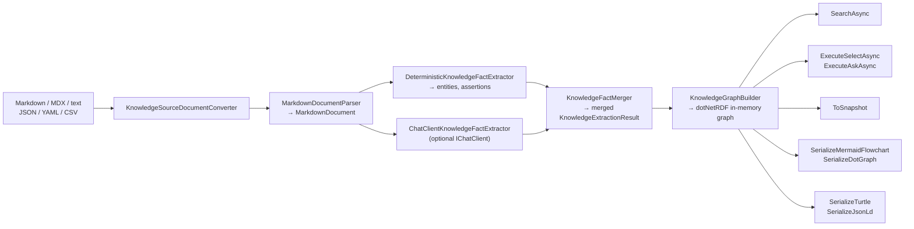
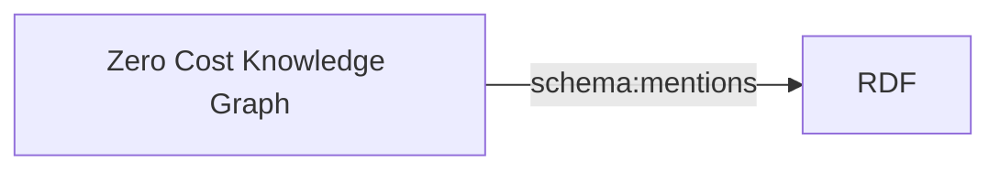
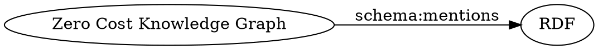

# Markdown-LD Knowledge Bank

Markdown-LD Knowledge Bank is a .NET 10 library for turning Markdown knowledge-base files into an in-memory RDF graph that can be searched, queried with read-only SPARQL, exported as RDF, and rendered as a diagram.

It ports the core idea from [lqdev/markdown-ld-kb](https://github.com/lqdev/markdown-ld-kb) into a C# library package. The runtime is local and in-memory: no localhost server, no Azure Functions host, no database server, and no hosted graph service are required.

Use it when you want plain Markdown notes to become a queryable knowledge graph without making your application depend on a specific model provider, graph server, or hosted indexing service.

## What It Does



**Deterministic extraction** produces facts without any network call:

- article identity, title, summary, dates, tags, authors, and topics from YAML front matter
- heading sections and document identity from Markdown structure
- Markdown links such as `[SPARQL](https://www.w3.org/TR/sparql11-query/)`
- optional wikilinks such as `[[RDF]]`
- optional assertion arrows such as `article --mentions--> RDF`

**Optional AI extraction** enriches the graph with LLM-produced entities and assertions through `Microsoft.Extensions.AI.IChatClient`. No provider-specific SDK is required in the core library.

**Graph outputs:**

- `ToSnapshot()` — stable `KnowledgeGraphSnapshot` with `Nodes` and `Edges`
- `SerializeMermaidFlowchart()` — Mermaid `graph LR` diagram
- `SerializeDotGraph()` — Graphviz DOT diagram
- `SerializeTurtle()` — Turtle RDF serialization
- `SerializeJsonLd()` — JSON-LD serialization
- `ExecuteSelectAsync(sparql)` — read-only SPARQL SELECT returning `SparqlQueryResult`
- `ExecuteAskAsync(sparql)` — read-only SPARQL ASK returning `bool`
- `SearchAsync(term)` — case-insensitive search across `schema:name`, `schema:description`, and `schema:keywords`, returning matching graph subjects as `SparqlQueryResult`

All async methods accept an optional `CancellationToken`.

## Install

```bash
dotnet add package ManagedCode.MarkdownLd.Kb --version 0.0.1
```

For local repository development:

```bash
dotnet add reference ./src/MarkdownLd.Kb/MarkdownLd.Kb.csproj
```

## Minimal Example

```csharp
using ManagedCode.MarkdownLd.Kb.Pipeline;

internal static class MinimalGraphDemo
{
    private const string SearchTerm = "rdf";
    private const string NameKey = "name";
    private const string RdfLabel = "RDF";

    private const string ArticleMarkdown = """
---
title: Zero Cost Knowledge Graph
description: Markdown notes can become a queryable graph.
tags:
  - markdown
  - rdf
author:
  - Ada Lovelace
---
# Zero Cost Knowledge Graph

Markdown-LD Knowledge Bank links [RDF](https://www.w3.org/RDF/) and [SPARQL](https://www.w3.org/TR/sparql11-query/).
""";

    private const string SelectFactsQuery = """
PREFIX schema: <https://schema.org/>
SELECT ?article ?entity ?name WHERE {
  ?article a schema:Article ;
           schema:name "Zero Cost Knowledge Graph" ;
           schema:keywords "markdown" ;
           schema:mentions ?entity .
  ?entity schema:name ?name ;
          schema:sameAs <https://www.w3.org/RDF/> .
}
""";

    public static async Task RunAsync()
    {
        var pipeline = new MarkdownKnowledgePipeline();

        var result = await pipeline.BuildFromMarkdownAsync(ArticleMarkdown);

        var graphRows = await result.Graph.ExecuteSelectAsync(SelectFactsQuery);
        var search = await result.Graph.SearchAsync(SearchTerm);

        Console.WriteLine(graphRows.Rows.Count);
        Console.WriteLine(search.Rows.Any(row =>
            row.Values.TryGetValue(NameKey, out var name) &&
            name == RdfLabel));
    }
}
```

## Build From Files

```csharp
using ManagedCode.MarkdownLd.Kb.Pipeline;

internal static class FileGraphDemo
{
    private const string FilePath = "/absolute/path/to/content/article.md";
    private const string DirectoryPath = "/absolute/path/to/content";
    private const string MarkdownSearchPattern = "*.md";

    public static async Task RunAsync()
    {
        var pipeline = new MarkdownKnowledgePipeline();

        var singleFile = await pipeline.BuildFromFileAsync(FilePath);
        var directory = await pipeline.BuildFromDirectoryAsync(
            DirectoryPath,
            searchPattern: MarkdownSearchPattern);

        Console.WriteLine(singleFile.Graph.TripleCount);
        Console.WriteLine(directory.Documents.Count);
    }
}
```

`KnowledgeSourceDocumentConverter` supports Markdown and other text-like knowledge inputs: `.md`, `.markdown`, `.mdx`, `.txt`, `.text`, `.log`, `.csv`, `.json`, `.jsonl`, `.yaml`, and `.yml`. Non-Markdown files are accepted as text sources and run through the same parsing, extraction, and graph build pipeline.

You do not need to pass a base URI for normal use. Document identity is resolved in this order:

- `KnowledgeDocumentConversionOptions.CanonicalUri` when you provide one
- the file path, normalized the same way as the upstream project: `content/notes/rdf.md` becomes a stable document IRI
- the generated inline document path when `BuildFromMarkdownAsync` is called without a path

The library uses `urn:managedcode:markdown-ld-kb:/` as an internal default base URI only to create valid RDF IRIs when the Markdown does not provide a canonical URL. Pass `new MarkdownKnowledgePipeline(new Uri("https://your-domain/"))` only when you want generated document/entity IRIs to live under your own domain.

## Optional AI Extraction

Optional AI extraction enriches the deterministic Markdown graph with entities and assertions returned by an injected `Microsoft.Extensions.AI.IChatClient`. The package stays provider-neutral: it does not reference OpenAI, Azure OpenAI, Anthropic, or any other model-specific SDK. If no chat client is provided, the pipeline still runs fully locally and builds the graph from Markdown/front matter/link extraction only.

```csharp
using ManagedCode.MarkdownLd.Kb.Pipeline;
using Microsoft.Extensions.AI;

internal static class AiGraphDemo
{
    private const string ArticlePath = "content/entity-extraction.md";

    private const string ArticleMarkdown = """
---
title: Entity Extraction RDF Pipeline
---
# Entity Extraction RDF Pipeline

The article mentions Markdown-LD Knowledge Bank, SPARQL, RDF, and entity extraction.
""";

    private const string AskQuery = """
PREFIX schema: <https://schema.org/>
ASK WHERE {
  ?article a schema:Article ;
           schema:name "Entity Extraction RDF Pipeline" ;
           schema:mentions ?entity .
  ?entity schema:name ?name .
}
""";

    public static async Task RunAsync(IChatClient chatClient)
    {
        var pipeline = new MarkdownKnowledgePipeline(chatClient: chatClient);

        var result = await pipeline.BuildFromMarkdownAsync(
            ArticleMarkdown,
            path: ArticlePath);

        var hasAiFacts = await result.Graph.ExecuteAskAsync(AskQuery);
        Console.WriteLine(hasAiFacts);
    }
}
```

The built-in chat extractor requests structured output through `GetResponseAsync<T>()`, normalizes the returned entity/assertion payload, merges it with deterministic facts, and then builds the same in-memory RDF graph used by search and SPARQL. Tests use one local non-network `IChatClient` implementation so the full extraction-to-graph flow is covered without a live model.

## Query The Graph

```csharp
using ManagedCode.MarkdownLd.Kb.Pipeline;

internal static class QueryGraphDemo
{
    private const string SelectQuery = """
PREFIX schema: <https://schema.org/>
SELECT ?article ?title WHERE {
  ?article a schema:Article ;
           schema:name ?title ;
           schema:mentions ?entity .
  ?entity schema:name "RDF" .
}
LIMIT 100
""";

    private const string SearchTerm = "sparql";
    private const string ArticleKey = "article";
    private const string TitleKey = "title";

    public static async Task RunAsync(MarkdownKnowledgeBuildResult result)
    {
        var rows = await result.Graph.ExecuteSelectAsync(SelectQuery);
        var search = await result.Graph.SearchAsync(SearchTerm);

        foreach (var row in rows.Rows)
        {
            Console.WriteLine(row.Values[ArticleKey]);
            Console.WriteLine(row.Values[TitleKey]);
        }

        Console.WriteLine(search.Rows.Count);
    }
}
```

SPARQL execution is intentionally read-only. `SELECT` and `ASK` are allowed; mutation forms such as `INSERT`, `DELETE`, `LOAD`, `CLEAR`, `DROP`, and `CREATE` are rejected before execution.

## Export The Graph

```csharp
using ManagedCode.MarkdownLd.Kb.Pipeline;

internal static class ExportGraphDemo
{
    public static void Run(MarkdownKnowledgeBuildResult result)
    {
        KnowledgeGraphSnapshot snapshot = result.Graph.ToSnapshot();
        string mermaid = result.Graph.SerializeMermaidFlowchart();
        string dot = result.Graph.SerializeDotGraph();
        string turtle = result.Graph.SerializeTurtle();
        string jsonLd = result.Graph.SerializeJsonLd();

        Console.WriteLine(snapshot.Nodes.Count);
        Console.WriteLine(snapshot.Edges.Count);
        Console.WriteLine(mermaid);
        Console.WriteLine(dot);
        Console.WriteLine(turtle.Length);
        Console.WriteLine(jsonLd.Length);
    }
}
```

`ToSnapshot()` returns a stable object graph with `Nodes` and `Edges` so callers can build their own UI, JSON endpoint, or visualization layer without touching dotNetRDF internals. URI node labels are resolved from `schema:name` when available, so diagram output is readable by default.

Example Mermaid output shape:



Example DOT output shape:



## Thread Safety

`KnowledgeGraph` is safe for shared in-memory read/write use through its public API. Search, read-only SPARQL, snapshot export, diagram serialization, and RDF serialization run under a read lock; `MergeAsync` snapshots a built graph and merges it under a write lock.

Use this when many workers convert Markdown independently and publish their results into one graph:

```csharp
var shared = await pipeline.BuildFromMarkdownAsync(string.Empty);
var next = await pipeline.BuildFromMarkdownAsync(markdown, path: "content/note.md");

await shared.Graph.MergeAsync(next.Graph);
var rows = await shared.Graph.SearchAsync("rdf");
```

## Key Types

| Type | Purpose |
|---|---|
| `MarkdownKnowledgePipeline` | Entry point. Orchestrates parsing, extraction, merge, and graph build. |
| `MarkdownKnowledgeBuildResult` | Holds `Documents`, `Facts`, and the built `Graph`. |
| `KnowledgeGraph` | In-memory dotNetRDF graph with query, search, export, and merge. |
| `KnowledgeGraphSnapshot` | Immutable view with `Nodes` (`KnowledgeGraphNode`) and `Edges` (`KnowledgeGraphEdge`). |
| `MarkdownDocument` | Pipeline parsed document: `FrontMatter`, `Body`, and `Sections`. |
| `MarkdownFrontMatter` | Typed access to YAML front matter fields. |
| `KnowledgeExtractionResult` | Merged collection of `KnowledgeEntityFact` and `KnowledgeAssertionFact`. |
| `SparqlQueryResult` | Query result with `Variables` and `Rows` of `SparqlRow`. |
| `KnowledgeSourceDocumentConverter` | Converts files and directories into pipeline-ready source documents. |
| `ChatClientKnowledgeFactExtractor` | AI extraction adapter behind `IChatClient`. |

## Markdown Conventions

```markdown
---
title: Markdown-LD Knowledge Bank
description: A Markdown knowledge graph note.
datePublished: 2026-04-11
tags:
  - markdown
  - rdf
author:
  - Ada Lovelace
about:
  - Knowledge Graph
---
# Markdown-LD Knowledge Bank

Use [RDF](https://www.w3.org/RDF/) and [SPARQL](https://www.w3.org/TR/sparql11-query/).
```

Recognized front matter keys:

| Key | RDF property | Type |
|---|---|---|
| `title` | `schema:name` | string |
| `description` / `summary` | `schema:description` | string |
| `datePublished` | `schema:datePublished` | string (ISO date) |
| `dateModified` | `schema:dateModified` | string (ISO date) |
| `author` | `schema:author` | string or list |
| `tags` / `keywords` | `schema:keywords` | list |
| `about` | `schema:about` | list |
| `canonicalUrl` / `canonical_url` | root parser document identity; use `KnowledgeDocumentConversionOptions.CanonicalUri` for pipeline identity | string (URL) |
| `entity_hints` / `entityHints` | entity hints | list of `{label, type, sameAs}` |

Optional advanced predicate forms:

- `mentions` becomes `schema:mentions`
- `about` becomes `schema:about`
- `author` becomes `schema:author`
- `creator` becomes `schema:creator`
- `sameas` becomes `schema:sameAs`
- `relatedTo` becomes `kb:relatedTo`
- prefixed predicates such as `schema:mentions`, `kb:relatedTo`, `prov:wasDerivedFrom`, and `rdf:type` are preserved
- absolute predicate URIs are preserved when valid

## Architecture Choices

- `Markdig` parses Markdown structure.
- `YamlDotNet` parses front matter.
- `dotNetRDF` builds the RDF graph, runs local SPARQL, and serializes Turtle/JSON-LD.
- `Microsoft.Extensions.AI.IChatClient` is the only AI boundary in the core pipeline.
- Embeddings are not required for the current graph/search flow.
- Microsoft Agent Framework is treated as host-level orchestration for future workflows, not a core package dependency.

See [docs/Architecture.md](docs/Architecture.md), [ADR-0001](docs/ADR/ADR-0001-rdf-sparql-library.md), and [ADR-0002](docs/ADR/ADR-0002-llm-extraction-ichatclient.md).

## Inspiration And Attribution

This project is inspired by Luis Quintanilla's Markdown-LD / AI Memex work:

- [lqdev/markdown-ld-kb](https://github.com/lqdev/markdown-ld-kb) - upstream Python reference repository
- [Zero-Cost Knowledge Graph from Markdown](https://lqdev.me/resources/ai-memex/blog-post-zero-cost-knowledge-graph-from-markdown/) - core idea for using Markdown, YAML front matter, LLM extraction, RDF, JSON-LD, Turtle, and SPARQL
- [Project Report: Entity Extraction & RDF Pipeline](https://lqdev.me/resources/ai-memex/project-report-entity-extraction-rdf-pipeline/) - extraction and RDF pipeline context
- [W3C SPARQL Federated Query](https://github.com/w3c/sparql-federated-query) - SPARQL federation reference material
- [dotNetRDF](https://github.com/dotnetrdf/dotnetrdf) - RDF/SPARQL engine used by this C# implementation

The original repository is kept as a read-only submodule under `external/lqdev-markdown-ld-kb`. This package ports the technology and API direction into a reusable .NET library instead of copying the Python repository layout.

## Development

```bash
dotnet restore MarkdownLd.Kb.slnx
dotnet build MarkdownLd.Kb.slnx --configuration Release --no-restore
dotnet test --solution MarkdownLd.Kb.slnx --configuration Release
dotnet format MarkdownLd.Kb.slnx --verify-no-changes
dotnet test --solution MarkdownLd.Kb.slnx --configuration Release -- --coverage --coverage-output-format cobertura --coverage-output "$PWD/TestResults/TUnitCoverage/coverage.cobertura.xml" --coverage-settings "$PWD/CodeCoverage.runsettings"
```

Current verification baseline:

- tests: 70 passed, 0 failed
- line coverage: 95.93%
- branch coverage: 84.55%
- target framework: .NET 10
- package version: 0.0.1
