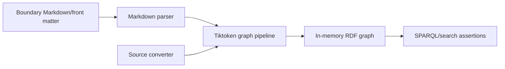

# Branch Coverage Improvement Plan

Chosen brainstorm: `branch-coverage-improvement.brainstorm.md`

## Goal And Scope

Raise branch coverage above the 83.28% baseline with meaningful boundary tests for the current Tiktoken graph extraction, Markdown parsing, converter, and search behavior. Keep coverage collection on `Microsoft.Testing.Extensions.CodeCoverage`; Cobertura remains only the report output format.

## Baseline

- Full test suite baseline: 73 passed, 0 failed.
- Coverage baseline: line 95.39%, branch 83.28%.
- Coverage collector: `Microsoft.Testing.Extensions.CodeCoverage`.
- Coverlet packages are not referenced by the solution.

## Already Failing Tests

- [x] None known.

## Ordered Steps

- [x] Add Tiktoken entity-hint boundary tests for scalar, numeric, `value`, `same_as`, blank, null, and empty-map shapes.
- [x] Add parser boundary tests for empty front matter, null metadata values, BOM-only source, and blank YAML keys.
- [x] Add converter boundary tests for default content conversion, media type override trimming, missing directories, no-extension files, and unsupported files when skipping is disabled.
- [x] Add search-service merge test for repeated optional SPARQL rows.
- [x] Run build, test, coverage, format, and diff checks.
- [x] Update README with verified test and coverage numbers.

## Testing Methodology

The added tests exercise public flows:

## Result

- Final tests: 77 passed, 0 failed.
- Final line coverage: 96.30%.
- Final branch coverage: 85.23%.
- Branch coverage increase: 83.28% to 85.23%.
