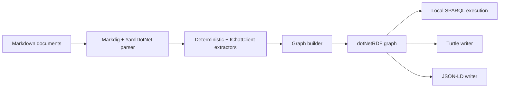

# ADR-0001: Use dotNetRDF for RDF and SPARQL

Status: Accepted  
Date: 2026-04-11  
Related Features: `docs/Architecture.md`  

---

## Implementation plan

- [x] Analyze upstream graph stack and .NET options.
- [x] Choose the RDF/SPARQL dependency.
- [x] Add dotNetRDF to the production project.
- [x] Add flow tests that query generated graphs through SPARQL.
- [x] Run build, test, format, and coverage commands.
- [x] Update `docs/Architecture.md` if dependency boundaries change.

## Context

The upstream implementation uses RDFLib for RDF graph construction, Turtle/JSON-LD serialization, and SPARQL query execution. The C# port needs equivalent standards support without implementing RDF and SPARQL directly.

Constraints:

- The repository targets .NET 10 and C#.
- The core library must be deterministic and network-free.
- SPARQL and RDF serialization are standards-heavy and should not be hand-rolled.
- Tests must verify Markdown -> graph -> query/search flows.

Goals:

- Build RDF triples from Markdown-derived facts.
- Execute SELECT/ASK SPARQL queries locally.
- Serialize graph output to Turtle and JSON-LD where supported.
- Keep public API small enough to allow a future storage/query backend if needed.

Non-goals:

- Implement a full RDF/SPARQL engine in this repository.
- Add remote federated SPARQL endpoints in the first slice.
- Add provider-specific live LLM clients in the core library.

## Decision

Use dotNetRDF as the RDF graph, serialization, and SPARQL engine for the first .NET implementation slice.

Key points:

- dotNetRDF replaces Python RDFLib for the C# port.
- The selected package supports RDF/SPARQL in .NET and the user guide documents in-memory RDF data and in-memory SPARQL querying, which matches the no-server core runtime boundary.
- Markdig and YamlDotNet will handle Markdown/front matter parsing separately.
- AI extraction remains behind an extraction port that uses `Microsoft.Extensions.AI.IChatClient`; provider/orchestration packages are not part of this RDF dependency decision.

## Diagram

## Alternatives considered

### Hand-rolled RDF and query engine

- Pros: fewer package dependencies and full control.
- Cons: high standards risk, large implementation burden, and weak fit for the repository goal.
- Rejected because RDF/SPARQL are core standards and should use a proven implementation.

### Separate RDF graph and SPARQL packages

- Pros: potentially smaller packages.
- Cons: higher integration risk and more public API churn.
- Rejected for the first slice because the library needs a cohesive graph/query/serialization backend quickly.

### Microsoft Agent Framework as the graph workflow engine

- Pros: useful for future AI orchestration and multi-step extraction.
- Cons: not an RDF/SPARQL engine and unnecessary for deterministic Markdown-to-graph conversion.
- Rejected for this decision. It remains a future adapter candidate for LLM extraction or NL-to-SPARQL.

## Consequences

### Positive

- The implementation can focus on Markdown semantics and public API design instead of RDF internals.
- Flow tests can execute real SPARQL queries locally.
- Turtle/JSON-LD serialization can be validated through the same graph backend.

### Negative / risks

- The core library takes a dependency on dotNetRDF APIs.
- JSON-LD support may require a specific package shape or writer availability in the selected version.
- Performance characteristics are inherited from dotNetRDF and must be measured before promising large-scale query throughput.

Mitigations:

- Hide dependency details behind `KnowledgeGraph` query methods, `KnowledgeSearchService`, and serialization methods where practical.
- Add tests for serialization and SPARQL query paths.
- Keep remote/federated SPARQL out of the first slice.

## Impact

### Code

- Affected modules:
  - `src/MarkdownLd.Kb`
  - `tests/MarkdownLd.Kb.Tests`
- New boundaries:
  - RDF graph construction and SPARQL execution live behind library services.
  - AI extraction remains a port, not a dotNetRDF concern.

### Data / configuration

- RDF namespace constants must cover schema.org, kb, prov, rdf, and xsd.
- No secrets or network configuration are required for core graph builds.

### Documentation

- `docs/Architecture.md` documents the dependency direction.
- `docs/ADR/ADR-0002-llm-extraction-ichatclient.md` documents the required `IChatClient` boundary. Future provider or Microsoft Agent Framework packages need a separate ADR before becoming core dependencies.

## Verification

### Objectives

- Prove Markdown fixtures produce RDF triples using schema.org/kb/prov predicates.
- Prove SELECT/ASK SPARQL queries return expected results.
- Prove mutating SPARQL queries are rejected by library safety checks.
- Prove serialization output is generated and parseable where supported.

### Test environment

- Local .NET 10 test run.
- No network access required.
- Test data lives under `tests/MarkdownLd.Kb.Tests/Fixtures`.

### Testing methodology

- Positive flows:
  - Build a graph from realistic Markdown and query article/entity/assertion triples.
  - Serialize the graph and parse/inspect the output.
- Negative flows:
  - Reject mutating SPARQL operations.
  - Ignore malformed deterministic assertion syntax.
- Edge flows:
  - Empty Markdown input.
  - Duplicate entity mentions and assertions.
  - Nested headings and relative document paths.
- Required realism level:
  - Use real Markdig/YamlDotNet/dotNetRDF dependencies.
  - No mocks for core graph flow tests.
- Coverage baseline requirement:
  - 95%+ line coverage for changed production code.
- Pass criteria:
  - All relevant tests pass.
  - Coverage stays at or above 95%.
  - Build and format checks pass.

### Test commands

- build: `dotnet build MarkdownLd.Kb.slnx --no-restore`
- test: `dotnet test --solution MarkdownLd.Kb.slnx --configuration Release`
- format: `dotnet format MarkdownLd.Kb.slnx --verify-no-changes`
- coverage: `dotnet test --solution MarkdownLd.Kb.slnx --configuration Release -- --coverage --coverage-output-format cobertura --coverage-output "$PWD/TestResults/TUnitCoverage/coverage.cobertura.xml" --coverage-settings "$PWD/CodeCoverage.runsettings"`

### New or changed tests

| ID | Scenario | Level | Expected result | Notes |
| --- | --- | --- | --- | --- |
| TST-001 | Markdown fixture to graph to SPARQL | Integration | Expected entities/assertions returned | Main flow |
| TST-002 | Duplicate facts | Integration | One canonical entity/assertion | De-dup |
| TST-003 | Mutating SPARQL query | Integration | Rejected before execution | Safety |
| TST-004 | Empty input | Integration | Empty graph and empty search results | Edge |
| TST-005 | Malformed assertion syntax | Integration | Ignored without graph corruption | Negative |

## Rollout and migration

No migration exists yet. This is the initial implementation decision.

## References

- `external/lqdev-markdown-ld-kb/README.md`
- `external/lqdev-markdown-ld-kb/tools/postprocess.py`
- `external/lqdev-markdown-ld-kb/api/function_app.py`
- `external/lqdev-markdown-ld-kb/.ai-memex/blog-post-zero-cost-knowledge-graph-from-markdown.md`
- dotNetRDF upstream repository: `https://github.com/dotnetrdf/dotnetrdf`
- dotNetRDF user guide: `https://dotnetrdf.org/docs/stable/user_guide/index.html`
