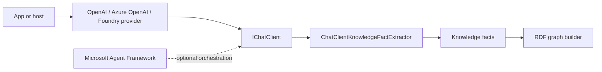

# ADR-0002: Use IChatClient for LLM extraction

Status: Accepted  
Date: 2026-04-11  
Related Features: `docs/Architecture.md`  

---

## Implementation plan

- [x] Update project rules and architecture to require `IChatClient`.
- [ ] Add `Microsoft.Extensions.AI.Abstractions` to the production project.
- [ ] Implement `ChatClientKnowledgeFactExtractor` behind the `IKnowledgeFactExtractor` port.
- [ ] Use structured output records for entities and assertions.
- [ ] Add non-network integration tests for the adapter contract.
- [ ] Run build, test, format, and coverage commands.

## Context

The upstream Python implementation calls an OpenAI-compatible client directly for GitHub Models extraction. The C# port should not couple the core library to a provider-specific SDK. Microsoft Learn documents `Microsoft.Extensions.AI.IChatClient` as the .NET chat abstraction and structured output through `GetResponseAsync<T>()`.

Constraints:

- The graph pipeline must be testable without network access.
- The production library should support multiple LLM providers without changing graph code.
- Provider-specific packages such as OpenAI, Azure OpenAI, or Foundry should be application-level choices.
- Microsoft Agent Framework can orchestrate agents and workflows later, but the core library needs a simple extraction boundary now.
- Tests must not use mocks, stubs, or fakes except one local test `IChatClient` implementation for this boundary.

## Decision

Use `Microsoft.Extensions.AI.IChatClient` as the LLM dependency boundary from the first implementation slice.

Key points:

- The production library references `Microsoft.Extensions.AI.Abstractions`.
- `ChatClientKnowledgeFactExtractor` accepts an `IChatClient` through constructor injection.
- Structured extraction output is modeled as repository records and requested via `GetResponseAsync<T>()`.
- Concrete providers and Microsoft Agent Framework workflow packages are not core dependencies.

## Diagram

## Alternatives considered

### Provider-specific SDK in core

- Pros: direct access to provider options.
- Cons: locks the library to one provider and makes tests/configuration harder.
- Rejected because `IChatClient` is the correct .NET abstraction.

### No LLM adapter in the first slice

- Pros: smaller first implementation.
- Cons: misses the required technology boundary and makes later API shape churn likely.
- Rejected because the project requires LLM extraction through `IChatClient` from the start.

### Microsoft Agent Framework as a core dependency

- Pros: useful for higher-level workflow and multi-agent orchestration.
- Cons: larger dependency surface and unnecessary for a library extraction adapter.
- Rejected for the core package. It can wrap or supply `IChatClient` in an app/adapter later.

## Consequences

### Positive

- The library starts with the correct .NET LLM abstraction.
- Provider choice stays outside the graph package.
- Tests can exercise the adapter contract without calling a live model.

### Negative / risks

- The core package now has an AI abstraction dependency.
- Structured output support depends on provider capabilities at runtime.

Mitigations:

- Depend on abstractions only.
- Keep deterministic extraction available for Markdown-native cues and non-network tests.
- Document provider/runtime assumptions in future app-level docs.

## Verification

### Objectives

- Prove the graph pipeline can use `ChatClientKnowledgeFactExtractor`.
- Prove structured output maps into entities and assertions.
- Prove provider-specific packages are not required by the core project.

### Testing methodology

- Positive flow:
  - Use a local non-network `IChatClient` test implementation that returns a structured extraction result.
  - Build a graph from Markdown and assert SPARQL sees the LLM-produced entity/assertion.
- Negative flow:
  - A malformed or empty structured result produces no assertions and does not corrupt graph construction.
- Edge flow:
  - Duplicate facts returned by the chat adapter are canonicalized before graph insertion.
- Coverage baseline requirement:
  - 95%+ line coverage for changed production code.

### Test commands

- build: `dotnet build MarkdownLd.Kb.slnx --no-restore`
- test: `dotnet test MarkdownLd.Kb.slnx --no-build`
- format: `dotnet format MarkdownLd.Kb.slnx --verify-no-changes`
- coverage: `dotnet test MarkdownLd.Kb.slnx --collect:"XPlat Code Coverage"`

## References

- Microsoft Learn: `Microsoft.Extensions.AI.IChatClient`
- Microsoft Learn: structured output via `ChatClientStructuredOutputExtensions.GetResponseAsync<T>()`
- Microsoft Learn: Microsoft Agent Framework overview
- `external/lqdev-markdown-ld-kb/tools/llm_client.py`
