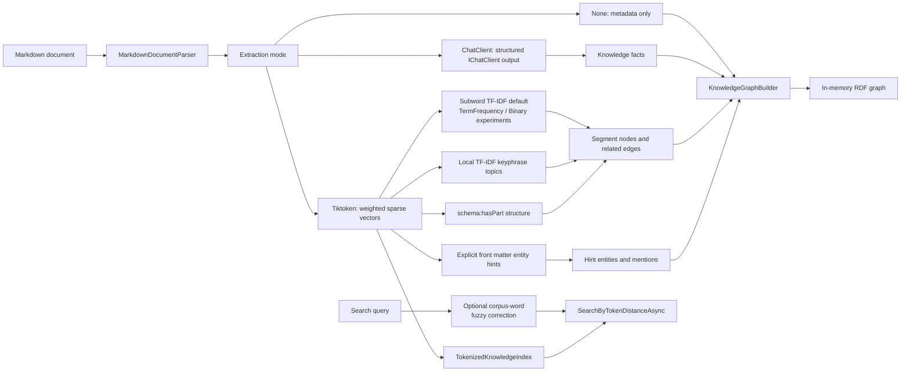

# ADR-0003: Use Explicit Tiktoken Token-Distance Extraction Mode

Status: Accepted
Date: 2026-04-13
Related Features: `docs/Features/TiktokenGraphExtraction.md`

---

## Context

The pipeline previously produced graph facts from deterministic Markdown heuristics such as wikilinks, Markdown links, and arrow assertions. The requested change is to remove those heuristic fact extractors and make non-LLM behavior explicit.

Constraints:

- The production library remains in-memory and network-free.
- `IChatClient` remains the primary LLM extraction boundary.
- Tiktoken is a tokenizer, not an embedding model.
- Research on subword TF-IDF suggests a stronger local lexical baseline than raw token frequency without introducing language-specific stop-word or stemming heuristics.
- Core code must not add provider-specific LLM or embedding SDKs.
- Tests must verify real Markdown -> graph -> query/search flows.

## Decision

Use explicit extraction modes in `MarkdownKnowledgePipeline`:

- `Auto`: use `IChatClient` when supplied; otherwise no fact extraction.
- `None`: parse Markdown and build document metadata only.
- `ChatClient`: require an `IChatClient` and use structured chat extraction only.
- `Tiktoken`: build an experimental token-distance graph from Tiktoken token IDs.

The Tiktoken mode uses `Microsoft.ML.Tokenizers` and `Microsoft.ML.Tokenizers.Data.O200kBase`. It segments Markdown through heading or loose document sections and paragraph/line blocks, encodes each segment with Tiktoken, fits a corpus-local sparse vector space, calculates Euclidean distance, creates segment entities, links the source document to each segment with `schema:mentions`, and links near segments with `kb:relatedTo`.

`SearchByTokenDistanceAsync` remains exact by default. Callers can pass `TokenDistanceSearchOptions` with `EnableFuzzyQueryCorrection = true` to expand absent query words with close corpus vocabulary terms before Tiktoken query encoding. This uses bounded word-level edit distance as a query-normalization step; it does not compute edit distance over Tiktoken IDs.

The local fallback also creates graph structure:

- section and segment nodes are `schema:CreativeWork`
- topic/keyphrase nodes are `schema:DefinedTerm`
- explicit `entity_hints` / `entityHints` become graph entities with stable hash IDs and preserved `schema:sameAs` values
- document -> section and section/document -> segment containment uses `schema:hasPart`
- document -> explicit entity hint uses `schema:mentions`
- segment -> topic and document -> topic membership uses `schema:about`

`TiktokenKnowledgeGraphOptions.Weighting` controls the local weighting strategy:

- `SubwordTfIdf`: default. Tiktoken token IDs are treated as subword terms, multiplied by smoothed IDF from the current build corpus, and L2-normalized.
- `TermFrequency`: raw token-count baseline from the first experiment, L2-normalized.
- `Binary`: presence/absence baseline, L2-normalized.

Subword TF-IDF is the accepted default because it follows the strongest no-model/no-heuristics research direction found in this pass while preserving the existing local dependency boundary.

Topic labels use Unicode word n-gram candidates scored with smoothed corpus-local TF-IDF and a small phrase-length boost. This is intentionally smaller than a full TextRank, YAKE, RAKE, or clustering implementation, but it gives the fallback named vertices and typed edges without model weights, language-specific stop-word lists, or a new numerical dependency.

## Diagram

## Consequences

### Positive

- Heuristic extraction is no longer implicit.
- Default no-chat behavior is explicit and caller-visible through diagnostics.
- Tiktoken mode is deterministic, local, and language-sensitive enough for lexical token matching experiments.
- Subword TF-IDF downweights corpus-common tokens without manually curated language rules.
- Tiktoken mode now produces named topic vertices and typed `schema:hasPart` / `schema:about` edges, not only segment similarity edges.
- Tiktoken mode preserves explicit front matter entity hints without reintroducing Markdown link, wikilink, or arrow scanner heuristics.
- Fuzzy query correction improves typo-heavy same-language token-distance search without changing the default exact behavior.
- Raw term frequency and binary weighting remain testable baselines.
- The core library still avoids concrete LLM and embedding providers.

### Negative / risks

- Tiktoken token vectors are lexical and do not provide semantic embeddings.
- Abstract questions can miss even in the same language.
- Cross-language queries generally do not match translated content because token IDs differ.
- Fuzzy query correction is lexical and corpus-local; it does not add semantic understanding or cross-language translation.
- IDF over small Markdown corpora can be noisy.
- Local keyphrase topic labels are lexical and can be noisy on short documents.
- Removing heuristic extraction is a breaking pre-release API and behavior change.

## Verification

Testing methodology:

- Default mode without chat builds document metadata, no extracted facts, and a diagnostic.
- Chat mode builds graph facts only from `IChatClient` output and does not use Markdown link heuristics.
- Tiktoken mode builds graph nodes/edges and supports `SearchByTokenDistanceAsync`.
- Fuzzy query correction tests cover query-side typos, corpus-side misspellings, distractor-biased exact tokens, invalid options, opt-in behavior, and long-vocabulary performance.
- Focused vector tests verify L2 normalization, binary count suppression, TF-IDF common-token downweighting, and Euclidean distance behavior.
- English, Ukrainian, French, and German same-language sources with 10 same-language queries each must hit at least 8 top matches.
- Cross-language translated-topic checks must stay low because no embedding or translation model is present.
- `TermFrequency`, `Binary`, and `SubwordTfIdf` must each remain selectable and pass the English flow baseline.
- Structured corpus graph tests verify section/segment/topic nodes and `schema:hasPart` / `schema:about` edges.
- Non-ASCII topic tests verify Ukrainian and French labels remain readable and IDs stay distinct.
- Headingless note tests verify loose Markdown still creates a document-title section node and segment containment.
- Entity hint tests verify label, type, `sameAs`, document `schema:mentions`, and non-ASCII hash IDs.

Commands:

- `dotnet restore MarkdownLd.Kb.slnx`
- `dotnet build MarkdownLd.Kb.slnx --no-restore`
- `dotnet test --solution MarkdownLd.Kb.slnx --configuration Release`
- `dotnet format MarkdownLd.Kb.slnx --verify-no-changes`
- `dotnet test --solution MarkdownLd.Kb.slnx --configuration Release -- --coverage --coverage-output-format cobertura --coverage-output "$PWD/TestResults/TUnitCoverage/coverage.cobertura.xml" --coverage-settings "$PWD/CodeCoverage.runsettings"`

## References

- Microsoft Learn: `https://learn.microsoft.com/en-us/dotnet/ai/how-to/use-tokenizers`
- Multilingual Search with Subword TF-IDF: `https://arxiv.org/abs/2209.14281`
- SPLADE v2: `https://arxiv.org/abs/2109.10086`
- Sentence-BERT: `https://arxiv.org/abs/1908.10084`
- MiniLM: `https://arxiv.org/abs/2002.10957`
- Language-agnostic BERT Sentence Embedding: `https://arxiv.org/abs/2007.01852`
- Pathway to Relevance: `https://arxiv.org/abs/2502.04645`
- TextRank: `https://aclanthology.org/W04-3252/`
- Unsupervised extraction of local and global keywords from a single text: `https://arxiv.org/abs/2307.14005`
- Unsupervised Keyphrase Extraction with Multipartite Graphs: `https://arxiv.org/abs/1803.08721`
- Improving Graph-Based Text Representations with Character and Word Level N-grams: `https://arxiv.org/abs/2210.05999`
- `docs/Architecture.md`
- `docs/Features/PerformanceBenchmarks.md`
