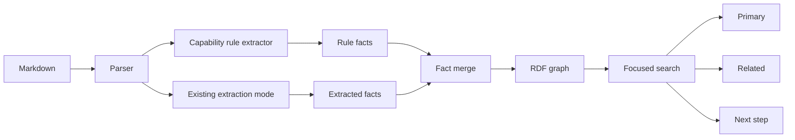

# ADR-0004: Add Deterministic Capability Graph Rules

Status: Accepted
Date: 2026-04-15
Related Features: `docs/Features/CapabilityGraphRules.md`

---

## Context

The library can already build document metadata, AI-extracted facts, and Tiktoken token-distance graph structure. That is useful for document knowledge graphs, but capability catalogs need more explicit topology. A tool catalog should expose domain groups, operation groups, related tools, and next-step tools without relying on broad semantic top-N retrieval.

Constraints:

- The core library must remain in-memory and network-free.
- Graph construction must be deterministic and testable.
- Applications must be able to provide graph rules without hard-coding their domain into the package.
- Search must support sparse high-confidence results and explainable expansion.

## Decision

Add deterministic capability graph rules to the pipeline.

Rules can come from Markdown front matter or `KnowledgeGraphBuildOptions`. The first shipped front matter keys are:

- `graph_entities`
- `graph_edges`
- `graph_groups`
- `graph_related`
- `graph_next_steps`

The pipeline merges rule-derived facts with extraction-derived facts before graph construction. The graph API also exposes `SearchFocusedAsync`, which returns primary matches, related matches, next-step matches, and a bounded focused graph snapshot.

## Diagram

## Consequences

### Positive

- Applications can build capability/workflow graphs directly from Markdown.
- Tool catalogs can retrieve fewer, more relevant primary tools.
- Related and next-step candidates are explicit and explainable.
- Focused graph snapshots make graph debugging readable.
- The library remains provider-neutral and deterministic.

### Negative / Risks

- Capability graph rules add a public API surface that must stay stable.
- Poor caller-authored rules can still create noisy graphs.
- Focused search is not a planner; it exposes graph neighborhood candidates for the caller to decide how to use.

## Verification

Testing methodology:

- Build a realistic Markdown tool corpus with capability front matter.
- Run the real `MarkdownKnowledgePipeline` in Tiktoken mode.
- Assert primary, related, and next-step matches.
- Assert focused graph export contains group and edge labels and excludes unrelated nodes.

Commands:

- `dotnet test --solution MarkdownLd.Kb.slnx --configuration Release -- --treenode-filter "/*/*/*/Capability_graph_front_matter_builds_focused_search_with_related_and_next_step_results" --no-progress`
- `dotnet test --solution MarkdownLd.Kb.slnx --configuration Release`
