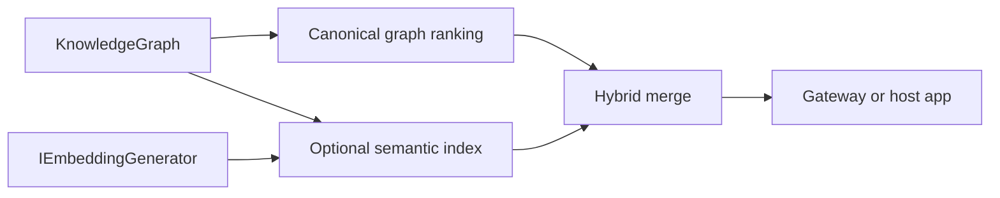

# ADR-0005: Hybrid Graph Search Boundary

Date: 2026-04-16

## Status

Accepted

## Context

The library already had two retrieval styles:

- graph-native lexical search over RDF metadata
- Tiktoken token-distance search for local lexical structure

Neither path solves cross-language mismatch between graph content and user queries. At the same time, the repository rules forbid turning the core library into a hosted vector-search subsystem or tying it to a provider-specific embedding SDK.

## Decision

Add an optional semantic ranked-search boundary that:

- builds an in-memory semantic index from graph-native candidate text
- uses `Microsoft.Extensions.AI.IEmbeddingGenerator<string, Embedding<float>>`
- keeps graph results canonical
- uses semantic results only as fallback or merge inputs
- excludes `schema:keywords` from canonical ranking

## Boundaries

## Consequences

Positive:

- cross-language queries have a provider-neutral recovery path
- graph-first explainability is preserved
- the host application keeps ownership of embedding-provider choice

Negative:

- the library now owns a small additional search boundary
- semantic tests need a deterministic non-network embedding adapter

## Rejected Alternatives

- Semantic-only ranking: rejected because graph must remain canonical.
- Provider-specific embedding package in the core library: rejected by repository rules.
- External vector database integration in the library: rejected because infra belongs in the host application.
