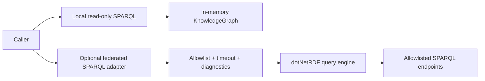

# ADR-0006: Federated SPARQL As An Explicit Adapter

Date: 2026-04-22

## Status

Accepted

## Context

The repository adopted dotNetRDF as the RDF/SPARQL engine with an intentionally local, in-memory public contract for SPARQL execution.

At the same time:

- dotNetRDF can process SPARQL `SERVICE` clauses and issue remote requests during query execution
- Wikidata Query Service now requires federation for some cross-graph scenarios after the split between main and scholarly endpoints
- the repository already contains flow knowledge and fixtures that treat federation as a real operational concern

The project therefore needs an explicit decision on whether federated SPARQL is:

- unsupported and blocked
- accidentally available but undocumented
- or promoted into a deliberate adapter boundary

## Decision

Treat federated SPARQL as an explicit optional adapter boundary, not as an accidental side effect of the underlying engine.

The project will:

- keep local read-only SPARQL as the default public contract
- define federated SPARQL as a separate opt-in capability
- require allowlist/profile, timeout, and diagnostics rules around remote execution
- keep the canonical Markdown-derived graph local and in-memory

## Package Decision

No new NuGet package is required for the first federated SPARQL implementation slice.

Package choices:

- Keep `dotNetRdf` in the production project.
- Keep `dotNetRdf.Shacl`.
- Do not add `dotNetRdf.Client` separately for this slice.
- Do not add a Wikidata-specific client package to the core library for this slice.

Reasoning:

- The current `dotNetRdf` meta-package already pulls in the split packages, including `dotNetRdf.Client`.
- The types used for SPARQL endpoint execution and `SERVICE` processing already exist in the dotNetRDF stack used by this repository.
- `dotNetRdf.Client` is aimed at triple-store connector scenarios and is not required as an extra package while the project already references the meta-package.
- Wikidata-specific NuGet packages focus on MediaWiki/Wikibase API access or narrow ad hoc query helpers, not the standards-first RDF/SPARQL federation boundary owned by this library.

## Boundaries

## Consequences

Positive:

- the public contract becomes explicit and defensible
- Wikidata federation can be supported without changing the local graph model
- no extra SPARQL engine dependency is needed
- package churn is minimized
- local `ExecuteSelectAsync` / `ExecuteAskAsync` now reject top-level `SERVICE`
- explicit federated methods and named Wikidata endpoint profiles now exist

Negative:

- the library now owns an additional policy surface around remote execution
- future implementation work must still distinguish supported federated behavior from raw dotNetRDF capability
- row-level remote provenance is still not part of the first implemented slice

## Rejected Alternatives

### Keep federation undocumented and rely on raw dotNetRDF behavior

Rejected because accidental network execution is not a stable public contract and would violate the repository's explicit-boundary style.

### Add a separate SPARQL federation engine package

Rejected because dotNetRDF already provides the standards-based federation mechanism the project needs.

### Add a Wikidata-specific package to the core library

Rejected because the core boundary is RDF/SPARQL-first, not MediaWiki API-first, and because current Wikidata-specific packages do not improve the core federation story enough to justify the dependency.

## Follow-Up Requirements

- Add a public API that makes federated execution explicit.
- Add policy-owned endpoint profiles, starting with Wikidata main and scholarly endpoints.
- Keep local SPARQL blocking top-level `SERVICE` unless the caller uses the explicit federated API.
- Add deterministic non-network tests for policy and failure behavior.
