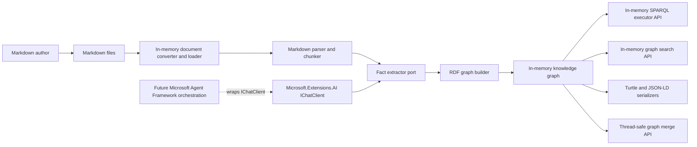
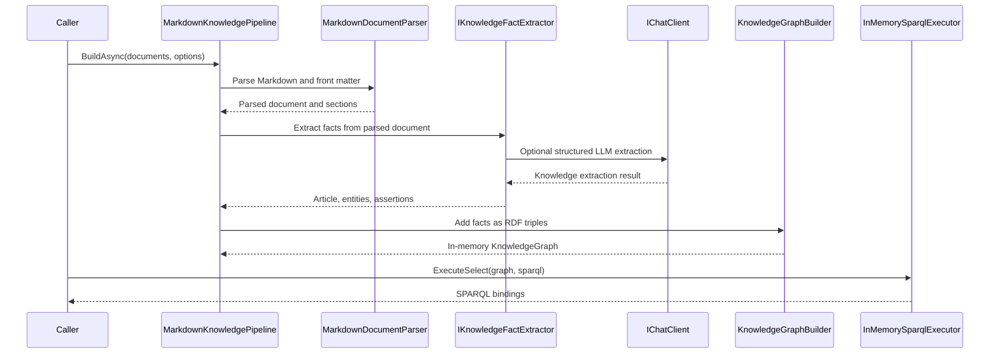
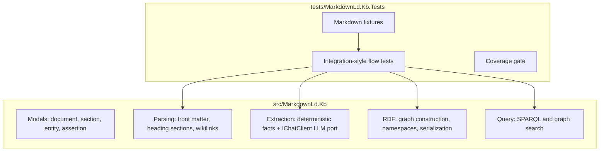
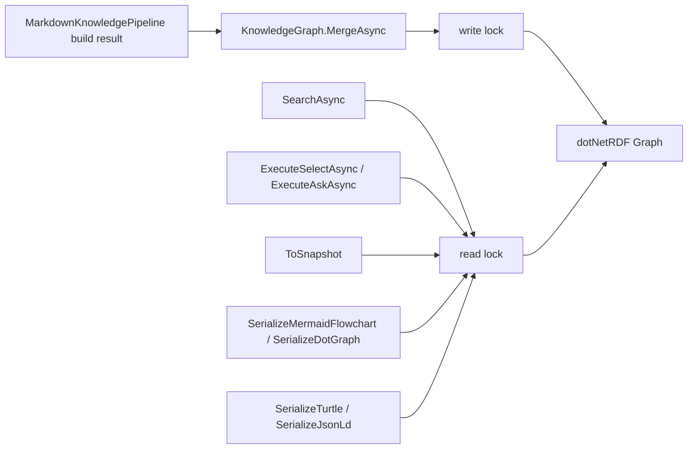

# Markdown-LD Knowledge Bank Architecture

Date: 2026-04-11

## Purpose

Markdown-LD Knowledge Bank is a .NET 10 library for converting human-authored Markdown knowledge-base files into an in-memory RDF knowledge graph and querying that graph through SPARQL or higher-level search APIs.

The upstream reference repository is kept as a read-only submodule at `external/lqdev-markdown-ld-kb`. This C# implementation ports the technology, not the Python file layout.

The core runtime has no localhost, HTTP server, background service, database server, or hosted API dependency. Callers pass files, directories, or in-memory document content into the library, and the library returns in-memory graph/search/query results.

The first-slice graph/search model does not require embeddings. The only AI boundary in the core pipeline is `Microsoft.Extensions.AI.IChatClient` for optional entity/assertion extraction. If semantic vector search is added later, it should be a separate optional adapter over `Microsoft.Extensions.AI.IEmbeddingGenerator<,>` or an equivalent small port, with the concrete provider owned by the host app.

## System Boundaries

## Core Flow

## Module Responsibilities

## Graph Thread Safety

`KnowledgeGraph` is the synchronization boundary around dotNetRDF `Graph`. dotNetRDF graphs are safe for concurrent read-only access, but not safe when reads overlap with `Assert`, `Retract`, or `Merge`. The library therefore guards graph operations with a reader/writer lock.

`MergeAsync` snapshots the source graph under that source graph's read lock, then merges the snapshot into the destination graph under the destination graph's write lock. This keeps shared in-memory graph updates safe without adding a server, database, background worker, or hosted graph service.

## Upstream Behaviour Mapping

| Upstream reference | C# boundary | First-slice behaviour |
| --- | --- | --- |
| `tools/chunker.py` | `MarkdownDocumentParser` | YAML front matter, stable document ID, heading sections, stable chunk IDs |
| `tools/postprocess.py` | `DeterministicKnowledgeFactExtractor`, RDF builders | slug IDs, entity canonicalization, assertion de-duplication, schema.org/kb/prov vocabulary |
| `tools/kg_build.py` | `MarkdownKnowledgePipeline` | orchestrates parse -> extract -> graph build -> query-ready graph |
| `api/function_app.py` | `KnowledgeGraph` query methods and `KnowledgeSearchService` | SELECT/ASK safety, in-memory SPARQL execution, JSON result shape at library level without a hosted function/server |
| `tools/llm_client.py` | `ChatClientKnowledgeFactExtractor` | structured LLM extraction through `Microsoft.Extensions.AI.IChatClient` |
| `api/nl_to_sparql.py` | future query adapter | schema-injected NL-to-SPARQL through `IChatClient`; Microsoft Agent Framework may orchestrate this later |
| `ontology/*.ttl`, `ontology/context.jsonld` | `KnowledgeGraphNamespaces` | schema.org, kb, prov, rdf, xsd namespaces |

## Dependency Direction

- Parsing depends on Markdig and YamlDotNet.
- RDF graph building and SPARQL execution depend on dotNetRDF.
- LLM extraction depends on `Microsoft.Extensions.AI.Abstractions` and accepts `IChatClient`.
- Embeddings are not required for the core graph build/query flow.
- Public API should prefer repository types over raw dependency types when feasible.
- AI adapters depend on the core extraction port. The core library must not depend on concrete provider packages or agent orchestration packages in the first slice.

## Testing Strategy

Tests are integration-style by default. They build realistic Markdown fixtures into a graph, then query the graph and validate the returned bindings or serialized RDF.

Required first-slice scenarios:

- Markdown with front matter, headings, wikilinks, markdown links, and assertion arrows builds a queryable graph.
- Duplicate entity mentions and assertions are canonicalized.
- Empty Markdown input produces an empty graph without throwing.
- Malformed assertion arrows are ignored without poisoning the graph.
- SPARQL mutating queries are rejected before execution.
- Shared graph merge can run concurrently with search and read-only SPARQL without corrupting dotNetRDF graph state.
- `IChatClient` extractor accepts structured extraction output without depending on a provider-specific SDK.
- No-match search returns an empty result instead of an error.
- Turtle and JSON-LD serialization produce parseable output where dependency support is available.

Coverage requirement: 95%+ line coverage for changed production code.

## References

- Upstream reference repository: `external/lqdev-markdown-ld-kb`
- Blog pattern: `external/lqdev-markdown-ld-kb/.ai-memex/blog-post-zero-cost-knowledge-graph-from-markdown.md`
- NL-to-SPARQL pattern: `external/lqdev-markdown-ld-kb/.ai-memex/pattern-nl-to-sparql-schema-injected-few-shot.md`
- dotNetRDF upstream repository: `https://github.com/dotnetrdf/dotnetrdf`
- dotNetRDF user guide: `https://dotnetrdf.org/docs/stable/user_guide/index.html`
- RDF/SPARQL dependency decision: `docs/ADR/ADR-0001-rdf-sparql-library.md`
- LLM extraction dependency decision: `docs/ADR/ADR-0002-llm-extraction-ichatclient.md`
