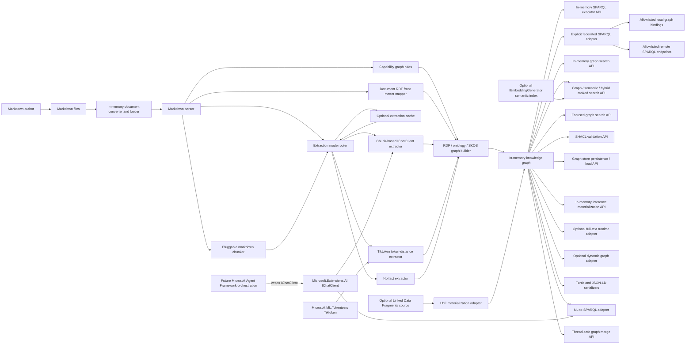
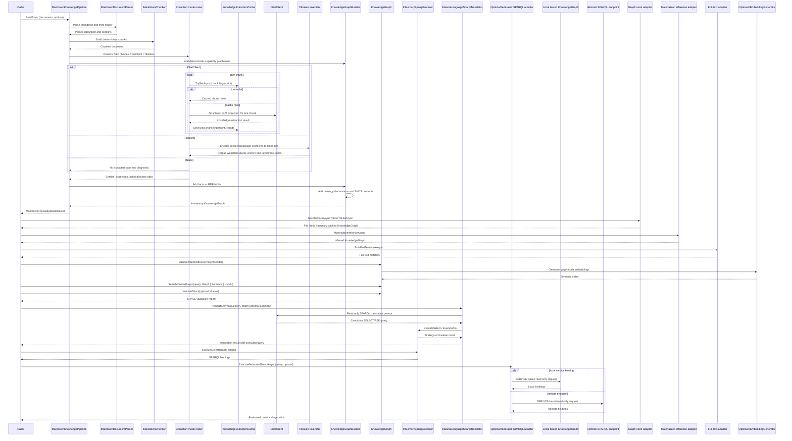
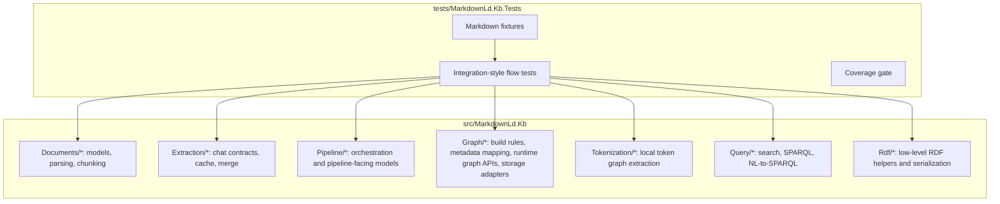
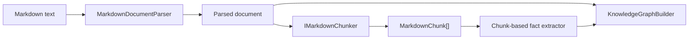
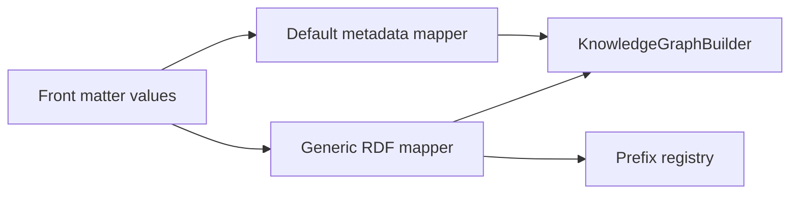
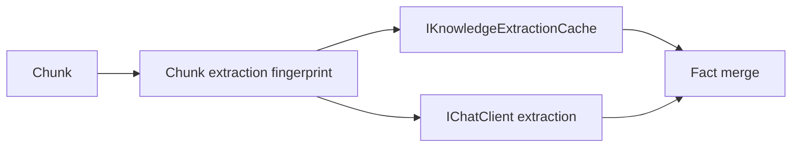
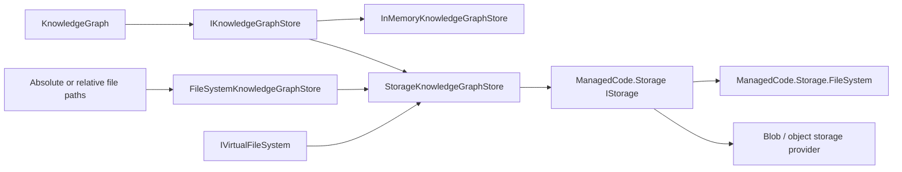
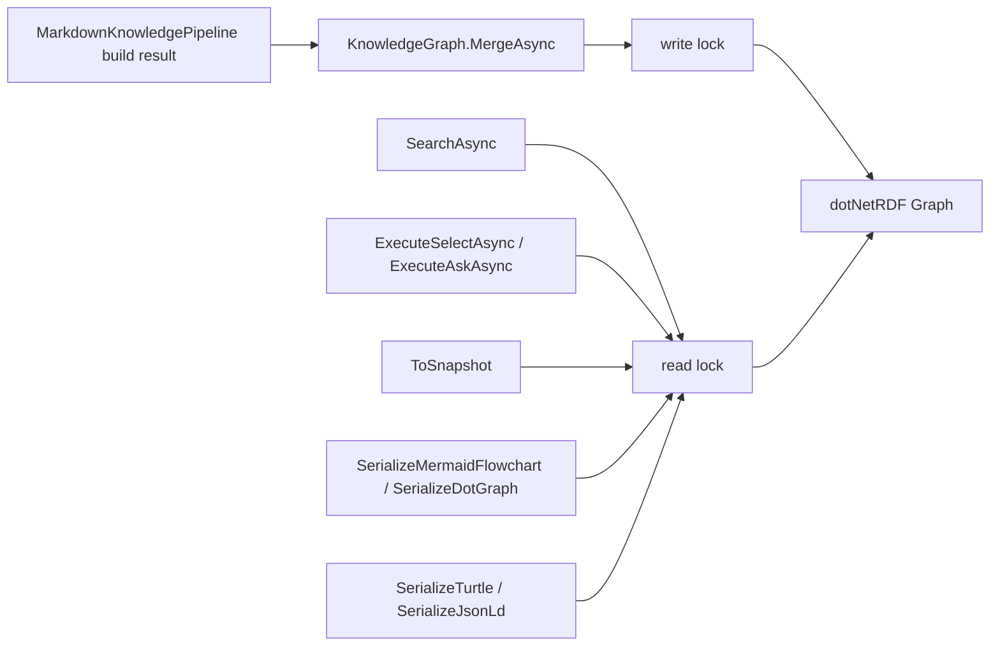

# Markdown-LD Knowledge Bank Architecture

Date: 2026-04-22

## Purpose

Markdown-LD Knowledge Bank is a .NET 10 library for converting human-authored Markdown knowledge-base files into an in-memory RDF knowledge graph and querying that graph through SPARQL or higher-level search APIs.

The upstream reference repository is kept as a read-only submodule at `external/lqdev-markdown-ld-kb`. This C# implementation ports the technology, not the Python file layout.

The core runtime has no localhost, HTTP server, background service, database server, or hosted API dependency. Callers pass files, directories, or in-memory document content into the library, and the library returns in-memory graph/search/query results.

The graph/search model does not require semantic embeddings. The AI boundary in the core pipeline is `Microsoft.Extensions.AI.IChatClient` for entity/assertion extraction. The library also exposes an explicit experimental Tiktoken mode that creates lexical sparse vectors from `Microsoft.ML.Tokenizers` token IDs and builds a local corpus graph. Its default weighting is corpus-fitted subword TF-IDF, with raw term frequency and binary presence kept as experimental baselines. Tiktoken mode also creates section/segment structure, local TF-IDF keyphrase topics, and explicit front matter entity hint nodes, but it is not a semantic embedding model. Capability graph rules add deterministic caller-authored entities and edges for groups, related nodes, and next-step nodes so applications can build workflow/capability graphs without relying on a flat document-topic graph. `KnowledgeGraphBuilder` now materializes three additive semantic layers in one graph: instance/document triples, a SKOS concept layer, and repository-owned ontology declarations over `kb:` terms using `dotNetRdf.Ontology` and `dotNetRdf.Skos`. `KnowledgeGraph` also exposes explicit runtime adapters for graph-store persistence/load, RDFS/SKOS/N3 materialized inference, Lucene-backed full-text indexing, dynamic graph access, and Linked Data Fragments materialization through `dotNetRdf.Inferencing`, `dotNetRdf.Query.FullText`, `dotNetRdf.Dynamic`, and `dotNetRdf.Ldf`. Linked Data Fragments transport stays caller-owned: hosts pass an already configured `HttpClient` when they need custom transport behavior, including clients created through `IHttpClientFactory`, but the core library does not depend on `IHttpClientFactory`. RDF serialization remains repository-owned, while filesystem/blob access is delegated to `ManagedCode.Storage` through `IKnowledgeGraphStore`, `StorageKnowledgeGraphStore`, `FileSystemKnowledgeGraphStore`, and `InMemoryKnowledgeGraphStore`. Cross-language retrieval can now use an optional semantic ranked-search adapter over `Microsoft.Extensions.AI.IEmbeddingGenerator<,>` that builds an in-memory semantic index from graph-native labels, descriptions, and related labels. The graph remains canonical; semantic hits are fallback or merge inputs rather than the source of truth. Chat-based fact extraction is chunk-oriented and may optionally reuse caller-selected cache storage, but cache and natural-language query translation remain adapters around the in-memory graph rather than hosted services. Document metadata mapping keeps article-friendly defaults, but it also supports generic front matter-driven RDF prefixes, types, and predicate/value mappings so callers are not locked to a fixed `schema:Article` subtype list.

## System Boundaries

## Core Flow

## Module Responsibilities

## Folder Layout

The production source tree now follows feature-oriented slices instead of a mostly flat technical grouping:

- `Documents/Models`, `Documents/Parsing`, `Documents/Chunking`
- `Extraction/Chat`, `Extraction/Cache`, `Extraction/Processing`
- `Pipeline/` for orchestration-only files
- `Graph/Build`, `Graph/Runtime`
- `Tokenization/`
- `Query/Search`, `Query/Sparql`, `Query/NaturalLanguage`
- `Rdf/` for the lower-level RDF helper surface

## Parsing, Chunking, And Extraction Boundaries

The parser and chunker are separate boundaries. Parsing is responsible for deterministic document identity, front matter normalization, links, and section structure. Chunking is responsible for turning parsed sections into deterministic `MarkdownChunk` values that can be swapped without changing the rest of the pipeline.

The default chunker is deterministic and section-aware. Alternative chunkers may change chunk shape or token budgets, but they must preserve stable ordering and deterministic chunk identifiers for the same input and options.

## Document Metadata Mapping

Document metadata mapping has two layers:

- default conventions for common fields such as title, summary, dates, keywords, authors, `entryType`, and `sourceProject`;
- generic front matter RDF mapping for explicit `rdf_prefixes`, `rdf_types`, and `rdf_properties`.

This keeps the library ergonomic for common article-like content while avoiding new hardcoded builder logic every time a corpus needs a different schema or vocabulary.

## Cache And Adapter Boundaries

Extraction cache is optional and sits only in the chat-based extraction path. The cache key must include at least the chunk identity, chunker profile, extraction prompt version, and model identity so stale reuse is caller-visible and avoidable.

Natural-language query support is also an adapter. The canonical graph remains RDF/SPARQL-first, and NL-to-SPARQL translation can be disabled without changing graph construction or search APIs.

## Graph Store Boundary

Graph persistence is split deliberately:

- the repository owns RDF format selection and serialization/deserialization
- `IKnowledgeGraphStore` is the graph-level persistence abstraction
- `ManagedCode.Storage` owns filesystem/blob transport concerns

## Graph Thread Safety

`KnowledgeGraph` is the synchronization boundary around dotNetRDF `Graph`. dotNetRDF graphs are safe for concurrent read-only access, but not safe when reads overlap with `Assert`, `Retract`, or `Merge`. The library therefore guards graph operations with a reader/writer lock.

`MergeAsync` snapshots the source graph under that source graph's read lock, then merges the snapshot into the destination graph under the destination graph's write lock. This keeps shared in-memory graph updates safe without adding a server, database, background worker, or hosted graph service.

## Upstream Behaviour Mapping

| Upstream reference | C# boundary | First-slice behaviour |
| --- | --- | --- |
| `tools/chunker.py` | `MarkdownDocumentParser`, `IMarkdownChunker` | YAML front matter, stable document ID, heading sections, deterministic pluggable chunking |
| `tools/postprocess.py` | `KnowledgeFactMerger`, RDF builders | slug IDs, entity canonicalization, assertion de-duplication, schema.org/kb/prov vocabulary |
| `tools/kg_build.py` | `MarkdownKnowledgePipeline`, `IKnowledgeExtractionCache`, document RDF mapper | orchestrates parse -> chunk -> extract -> cache reuse -> graph build -> query-ready graph |
| `api/function_app.py` | `KnowledgeGraph` query methods and `KnowledgeSearchService` | SELECT/ASK safety, in-memory SPARQL execution, JSON result shape at library level without a hosted function/server |
| `tools/llm_client.py` | `ChatClientKnowledgeFactExtractor` | structured LLM extraction through `Microsoft.Extensions.AI.IChatClient` |
| Tokenizer fallback | `TiktokenKnowledgeGraphExtractor`, `TokenKeyphraseExtractor`, `TokenizedEntityHintExtractor`, `TokenizedKnowledgeIndex` | explicit local graph from Tiktoken sparse vectors, section/segment structure, TF-IDF keyphrase topics, and front matter entity hints |
| `api/nl_to_sparql.py` | `INaturalLanguageSparqlTranslator` | schema-injected NL-to-SPARQL through `IChatClient`; Microsoft Agent Framework may orchestrate this later |
| `ontology/*.ttl`, `ontology/context.jsonld` | `KnowledgeGraphNamespaces`, `KnowledgeGraphSemanticLayerBuilder` | schema / kb / prov / rdf / rdfs / owl / skos namespaces plus repository-owned ontology and SKOS layers |

## Dependency Direction

- Parsing depends on Markdig and YamlDotNet.
- Chunking depends on parsed document models and stays deterministic.
- RDF graph building and SPARQL execution depend on dotNetRDF.
- Graph-store persistence/load depends on dotNetRDF parsers and writers plus `ManagedCode.Storage` for filesystem/blob transport.
- Materialized inference depends on `dotNetRdf.Inferencing`.
- Optional full-text indexing depends on `dotNetRdf.Query.FullText` and Lucene.
- Optional dynamic graph access depends on `dotNetRdf.Dynamic`.
- Optional Linked Data Fragments materialization depends on `dotNetRdf.Ldf` and remains an explicit external-source adapter.
- Optional federated SPARQL depends on dotNetRDF `SERVICE` processing plus library-owned allowlist, timeout, and endpoint-diagnostics policy; it must remain explicit and opt-in.
- SHACL validation depends on `dotNetRdf.Shacl` and runs against the in-memory graph through `VDS.RDF.Shacl.ShapesGraph`.
- LLM extraction depends on `Microsoft.Extensions.AI.Abstractions` and accepts `IChatClient`.
- Optional extraction cache depends on small library-owned contracts; file-backed cache adapters may live in the core library as local file-system helpers because they do not introduce hosted infrastructure.
- Tiktoken extraction depends on `Microsoft.ML.Tokenizers` and the O200k data package. It uses tokenizer IDs and Unicode word n-gram keyphrase candidates only, and does not add an embedding provider. The default vector weighting is subword TF-IDF fitted over the current build corpus.
- Optional semantic ranked search depends only on `Microsoft.Extensions.AI.IEmbeddingGenerator<string, Embedding<float>>` and keeps the concrete embedding provider in the host application.
- Embeddings are not required for the core graph build/query flow.
- Public API should prefer repository types over raw dependency types when feasible.
- AI adapters depend on the core extraction port. The core library must not depend on concrete provider packages or agent orchestration packages in the first slice.
- NL-to-SPARQL translation depends on `IChatClient`, existing SPARQL safety enforcement, and graph schema summaries; it must remain read-only.

## Testing Strategy

Tests are integration-style by default. They build realistic Markdown fixtures into a graph, then query the graph and validate the returned bindings or serialized RDF.

Required first-slice scenarios:

- Markdown with front matter and headings builds a queryable document metadata graph without requiring fact extraction.
- Empty Markdown input produces an empty graph without throwing.
- Explicit Tiktoken mode builds section/segment/topic/entity-hint nodes plus `schema:hasPart`, `schema:about`, `schema:mentions`, and token-distance `kb:relatedTo` edges without network access.
- Capability graph rules build `kb:memberOf`, `kb:relatedTo`, and `kb:nextStep` workflow edges from Markdown front matter or caller options, and focused search returns primary, related, and next-step result groups.
- Ranked search supports `Graph`, `Semantic`, and `Hybrid` modes. Hybrid mode keeps canonical graph hits first, then appends semantic-only fallback hits when graph-native recall is insufficient.
- SHACL validation uses default Markdown-LD Knowledge Bank shapes or caller-supplied shapes, and assertion confidence/provenance metadata is represented as RDF statements so validation remains RDF-native.
- English, Ukrainian, French, and German queries over same-language token graphs produce a higher hit rate than cross-language translated-topic queries.
- Term frequency, binary presence, and subword TF-IDF token weighting modes are covered by focused and flow tests.
- SPARQL mutating queries are rejected before execution.
- Local SPARQL remains the default public contract; `ExecuteFederatedSelectAsync` and `ExecuteFederatedAskAsync` are the explicit opt-in boundary and local query methods reject top-level `SERVICE`.
- Graph persistence is covered through `IKnowledgeGraphStore` implementations for in-memory, filesystem-backed `IStorage`, keyed DI multi-store setups, and file-path convenience APIs.
- Shared graph merge can run concurrently with search and read-only SPARQL without corrupting dotNetRDF graph state.
- Federated SPARQL, when implemented, must be verified with deterministic policy tests and controlled endpoint fixtures; unsupported local executors must not issue remote requests.
- One Markdown file on disk can become a queryable graph through `BuildFromFileAsync`.
- A built graph can round-trip through RDF file persistence and reload.
- Materialized inference changes caller-visible SPARQL results through explicit runtime APIs.
- Full-text, dynamic, and Linked Data Fragments runtime adapters are covered through public flow tests.
- `IChatClient` extractor accepts structured extraction output without depending on a provider-specific SDK.
- Chunk-based `IChatClient` extraction is deterministic in chunk ordering, can reuse optional cache entries, and merges chunk results into a single canonical graph.
- Default no-chat mode emits no extracted facts and reports a diagnostic telling callers to connect `IChatClient` or choose Tiktoken mode.
- No-match search returns an empty result instead of an error.
- Semantic-only or hybrid search without a semantic index fails explicitly.
- Turtle and JSON-LD serialization produce parseable output where dependency support is available.
- NL-to-SPARQL translation only emits read-only `SELECT` or `ASK` queries and rejects mutating or unsafe queries before execution.

Coverage requirement: 95%+ line coverage for changed production code.

## References

- Upstream reference repository: `external/lqdev-markdown-ld-kb`
- Blog pattern: `external/lqdev-markdown-ld-kb/.ai-memex/blog-post-zero-cost-knowledge-graph-from-markdown.md`
- NL-to-SPARQL pattern: `external/lqdev-markdown-ld-kb/.ai-memex/pattern-nl-to-sparql-schema-injected-few-shot.md`
- dotNetRDF upstream repository: `https://github.com/dotnetrdf/dotnetrdf`
- dotNetRDF user guide: `https://dotnetrdf.org/docs/stable/user_guide/index.html`
- W3C SPARQL 1.1 Federated Query: `https://www.w3.org/TR/2013/REC-sparql11-federated-query-20130321/`
- W3C SPARQL 1.2 Federated Query Working Draft: `https://www.w3.org/TR/sparql12-federated-query/`
- Wikidata federated queries guide: `https://www.wikidata.org/wiki/Wikidata:SPARQL_query_service/Federated_queries`
- Wikidata Query Service user manual: `https://www.mediawiki.org/wiki/Wikidata_Query_Service/User_Manual/en`
- WDQS graph split: `https://www.wikidata.org/wiki/Wikidata:SPARQL_query_service/WDQS_graph_split`
- Microsoft.ML.Tokenizers guide: `https://learn.microsoft.com/dotnet/ai/how-to/use-tokenizers`
- Multilingual Search with Subword TF-IDF: `https://arxiv.org/abs/2209.14281`
- SPLADE v2: `https://arxiv.org/abs/2109.10086`
- Sentence-BERT: `https://arxiv.org/abs/1908.10084`
- MiniLM: `https://arxiv.org/abs/2002.10957`
- Language-agnostic BERT Sentence Embedding: `https://arxiv.org/abs/2007.01852`
- TextRank: `https://aclanthology.org/W04-3252/`
- RDF/SPARQL dependency decision: `docs/ADR/ADR-0001-rdf-sparql-library.md`
- LLM extraction dependency decision: `docs/ADR/ADR-0002-llm-extraction-ichatclient.md`
- Capability graph rules decision: `docs/ADR/ADR-0004-capability-graph-rules.md`
- Capability graph rules feature: `docs/Features/CapabilityGraphRules.md`
- Hybrid ranked search feature: `docs/Features/HybridGraphSearch.md`
- SHACL validation feature: `docs/Features/GraphShaclValidation.md`
- Graph runtime lifecycle feature: `docs/Features/GraphRuntimeLifecycle.md`
- Federated SPARQL feature: `docs/Features/FederatedSparqlExecution.md`
- Federated SPARQL decision: `docs/ADR/ADR-0006-federated-sparql-adapter.md`
