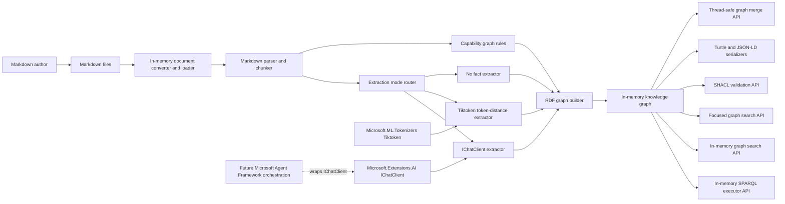
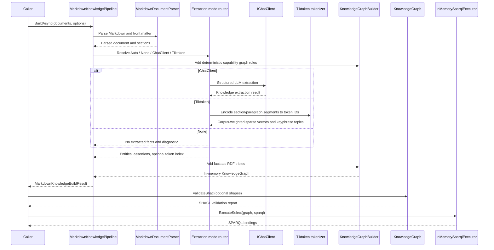
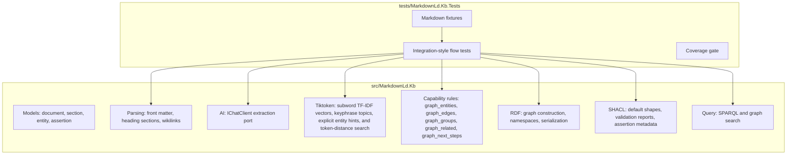
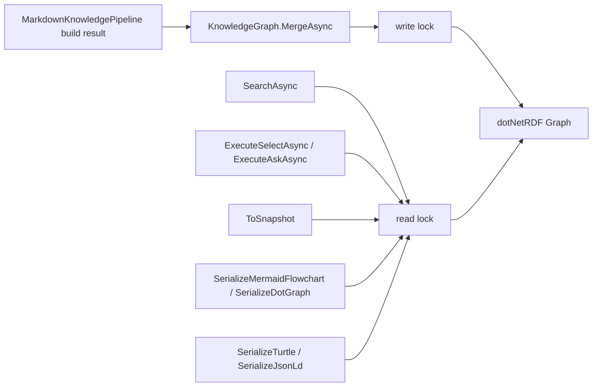

# Markdown-LD Knowledge Bank Architecture

Date: 2026-04-15

## Purpose

Markdown-LD Knowledge Bank is a .NET 10 library for converting human-authored Markdown knowledge-base files into an in-memory RDF knowledge graph and querying that graph through SPARQL or higher-level search APIs.

The upstream reference repository is kept as a read-only submodule at `external/lqdev-markdown-ld-kb`. This C# implementation ports the technology, not the Python file layout.

The core runtime has no localhost, HTTP server, background service, database server, or hosted API dependency. Callers pass files, directories, or in-memory document content into the library, and the library returns in-memory graph/search/query results.

The graph/search model does not require semantic embeddings. The AI boundary in the core pipeline is `Microsoft.Extensions.AI.IChatClient` for entity/assertion extraction. The library also exposes an explicit experimental Tiktoken mode that creates lexical sparse vectors from `Microsoft.ML.Tokenizers` token IDs and builds a local corpus graph. Its default weighting is corpus-fitted subword TF-IDF, with raw term frequency and binary presence kept as experimental baselines. Tiktoken mode also creates section/segment structure, local TF-IDF keyphrase topics, and explicit front matter entity hint nodes, but it is not a semantic embedding model. Capability graph rules add deterministic caller-authored entities and edges for groups, related nodes, and next-step nodes so applications can build workflow/capability graphs without relying on a flat document-topic graph. If semantic vector search is added later, it should be a separate optional adapter over `Microsoft.Extensions.AI.IEmbeddingGenerator<,>` or an equivalent small port, with the concrete provider owned by the host app.

## System Boundaries

## Core Flow

## Module Responsibilities

## Graph Thread Safety

`KnowledgeGraph` is the synchronization boundary around dotNetRDF `Graph`. dotNetRDF graphs are safe for concurrent read-only access, but not safe when reads overlap with `Assert`, `Retract`, or `Merge`. The library therefore guards graph operations with a reader/writer lock.

`MergeAsync` snapshots the source graph under that source graph's read lock, then merges the snapshot into the destination graph under the destination graph's write lock. This keeps shared in-memory graph updates safe without adding a server, database, background worker, or hosted graph service.

## Upstream Behaviour Mapping

| Upstream reference | C# boundary | First-slice behaviour |
| --- | --- | --- |
| `tools/chunker.py` | `MarkdownDocumentParser` | YAML front matter, stable document ID, heading sections, stable chunk IDs |
| `tools/postprocess.py` | `KnowledgeFactMerger`, RDF builders | slug IDs, entity canonicalization, assertion de-duplication, schema.org/kb/prov vocabulary |
| `tools/kg_build.py` | `MarkdownKnowledgePipeline` | orchestrates parse -> extract -> graph build -> query-ready graph |
| `api/function_app.py` | `KnowledgeGraph` query methods and `KnowledgeSearchService` | SELECT/ASK safety, in-memory SPARQL execution, JSON result shape at library level without a hosted function/server |
| `tools/llm_client.py` | `ChatClientKnowledgeFactExtractor` | structured LLM extraction through `Microsoft.Extensions.AI.IChatClient` |
| Tokenizer fallback | `TiktokenKnowledgeGraphExtractor`, `TokenKeyphraseExtractor`, `TokenizedEntityHintExtractor`, `TokenizedKnowledgeIndex` | explicit local graph from Tiktoken sparse vectors, section/segment structure, TF-IDF keyphrase topics, and front matter entity hints |
| `api/nl_to_sparql.py` | future query adapter | schema-injected NL-to-SPARQL through `IChatClient`; Microsoft Agent Framework may orchestrate this later |
| `ontology/*.ttl`, `ontology/context.jsonld` | `KnowledgeGraphNamespaces` | schema.org, kb, prov, rdf, xsd namespaces |

## Dependency Direction

- Parsing depends on Markdig and YamlDotNet.
- RDF graph building and SPARQL execution depend on dotNetRDF.
- SHACL validation depends on `dotNetRdf.Shacl` and runs against the in-memory graph through `VDS.RDF.Shacl.ShapesGraph`.
- LLM extraction depends on `Microsoft.Extensions.AI.Abstractions` and accepts `IChatClient`.
- Tiktoken extraction depends on `Microsoft.ML.Tokenizers` and the O200k data package. It uses tokenizer IDs and Unicode word n-gram keyphrase candidates only, and does not add an embedding provider. The default vector weighting is subword TF-IDF fitted over the current build corpus.
- Embeddings are not required for the core graph build/query flow.
- Public API should prefer repository types over raw dependency types when feasible.
- AI adapters depend on the core extraction port. The core library must not depend on concrete provider packages or agent orchestration packages in the first slice.

## Testing Strategy

Tests are integration-style by default. They build realistic Markdown fixtures into a graph, then query the graph and validate the returned bindings or serialized RDF.

Required first-slice scenarios:

- Markdown with front matter and headings builds a queryable document metadata graph without requiring fact extraction.
- Empty Markdown input produces an empty graph without throwing.
- Explicit Tiktoken mode builds section/segment/topic/entity-hint nodes plus `schema:hasPart`, `schema:about`, `schema:mentions`, and token-distance `kb:relatedTo` edges without network access.
- Capability graph rules build `kb:memberOf`, `kb:relatedTo`, and `kb:nextStep` workflow edges from Markdown front matter or caller options, and focused search returns primary, related, and next-step result groups.
- SHACL validation uses default Markdown-LD Knowledge Bank shapes or caller-supplied shapes, and assertion confidence/provenance metadata is represented as RDF statements so validation remains RDF-native.
- English, Ukrainian, French, and German queries over same-language token graphs produce a higher hit rate than cross-language translated-topic queries.
- Term frequency, binary presence, and subword TF-IDF token weighting modes are covered by focused and flow tests.
- SPARQL mutating queries are rejected before execution.
- Shared graph merge can run concurrently with search and read-only SPARQL without corrupting dotNetRDF graph state.
- `IChatClient` extractor accepts structured extraction output without depending on a provider-specific SDK.
- Default no-chat mode emits no extracted facts and reports a diagnostic telling callers to connect `IChatClient` or choose Tiktoken mode.
- No-match search returns an empty result instead of an error.
- Turtle and JSON-LD serialization produce parseable output where dependency support is available.

Coverage requirement: 95%+ line coverage for changed production code.

## References

- Upstream reference repository: `external/lqdev-markdown-ld-kb`
- Blog pattern: `external/lqdev-markdown-ld-kb/.ai-memex/blog-post-zero-cost-knowledge-graph-from-markdown.md`
- NL-to-SPARQL pattern: `external/lqdev-markdown-ld-kb/.ai-memex/pattern-nl-to-sparql-schema-injected-few-shot.md`
- dotNetRDF upstream repository: `https://github.com/dotnetrdf/dotnetrdf`
- dotNetRDF user guide: `https://dotnetrdf.org/docs/stable/user_guide/index.html`
- Microsoft.ML.Tokenizers guide: `https://learn.microsoft.com/dotnet/ai/how-to/use-tokenizers`
- Multilingual Search with Subword TF-IDF: `https://arxiv.org/abs/2209.14281`
- SPLADE v2: `https://arxiv.org/abs/2109.10086`
- Sentence-BERT: `https://arxiv.org/abs/1908.10084`
- MiniLM: `https://arxiv.org/abs/2002.10957`
- Language-agnostic BERT Sentence Embedding: `https://arxiv.org/abs/2007.01852`
- TextRank: `https://aclanthology.org/W04-3252/`
- RDF/SPARQL dependency decision: `docs/ADR/ADR-0001-rdf-sparql-library.md`
- LLM extraction dependency decision: `docs/ADR/ADR-0002-llm-extraction-ichatclient.md`
- Capability graph rules decision: `docs/ADR/ADR-0004-capability-graph-rules.md`
- Capability graph rules feature: `docs/Features/CapabilityGraphRules.md`
- SHACL validation feature: `docs/Features/GraphShaclValidation.md`
