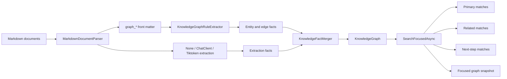

# Capability Graph Rules

## Purpose

Capability graph rules let callers build structured, sparse graphs from Markdown documents. They are intended for tool catalogs, workflow catalogs, and other corpora where a caller needs a small primary result set plus explainable related and next-step candidates.

## Flow

## Front Matter

- `graph_entities` / `graphEntities` adds explicit graph entities.
- `graph_edges` / `graphEdges` adds explicit assertions.
- `graph_groups` / `graphGroups` adds group entities and `kb:memberOf` edges from the current document.
- `graph_related` / `graphRelated` adds `kb:relatedTo` edges from the current document.
- `graph_next_steps` / `graphNextSteps` adds `kb:nextStep` edges from the current document.

Rule values can be strings or maps. Strings become node labels. Maps can use `id`, `label`, `name`, `type`, `sameAs`, `subject`, `predicate`, `object`, and `target` fields. Absolute IRIs are preserved, and labels become stable entity IRIs under the pipeline base URI.

## Search Behavior

`SearchFocusedAsync` returns:

- primary matches from token-distance search when the graph was built in Tiktoken mode
- primary matches from graph metadata search when no token index is present
- related matches from direct `kb:relatedTo` edges and shared `kb:memberOf` groups
- next-step matches from direct `kb:nextStep` edges
- a bounded focused graph snapshot containing selected matches plus explanatory group nodes

## Diagnostics

Malformed caller-authored rule entries are skipped with caller-visible build diagnostics. The pipeline reports invalid shapes, missing predicates, unsupported predicates, missing objects, and blank node references in `MarkdownKnowledgeBuildResult.Diagnostics` instead of silently dropping them.

## Test Matrix

| Case | Expected behavior |
| --- | --- |
| Capability front matter | Builds `kb:memberOf`, `kb:relatedTo`, and `kb:nextStep` edges |
| Focused search | Returns a small primary set before related or next-step candidates |
| Related expansion | Includes same-group and explicit related nodes |
| Next-step expansion | Includes explicit `kb:nextStep` nodes |
| Malformed rules | Reports skipped rule entries in build diagnostics |
| Focused export | Mermaid/DOT export includes only selected graph neighborhood and explanatory groups |

## Verification

- `dotnet test --solution MarkdownLd.Kb.slnx --configuration Release -- --treenode-filter "/*/*/*/Capability_graph_front_matter_builds_focused_search_with_related_and_next_step_results" --no-progress`
- `dotnet test --solution MarkdownLd.Kb.slnx --configuration Release`
