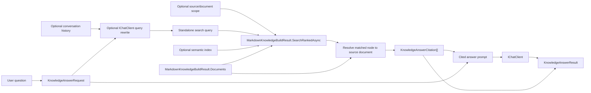

# Cited Knowledge Answering

## Purpose

Cited knowledge answering turns a built `MarkdownKnowledgeBuildResult` into a grounded answer with caller-visible citations. It provides RAG-style answering in the library without adding ASP.NET, PostgreSQL, pgvector, GitHub webhooks, conversation storage, or provider-specific OpenAI SDK dependencies.

The graph remains canonical. The answer service retrieves build-result ranked matches, resolves them back to original Markdown documents and chunks, builds cited context, and calls `Microsoft.Extensions.AI.IChatClient`.

## Flow



## Behaviour

1. `ChatClientKnowledgeAnswerService.AnswerAsync` requires a built result and a non-empty question.
2. If conversation history is supplied and `RewriteQuestionWithHistory` is true, the service asks `IChatClient` for a standalone search query before retrieval.
3. An empty rewritten query fails explicitly.
4. Retrieval uses `MarkdownKnowledgeBuildResult.SearchRankedAsync` with the caller-supplied `KnowledgeGraphRankedSearchOptions` and optional `KnowledgeGraphSemanticIndex`. BM25, graph, semantic, and hybrid ranked matches all flow through the same citation builder.
5. Build-result retrieval adds parsed Markdown chunk text to document candidates, so cited BM25 answers can use body-only evidence that is absent from front matter.
6. `AllowedSourcePaths` and `AllowedDocumentUris` can scope retrieval to a caller-selected subset of the built documents. Empty filter entries fail explicitly, and source/document scope intersects any existing `CandidateNodeIds` filter instead of widening it.
7. Citations are resolved from direct document matches or `prov:wasDerivedFrom` edges on matched graph nodes. Duplicate document URIs, multi-source entity provenance, and multi-source assertion provenance are resolved by evidence score so the citation points at the document chunk that best supports the match.
8. Citation snippets come from deterministic parsed Markdown chunks, with a bounded snippet length and a query-focused window when matched evidence appears deep in a chunk. If the graph label is stronger evidence than an unrelated body chunk, the citation uses the graph label rather than a misleading body snippet; one weak overlapping description token is not enough to override stronger label evidence.
9. A no-match query returns an answer result with empty citations and an explicit no-relevant-documents context in the chat prompt.
10. An empty answer from `IChatClient` fails explicitly.

## Boundary

- The library owns prompt assembly, graph retrieval, source resolution, and citation shaping.
- The host owns the concrete `IChatClient`, optional semantic embedding provider, user/session storage, API endpoint, UI, and channel integrations.
- The service does not mutate the graph, does not persist conversation state, and does not impose a conversation-history window. Callers decide how much history to pass.
- The service is an adapter over built graph state; it is not a replacement for SPARQL, schema-aware search, or graph contracts.

## Verification

```bash
dotnet test --solution MarkdownLd.Kb.slnx --configuration Release -- --treenode-filter "/*/*/KnowledgeAnswerServiceFlowTests/*"
dotnet test --solution MarkdownLd.Kb.slnx --configuration Release
```

Covered scenarios:

- direct answer with a source citation
- follow-up question rewrite before search
- BM25-ranked retrieval with source citation
- body-only BM25 retrieval with source citation
- focused snippets for long body chunks
- source/document-scoped retrieval
- source scope intersection with existing candidate filters
- duplicate document URI, multi-source entity provenance, and multi-source assertion provenance evidence selection
- no-match context with empty citations
- explicit failure for empty rewritten query
