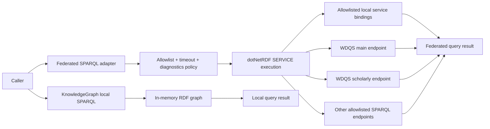
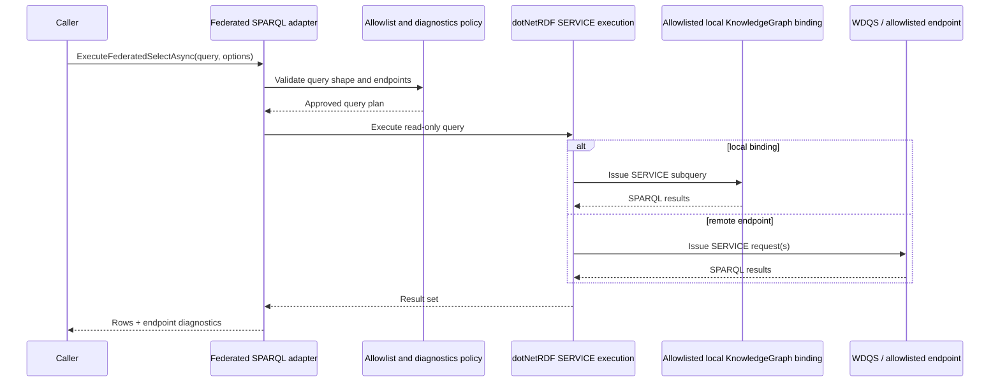

# Federated SPARQL Execution

## Purpose

Federated SPARQL execution adds an explicit adapter boundary for read-only `SERVICE` queries against remote SPARQL endpoints such as Wikidata Query Service and against caller-bound local in-memory graphs.

The canonical graph remains the local in-memory `KnowledgeGraph`. Federation is an opt-in query adapter for cases where the caller knowingly needs remote RDF data or a cross-endpoint join.

## Scope

In scope:

- explicit read-only federated query execution through `ExecuteFederatedSelectAsync` and `ExecuteFederatedAskAsync`
- endpoint allowlists and endpoint profiles
- deterministic local service bindings for multi-graph in-memory federation
- caller-visible endpoint diagnostics
- timeout and cancellation-aware behavior
- Wikidata-specific profiles for main and scholarly endpoints

Out of scope:

- automatic fallback from local search/query into federation
- hosted query services or background sync
- network-dependent graph build steps
- write/update access to remote SPARQL endpoints

## Package Baseline

- Keep `dotNetRdf` as the core RDF/SPARQL engine.
- Keep `dotNetRdf.Shacl` for SHACL validation.
- Do not add a Wikidata-specific NuGet package to the production library for this slice.
- Do not add `dotNetRdf.Client` separately unless the repository later narrows away from the `dotNetRdf` meta-package and still needs triple-store connector features.

Reason:

- dotNetRDF already parses and executes `SERVICE` clauses and already contains the query client types needed for endpoint calls.
- Wikidata-specific client packages target MediaWiki/Wikibase APIs, not the standards-first SPARQL federation boundary that this library exposes.

## Boundaries

## Rules

1. Federated execution must be explicit. The default local query methods remain local-only in their public contract.
2. Federated execution must remain read-only. Only `SELECT` and `ASK` are allowed.
3. The adapter must reject mutating verbs and unsafe SPARQL forms before execution.
4. The adapter must reject remote endpoints that are not explicitly allowlisted by the caller or by a named profile.
5. Local service bindings must also stay behind the same allowlist boundary; a bound in-memory graph must not bypass endpoint policy.
6. The adapter must expose caller-visible diagnostics that name each locally executed service endpoint.
7. The adapter must support cancellation and bounded timeout budgets.
8. Local query methods must reject top-level `SERVICE` clauses.
9. The adapter must reject variable or non-absolute local `SERVICE` specifiers.
10. Remote failures must fail closed by default.
11. The adapter must not automatically use legacy Wikidata full-graph endpoints as the default strategy.
12. The adapter must not change Markdown ingestion, graph build determinism, or local SPARQL execution semantics.

## Endpoint Profiles

### Wikidata Main

- Endpoint URI: `https://query.wikidata.org/sparql`
- Intended use: queries against the main WDQS graph
- Typical purpose: non-scholarly Wikidata entities

### Wikidata Scholarly

- Endpoint URI: `https://query-scholarly.wikidata.org/sparql`
- Intended use: queries against the scholarly WDQS graph
- Typical purpose: scholarly articles and closely related scholarly data

### Wikidata Main + Scholarly Federation

- Intended use: explicit caller-selected federation across the split WDQS graphs
- Default behavior: require the caller to choose this profile or enumerate both endpoints explicitly

## Main Flow

## Failure And Edge Flows

### Unallowlisted Endpoint

- Reject before execution.
- Return a caller-readable error that identifies the endpoint and the active allowlist/profile.

### Mutating Or Unsafe Query

- Reject before execution.
- Report the exact reason:
  - unsupported query verb
  - non-read-only operation
  - blocked federation usage in a local-only executor

### Timeout Or Cancellation

- Stop execution promptly.
- Surface the timeout/cancellation reason.
- Include the endpoint or endpoint set involved if known.

### Endpoint Drift Or Schema Drift

- Fail explicitly.
- Return endpoint diagnostics that let the caller distinguish transport failure from query/schema mismatch.

## System Behavior Notes

- The local graph remains authoritative for Markdown-derived knowledge.
- Federation supplements query-time access; it does not mutate the local graph automatically.
- Local service bindings give hosts and tests a deterministic way to federate across multiple in-memory graphs without network access.
- The adapter may expose endpoint profiles, but it does not own remote dataset semantics.
- Wikidata federation often needs explicit graph-shape knowledge and endpoint selection because WDQS split the main and scholarly graphs in 2025.

## Verification

- `dotnet build MarkdownLd.Kb.slnx --no-restore`
- `dotnet test --solution MarkdownLd.Kb.slnx --configuration Release`
- `dotnet format MarkdownLd.Kb.slnx --verify-no-changes`

Current verification focus:

- deterministic tests for query rejection before any HTTP call
- deterministic tests for endpoint allowlist enforcement
- deterministic tests for unsupported variable `SERVICE` specifiers
- deterministic tests for Wikidata profile selection
- deterministic tests for one-query multi-graph federation across five local graphs
- deterministic tests for federated `ASK` across multiple local graphs
- deterministic tests that local service bindings do not bypass the allowlist

## Definition Of Done

- The public API clearly distinguishes local SPARQL from federated SPARQL.
- The adapter is opt-in and read-only.
- Endpoint allowlist/profile behavior is explicit and testable.
- Endpoint diagnostics are caller-visible.
- Wikidata main/scholarly profile behavior is documented and testable.
- Deterministic local multi-graph federation is documented and testable.
- Local graph build determinism and local SPARQL semantics remain unchanged.
