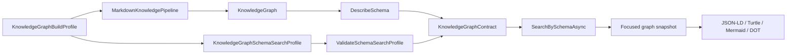

# Graph Creation Contracts

## Purpose

Graph creation contracts connect the graph build pipeline with schema-aware SPARQL search. A build can now carry a `KnowledgeGraphBuildProfile` that bundles graph build options, the recommended `KnowledgeGraphSchemaSearchProfile`, and optional SHACL shapes. The resulting `MarkdownKnowledgeBuildResult.Contract` describes the RDF shape that was actually produced and validates the bundled search profile against that graph.

This is what "self-describing graph" means in this library: the graph can expose its RDF types, predicates, literal predicates, resource predicates, and profile mismatch diagnostics without requiring the caller to guess the schema from documentation.

## Flow



## Public API

- `KnowledgeGraphBuildProfile`
- `MarkdownKnowledgePipelineOptions.BuildProfile`
- `MarkdownKnowledgeBuildResult.Contract`
- `KnowledgeGraph.DescribeSchema(...)`
- `KnowledgeGraph.ValidateSchemaSearchProfile(...)`
- `KnowledgeGraphContract.SerializeJson()`
- `KnowledgeGraphContract.SerializeYaml()`
- `KnowledgeGraphContract.LoadJson(...)`
- `KnowledgeGraphContract.LoadYaml(...)`
- `KnowledgeGraphContract.GenerateShacl()`
- `KnowledgeGraphSnapshot.SerializeJsonLd()`
- `KnowledgeGraphSnapshot.SerializeTurtle()`
- `KnowledgeGraphSnapshot.SerializeMermaidFlowchart()`
- `KnowledgeGraphSnapshot.SerializeDotGraph()`

## Build Profile Example

```csharp
var searchProfile = new KnowledgeGraphSchemaSearchProfile
{
    Prefixes = new Dictionary<string, string>(StringComparer.Ordinal)
    {
        ["ex"] = "https://kb.example/vocab/",
    },
    TypeFilters = ["ex:Capability"],
    TextPredicates =
    [
        new KnowledgeGraphSchemaTextPredicate("schema:name"),
        new KnowledgeGraphSchemaTextPredicate("ex:intent"),
    ],
};

var pipeline = new MarkdownKnowledgePipeline(new MarkdownKnowledgePipelineOptions
{
    ExtractionMode = MarkdownKnowledgeExtractionMode.None,
    BuildProfile = new KnowledgeGraphBuildProfile
    {
        Name = "capability-workflow",
        BuildOptions = new KnowledgeGraphBuildOptions(),
        SearchProfile = searchProfile,
    },
});

var result = await pipeline.BuildFromMarkdownAsync(markdown);

if (result.Contract.Validation.IsValid)
{
    var search = await result.Graph.SearchBySchemaAsync("restore cache", result.Contract.SearchProfile);
}
```

## Schema Introspection

`DescribeSchema` reads the actual in-memory RDF graph and returns:

- `RdfTypes`
- `Predicates`
- `LiteralPredicates`
- `ResourcePredicates`

`ValidateSchemaSearchProfile` checks that profile terms resolve and exist in the expected graph role. It reports missing type filters, missing literal predicates, missing resource relationship predicates, missing relationship target predicates, missing expansion predicates, missing facet predicates, and unknown prefixes.

## Focused Graph Export

Schema-aware search can return a focused graph. That snapshot can now be exported directly:

```csharp
var result = await graph.SearchBySchemaAsync("cache recovery", profile);

string jsonLd = result.FocusedGraph.SerializeJsonLd();
string turtle = result.FocusedGraph.SerializeTurtle();
string mermaid = result.FocusedGraph.SerializeMermaidFlowchart();
string dot = result.FocusedGraph.SerializeDotGraph();
```

The focused graph export is intended for result handoff to UI, agents, follow-up SPARQL, and external preprocessing steps.

## Production Handoff

Contract artifacts are the durable companion to generated JSON-LD. Store the graph JSON-LD together with `KnowledgeGraphContract.SerializeJson()` or `SerializeYaml()`. A later process can reload both, validate the graph with `GenerateShacl()`, and run `SearchBySchemaAsync` through the contract profile without repeating Markdown parsing or AI extraction.

For the full production flow, including generated JSON-LD, source-backed evidence, graph diffing, presets, and incremental manifests, see [Graph Production Pipeline](GraphProductionPipeline.md).

## Verification

```bash
dotnet test --solution MarkdownLd.Kb.slnx --configuration Release -- --treenode-filter "/*/*/GraphContractAndAdvancedSearchFlowTests/*" --no-progress
```

Covered scenarios:

- pipeline build profile returns a search-ready contract
- schema introspection describes actual RDF types and predicates
- profile validation reports missing terms
- advanced search profiles support all-terms mode, inbound relationships, property paths, and facets
- focused graph snapshots export to JSON-LD, Turtle, Mermaid, and DOT
