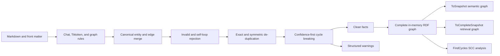

# Graph Normalization and Semantic Projection

## Purpose

Graph normalization protects the final Markdown-LD Knowledge Bank graph from malformed or duplicated model output without hiding what was removed. It also separates the semantic/operator graph from Tiktoken retrieval internals so a visualization does not turn one document into hundreds of section, n-gram topic, and nearest-segment connections.

The complete RDF graph remains available for SPARQL, persistence, and retrieval diagnostics. The safe default snapshot is the semantic projection.

## Flow



## Normalization Rules

- Exact edge identity uses canonical predicate IRI plus case-sensitive subject and object IRIs. `/A` and `/a` remain different nodes.
- Exact duplicates keep the maximum confidence and merge every provenance source.
- `kb:relatedTo` uses an unordered pair only for reverse-duplicate detection. The first authored direction is retained for existing RDF/SPARQL compatibility.
- Blank/malformed endpoints, unresolved predicates, non-finite or negative confidence values, and assertion self-loops are removed. Finite confidence above one is normalized to one with a warning so weighting-oriented extractors keep their relationship without emitting invalid assertion metadata.
- Duplicate, invalid, and self-referential entity `schema:sameAs` values are removed before and after alias merging.
- Entities with no usable label/absolute identity or with non-finite/negative confidence are removed; confidence above one is normalized with the same caller-visible policy as assertion confidence.
- Non-IRI assertion and entity provenance values are removed before RDF materialization.
- `kb:nextStep` is acyclic by default. Callers can add other acyclic predicates through `KnowledgeGraphNormalizationOptions.AcyclicPredicates`.
- Cycle breaking processes higher-confidence edges first, then stable ordinal edge identity. An edge is removed when adding it would close a directed path.
- Each removal produces a `KnowledgeGraphNormalizationWarning`; pipeline and facade callers receive the typed `KnowledgeGraphNormalizationReport` and the existing string `Diagnostics` stream.

## Cycle Analysis

`KnowledgeGraph.FindCycles()` analyzes `kb:nextStep` by default. `KnowledgeGraphCycleSearchOptions.PredicateIds` can select other predicates, including `kb:relatedTo`, without changing normalization policy.

The result contains bounded strongly connected components with stable node and edge IDs. SCC analysis is linear in graph size and avoids exponential enumeration of every simple cycle.

## Snapshot Scopes

- `ToSnapshot()` is the default semantic/operator projection.
- `ToSemanticSnapshot()` is the explicit equivalent.
- `ToCompleteSnapshot()` includes Tiktoken sections, segments, topics, and retrieval-neighbor edges.
- Turtle and JSON-LD serialization remain complete RDF exchange formats.
- Instance Mermaid and DOT diagram export uses the semantic projection. To diagram retrieval internals deliberately, serialize `ToCompleteSnapshot()` through the static snapshot serializer.

The semantic projection removes nodes in the repository-owned `token-section/`, `token-segment/`, and `token-topic/` namespaces and every incident edge. Authored entity hints and relationships remain, so a UI can use `KnowledgeGraphEdge.SubjectId` and `ObjectId` to focus and highlight a selected related node.

## Testing Methodology

Flow-level TUnit tests build real graphs from configured rules, malformed low-level facts, duplicate chat output, and Tiktoken Markdown. They assert normalized facts, structured warnings, SPARQL topology, one-time assertion reification, SCC results, case-sensitive URI identity, safe default snapshots, explicit complete snapshots, stable navigation IDs, and continued token-distance retrieval.

Focused proof:

```bash
dotnet test --solution MarkdownLd.Kb.slnx --configuration Release -- --treenode-filter "/*/*/GraphNormalizationFlowTests/*"
```

The full Release suite and repository coverage command remain required. Changed production code and critical public contracts must reach at least 95% line coverage.
