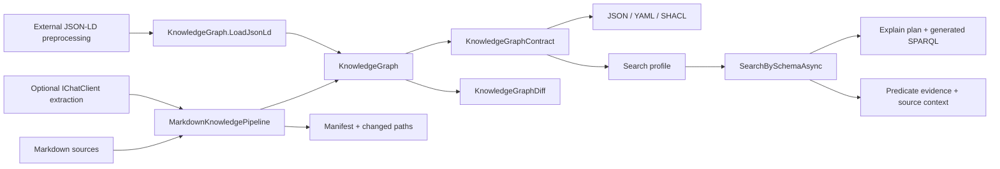

# Graph Production Pipeline

## Purpose

The production pipeline turns a Markdown or preprocessed JSON-LD corpus into a self-describing RDF graph that can be searched through schema-aware SPARQL. The same library contracts cover locally generated graphs, externally generated JSON-LD, AI-assisted extraction through `IChatClient`, generated SHACL, diffing, and incremental rebuild diagnostics.

## Flow



## Contract Artifacts

`MarkdownKnowledgeBuildResult.Contract` describes the graph that was actually built. It includes RDF types, predicates, the recommended schema-aware search profile, validation diagnostics, and optional SHACL.

```csharp
var pipeline = new MarkdownKnowledgePipeline(new MarkdownKnowledgePipelineOptions
{
    BuildProfile = KnowledgeGraphBuildProfiles.Documentation,
});

var result = await pipeline.BuildFromDirectoryAsync("/absolute/path/to/docs");

string contractJson = result.Contract.SerializeJson();
string contractYaml = result.Contract.SerializeYaml();

var fromJson = KnowledgeGraphContract.LoadJson(contractJson);
var fromYaml = KnowledgeGraphContract.LoadYaml(contractYaml);
```

Use the contract as the handoff between preprocessing and querying. If an app or agent builds the graph ahead of time, store the JSON-LD graph plus the JSON/YAML contract. A later process can load both and search without rerunning extraction.

## Generating JSON-LD

When the library owns preprocessing:

```csharp
var result = await pipeline.BuildFromDirectoryAsync("/absolute/path/to/docs");
await result.Graph.SaveJsonLdToFileAsync("/absolute/path/to/graph.jsonld");
```

When another process owns preprocessing, it only needs to emit RDF-compatible JSON-LD that matches the contract profile:

```csharp
var graph = await KnowledgeGraph.LoadJsonLdFromFileAsync("/absolute/path/to/preprocessed.jsonld");
var contract = KnowledgeGraphContract.LoadYaml(File.ReadAllText("/absolute/path/to/contract.yaml"));
var search = await graph.SearchBySchemaAsync("restore cache", contract.SearchProfile);
```

For AI-assisted preprocessing, keep provider code outside the graph runtime and use the `IChatClient` boundary:

```csharp
var pipeline = new MarkdownKnowledgePipeline(new MarkdownKnowledgePipelineOptions
{
    ChatClient = chatClient,
    ExtractionMode = MarkdownKnowledgeExtractionMode.ChatClient,
    BuildProfile = KnowledgeGraphBuildProfiles.CapabilityWorkflow,
});
```

The runtime still receives deterministic `MarkdownSourceDocument` inputs and produces an in-memory `KnowledgeGraph`.

## Generated SHACL

`KnowledgeGraphContract.GenerateShacl()` creates Turtle SHACL from the search contract. Required text predicates and facet filters become required property shapes. Relationship and expansion predicates are included as optional IRI property constraints.

```csharp
string shapes = result.Contract.GenerateShacl();
var report = result.Graph.ValidateShacl(shapes);

if (!report.Conforms)
{
    foreach (var issue in report.Results)
    {
        Console.WriteLine(issue.Message);
    }
}
```

Use this to fail fast when an externally generated JSON-LD file does not satisfy the search profile.

## Explain And Evidence

Schema-aware search returns the generated SPARQL and a structured explain plan:

```csharp
var search = await graph.SearchBySchemaAsync("restore cache", contract.SearchProfile);

Console.WriteLine(search.Explain.GeneratedSparql);
Console.WriteLine(search.Explain.TermMode);
Console.WriteLine(search.Matches[0].Evidence[0].PredicateId);
Console.WriteLine(search.Matches[0].Evidence[0].SourceContexts[0].SourceId);
```

Evidence source context comes from `prov:wasDerivedFrom` triples on matched subjects and, for relationship evidence, on the related node that supplied the matched literal. This lets callers show which document or preprocessor source produced the match instead of only naming the result node.

## Federated Search

Federated schema search uses the same profile model, but `FederatedServiceEndpoints` and `FederatedSparqlExecutionOptions` decide which endpoints are allowed. The generated query uses explicit SPARQL `SERVICE` blocks and still returns `Explain` plus endpoint diagnostics.

```csharp
var profile = contract.SearchProfile with
{
    FederatedServiceEndpoints =
    [
        new Uri("https://kb.example/services/runbooks"),
    ],
};

var result = await graph.SearchBySchemaFederatedAsync("restore cache", profile, federatedOptions);
```

Use local service bindings when the "federated" graph slices are already in memory:

```csharp
var options = new FederatedSparqlExecutionOptions
{
    AllowedServiceEndpoints =
    [
        new Uri("https://kb.example/services/runbooks"),
    ],
    LocalServiceBindings =
    [
        new FederatedSparqlLocalServiceBinding(
            new Uri("https://kb.example/services/runbooks"),
            runbookGraph),
    ],
};
```

For detailed raw SPARQL, schema-aware search, local binding, remote endpoint, and failure examples, see [Federated SPARQL Execution](FederatedSparqlExecution.md).

## Diff And Incremental Builds

Use graph diff when comparing two materialized graphs:

```csharp
var diff = previousGraph.Diff(currentGraph);

foreach (var changed in diff.ChangedLiteralEdges)
{
    Console.WriteLine($"{changed.PredicateId}: {changed.OldValue} -> {changed.NewValue}");
}
```

Use incremental builds when the caller needs changed-path diagnostics. The implementation rebuilds the in-memory graph deterministically, returns a source manifest, reports changed and removed paths, and optionally diffs against the previous graph.

```csharp
var first = await pipeline.BuildIncrementalAsync(sources);
var next = await pipeline.BuildIncrementalAsync(updatedSources, first.Manifest, first.BuildResult.Graph);

Console.WriteLine(next.ChangedPaths.Count);
Console.WriteLine(next.Diff.ChangedLiteralEdges.Count);
```

Persist the manifest between process runs when the next build will happen later:

```csharp
await next.Manifest.SaveJsonToFileAsync("/absolute/path/to/graph.manifest.json");

var previousManifest = await KnowledgeGraphSourceManifest.LoadJsonFromFileAsync(
    "/absolute/path/to/graph.manifest.json");
```

## Presets

`KnowledgeGraphBuildProfiles` provides ready-made profiles for common graph shapes:

- `Documentation`
- `CapabilityWorkflow`
- `Runbook`
- `DecisionLog`
- `ServiceCatalog`

Presets are starting points. For domain graphs, prefer an explicit `KnowledgeGraphSchemaSearchProfile` with your prefixes, type filters, predicates, property paths, facets, and federation endpoints.

## Verification

```bash
dotnet test --project tests/MarkdownLd.Kb.Tests/MarkdownLd.Kb.Tests.csproj --configuration Release -- --treenode-filter "/*/*/GraphProductionPipelineFlowTests/*"
```

Covered scenarios:

- contract JSON/YAML artifact round-trip
- generated SHACL over valid and invalid JSON-LD
- schema-aware SPARQL explain plan and source-backed evidence
- graph diff for added, removed, and changed literal edges
- preset profile search
- incremental manifest, changed paths, and graph diff
