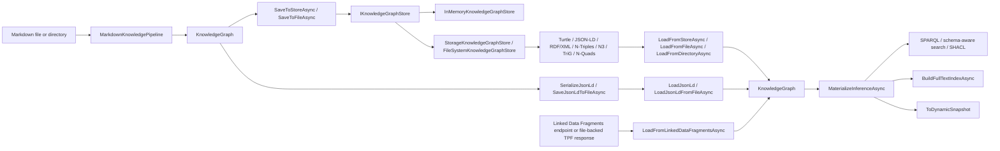
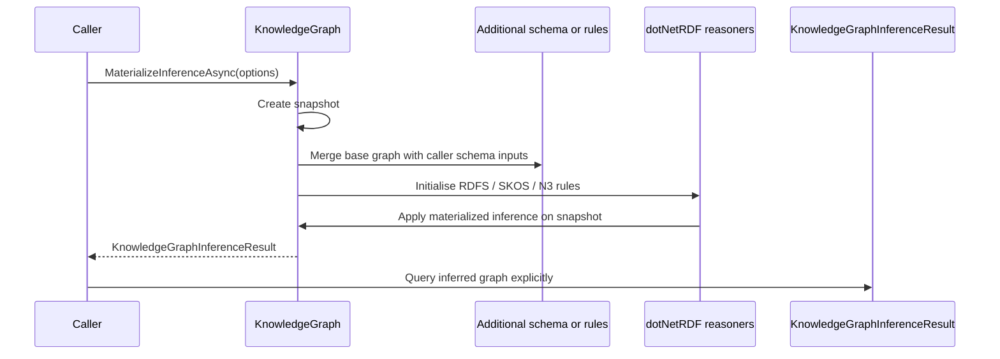
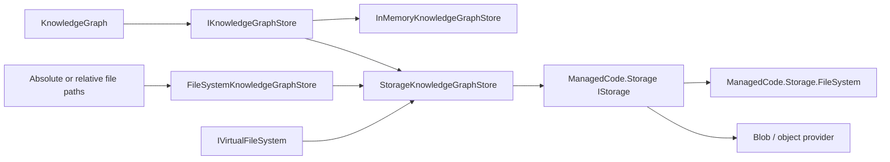

# Graph Runtime Lifecycle

Date: 2026-04-23

## Purpose

Markdown-LD Knowledge Bank now exposes a fuller graph runtime lifecycle over the Markdown-derived `KnowledgeGraph`:

- build a graph from one Markdown file, a directory, or in-memory Markdown
- persist the graph through a graph-store abstraction and reload it later
- generate JSON-LD and reload it through explicit JSON-LD helpers
- materialize RDFS, SKOS, and optional N3-rule inference in memory
- build optional full-text and dynamic adapters over the resulting graph
- materialize a read-only Linked Data Fragments source into a local `KnowledgeGraph`

The canonical graph remains library-owned and in memory. Persistence, inference, full-text, dynamic access, and LDF import are explicit runtime adapters around that graph. RDF serialization stays in this repository; filesystem/blob transport goes through `ManagedCode.Storage`.

## Flow

## Public Runtime Surface

- `MarkdownKnowledgePipeline.BuildFromFileAsync(...)`
- `MarkdownKnowledgePipeline.BuildFromDirectoryAsync(...)`
- `KnowledgeGraph.SaveToStoreAsync(...)`
- `KnowledgeGraph.SaveToFileAsync(...)`
- `KnowledgeGraph.SerializeJsonLd()`
- `KnowledgeGraph.LoadJsonLd(...)`
- `KnowledgeGraph.SaveJsonLdToStoreAsync(...)`
- `KnowledgeGraph.SaveJsonLdToFileAsync(...)`
- `KnowledgeGraph.LoadJsonLdFromStoreAsync(...)`
- `KnowledgeGraph.LoadJsonLdFromFileAsync(...)`
- `KnowledgeGraph.LoadFromStoreAsync(...)`
- `KnowledgeGraph.LoadFromFileAsync(...)`
- `KnowledgeGraph.LoadFromDirectoryAsync(...)`
- `KnowledgeGraph.LoadFromLinkedDataFragmentsAsync(...)`
- `KnowledgeGraph.DescribeSchema(...)`
- `KnowledgeGraph.ValidateSchemaSearchProfile(...)`
- `KnowledgeGraph.SearchBySchemaAsync(...)`
- `KnowledgeGraph.SearchBySchemaFederatedAsync(...)`
- `KnowledgeGraph.MaterializeInferenceAsync(...)`
- `KnowledgeGraph.BuildFullTextIndexAsync(...)`
- `KnowledgeGraph.ToDynamicSnapshot()`

## Inference Behavior

Inference is materialized explicitly and never applied silently to the canonical built graph.

`KnowledgeGraphInferenceOptions` supports:

- built-in RDFS reasoning
- built-in SKOS hierarchy reasoning
- caller-supplied schema files or inline schema text
- caller-supplied N3 rule files or inline rule text

## Linked Data Fragments Boundary

Linked Data Fragments support is explicit and materializes fragment data into a local `KnowledgeGraph`. This keeps the rest of the runtime uniform: once loaded, callers use the same local SPARQL, search, SHACL, persistence, and inference APIs.

The adapter wraps `dotNetRdf.Ldf` and is intended for read-only fragment sources. It does not turn the library into a hosted graph server or mutable remote store.

Transport ownership stays with the caller. `KnowledgeGraphLinkedDataFragmentsOptions.HttpClient` accepts an already configured `HttpClient`; host applications may create it directly or obtain it from `IHttpClientFactory`, but the core library does not depend on `IHttpClientFactory`.

## Graph Store Boundary

`IKnowledgeGraphStore` is now the canonical persistence boundary for caller-visible graph storage.

Built-in implementations:

- `InMemoryKnowledgeGraphStore` for process-local persistence
- `StorageKnowledgeGraphStore` for any configured `IStorage`
- `FileSystemKnowledgeGraphStore` for local file-path convenience over `ManagedCode.Storage.FileSystem`

## Testing Methodology

Flow tests cover:

- one Markdown file on disk becoming a queryable graph
- a directory corpus becoming a merged graph
- graph-store round-trips through in-memory, filesystem, keyed DI, and VFS-backed registrations
- JSON-LD text, file, and store round-trips into queryable/searchable graphs
- RDF file round-trips through public file convenience APIs
- inference changing caller-visible SPARQL results
- full-text and dynamic adapters over the inferred graph
- file-backed Linked Data Fragments materialization into a local queryable graph

Verification commands:

- `dotnet build MarkdownLd.Kb.slnx --no-restore`
- `dotnet test --solution MarkdownLd.Kb.slnx --configuration Release`
- `dotnet format MarkdownLd.Kb.slnx --verify-no-changes`
- coverage command from the root `AGENTS.md`
