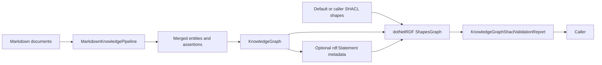
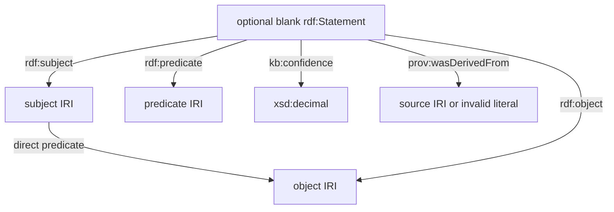

# Graph SHACL Validation

Date: 2026-04-15

## Purpose

Markdown-LD Knowledge Bank validates built RDF graphs with SHACL so callers can detect malformed graph construction through a standards-based report instead of custom post-processing.

The feature uses `dotNetRdf.Shacl` over the in-memory `KnowledgeGraph`. It does not add a server, database, cache, provider SDK, or Python runtime.

## Flow

## Default Shapes

The built-in shapes graph validates:

- `schema:Article` nodes have `schema:name` and IRI provenance.
- common entity classes have `schema:name`.
- `schema:sameAs` values are IRIs.
- `prov:wasDerivedFrom` values are IRIs.
- reified `rdf:Statement` assertion metadata, when included, has one IRI subject, predicate, object, and a decimal `kb:confidence` from 0 through 1.

Callers can pass custom Turtle SHACL shapes to `KnowledgeGraph.ValidateShacl(shapesTurtle)` or `MarkdownKnowledgeBuildResult.ValidateShacl(shapesTurtle)`.

## Assertion Metadata

Graph assertions remain direct RDF edges for existing SPARQL/search callers. RDF reification metadata is optional and controlled by `KnowledgeGraphBuildOptions.IncludeAssertionReification`.

Invalid caller-authored `sameAs` and provenance values are represented as literals so SHACL can report node-kind violations instead of silently dropping them.

## Testing Methodology

Flow tests cover:

- valid Markdown and configured graph rules conform to the default shapes;
- invalid `schema:sameAs`, provenance, and assertion confidence produce SHACL results;
- caller-supplied shapes validate the same built graph;
- sameAs-first entity merge rewrites assertion endpoints before validation.

Verification commands:

- `dotnet build MarkdownLd.Kb.slnx --no-restore`
- `dotnet test --solution MarkdownLd.Kb.slnx --configuration Release`
- `dotnet format MarkdownLd.Kb.slnx --verify-no-changes`
- coverage command from the root `AGENTS.md`
