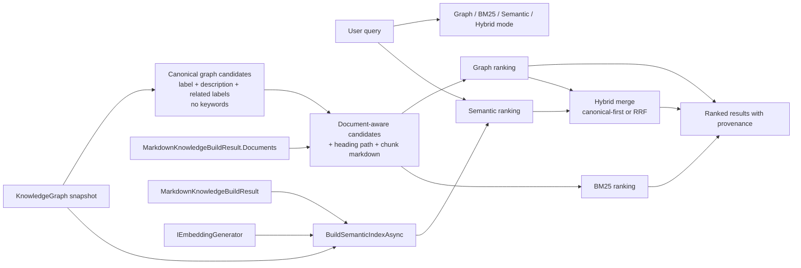

# Hybrid Graph Search

## Purpose

Ranked graph search supports graph-native exact matching, in-memory BM25 lexical ranking, optional semantic ranking, and hybrid graph/semantic retrieval.

The graph remains canonical. Graph-only callers rank graph-native text. Build-result and facade callers can rank document-aware text that appends parsed Markdown body chunks to the document node candidate without changing the RDF graph.

## Flow

## Modes

- `Graph`: rank only graph-native matches from `schema:name`, `schema:description`, and graph-related labels such as `schema:mentions` and `schema:about`.
- `Bm25`: rank candidates with an in-memory BM25 lexical score. `KnowledgeGraph.SearchRankedAsync` uses graph-native labels, descriptions, and related labels. `MarkdownKnowledgeBuildResult.SearchRankedAsync`, `MarkdownKnowledgeBankBuild.SearchAsync`, and cited answering add parsed Markdown body chunks for body-only evidence. Exact BM25 counts only selected query terms with span-based lookup and pooled per-query statistics. `EnableFuzzyTokenMatching` can opt into bounded edit-distance token matching for typo-tolerant BM25 queries; fuzzy BM25 builds full candidate term dictionaries only when it needs to enumerate typo candidates.
- `Semantic`: rank only semantic matches from the optional semantic index.
- `Hybrid`: combine graph-ranked and semantic-ranked matches. The default strategy keeps graph-ranked results first and appends semantic-only fallback matches only when graph recall is insufficient.

## Behavior

- `schema:keywords` are excluded from canonical ranking.
- BM25 mode does not require an embedding provider, semantic index, Lucene index, or database.
- Build-result BM25 can find body-only terms that are absent from title, summary, and front matter.
- Fuzzy BM25 token matching is opt-in through `KnowledgeGraphRankedSearchOptions.EnableFuzzyTokenMatching`, `MaxFuzzyEditDistance`, and `MinimumFuzzyTokenLength`. It handles insertion, deletion, and substitution typos with common-affix trimming, stack-backed bit-vector masks for short residual tokens, and a pooled bounded banded dynamic-programming fallback for longer residual tokens. It does not use platform-specific SIMD intrinsics.
- A hit present in both graph and semantic ranking is marked as merged and keeps its graph-first position.
- Semantic-only hits never outrank canonical graph hits in hybrid mode.
- `KnowledgeGraphHybridFusionStrategy.ReciprocalRank` is opt-in. It applies reciprocal rank fusion across graph and semantic result lists while preserving the canonical and semantic component scores for diagnostics.
- `SearchFocusedAsync` can use hybrid primary matching when `KnowledgeGraphFocusedSearchOptions.SemanticIndex` is supplied.
- `MarkdownKnowledgeBuildResult.BuildSemanticIndexAsync` builds the optional semantic index from the same document-aware candidates used by build-result ranked search.
- Calling `Semantic` or `Hybrid` mode without a semantic index fails explicitly.

## Intended Library Boundary

- The library owns the graph-native candidate extraction and merge policy.
- BM25 ranking is in-memory and uses the same candidate text as semantic indexing for the selected boundary: graph-native for graph-only callers, document-aware for build-result/facade callers. Exact BM25 keeps the allocation profile close to ranked graph search by avoiding full per-document dictionaries. Optional fuzzy token matching is implemented inside this library, does not add an external package dependency, and follows public bounded edit-distance algorithms with our own implementation.
- The host application owns the concrete embedding provider and supplies it as `Microsoft.Extensions.AI.IEmbeddingGenerator<string, Embedding<float>>`.
- The library does not own a vector database, gateway endpoint, or hosted ranking infrastructure.

## Verification

- `dotnet test --solution MarkdownLd.Kb.slnx --configuration Release -- --treenode-filter "/*/*/HybridGraphSearchFlowTests/*" --no-progress`
- `dotnet test --solution MarkdownLd.Kb.slnx --configuration Release`
