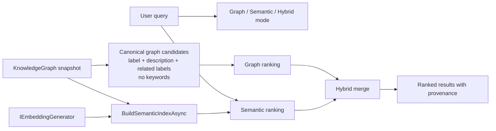

# Hybrid Graph Search

## Purpose

Hybrid graph search solves the case where the graph language and the user query language differ.

The graph remains canonical. Semantic vectors are optional fallback or merge inputs built from graph-native text, not an alternative source of truth.

## Flow

## Modes

- `Graph`: rank only graph-native matches from `schema:name`, `schema:description`, and graph-related labels such as `schema:mentions` and `schema:about`.
- `Semantic`: rank only semantic matches from the optional semantic index.
- `Hybrid`: keep graph-ranked results first and append semantic-only fallback matches only when graph recall is insufficient.

## Behavior

- `schema:keywords` are excluded from canonical ranking.
- A hit present in both graph and semantic ranking is marked as merged and keeps its graph-first position.
- Semantic-only hits never outrank canonical graph hits in hybrid mode.
- `SearchFocusedAsync` can use hybrid primary matching when `KnowledgeGraphFocusedSearchOptions.SemanticIndex` is supplied.
- Calling `Semantic` or `Hybrid` mode without a semantic index fails explicitly.

## Intended Library Boundary

- The library owns the graph-native candidate extraction and merge policy.
- The host application owns the concrete embedding provider and decides whether to call `Graph`, `Semantic`, or `Hybrid`.
- The library does not own a vector database, gateway endpoint, or hosted ranking infrastructure.

## Verification

- `dotnet test --solution MarkdownLd.Kb.slnx --configuration Release -- --treenode-filter "/*/*/HybridGraphSearchFlowTests/*" --no-progress`
- `dotnet test --solution MarkdownLd.Kb.slnx --configuration Release`
