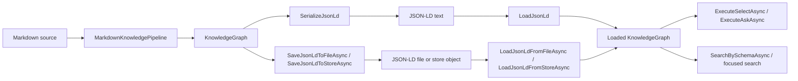

# JSON-LD Graph Round Trip

Date: 2026-05-01

## Purpose

JSON-LD is a first-class RDF exchange format for Markdown-LD Knowledge Bank. Callers can generate JSON-LD from a built `KnowledgeGraph`, load JSON-LD text or files back into a new `KnowledgeGraph`, and then use the normal SPARQL and graph search APIs.

JSON-LD is not a separate search index. Search remains graph-native over the loaded in-memory RDF graph.

## Flow



## Public API

- `KnowledgeGraph.SerializeJsonLd()`
- `KnowledgeGraph.LoadJsonLd(string jsonLd)`
- `KnowledgeGraph.SaveJsonLdToFileAsync(...)`
- `KnowledgeGraph.LoadJsonLdFromFileAsync(...)`
- `KnowledgeGraph.SaveJsonLdToStoreAsync(...)`
- `KnowledgeGraph.LoadJsonLdFromStoreAsync(...)`

The file and store helpers force JSON-LD format explicitly, so callers do not need `.jsonld` extension inference when their storage location uses an opaque key.

## Supported Inputs

Markdown build inputs come through `KnowledgeSourceDocumentConverter`. It accepts `.md`, `.markdown`, `.mdx`, `.txt`, `.text`, `.log`, `.csv`, `.json`, `.jsonl`, `.yaml`, and `.yml` as text-like knowledge sources.

Graph load inputs are RDF serializations. The runtime can load Turtle (`.ttl`), JSON-LD (`.jsonld`, `.json`), RDF/XML (`.rdf`, `.xml`), N-Triples (`.nt`), Notation3 (`.n3`), TriG (`.trig`), and N-Quads (`.nq`). Use explicit JSON-LD helpers when a path or storage object key has no meaningful extension.

## How To Generate JSON-LD Files

### Metadata-Only Build

Use this when Markdown front matter and deterministic graph rules are enough.

```csharp
var pipeline = new MarkdownKnowledgePipeline(
    new Uri("https://kb.example/"),
    extractionMode: MarkdownKnowledgeExtractionMode.None);

var result = await pipeline.BuildFromDirectoryAsync(
    "/absolute/path/to/content",
    searchPattern: "*.md");

await result.Graph.SaveJsonLdToFileAsync("/absolute/path/to/output/kb.jsonld");
```

### `IChatClient` Extraction Build

Use this when body content should produce extracted entities and assertions. The host supplies the concrete model provider as an `IChatClient`; the core library remains provider-neutral.

```csharp
var pipeline = new MarkdownKnowledgePipeline(new MarkdownKnowledgePipelineOptions
{
    BaseUri = new Uri("https://kb.example/"),
    ChatClient = chatClient,
    ChatModelId = "host-selected-model",
    ExtractionMode = MarkdownKnowledgeExtractionMode.ChatClient,
    ExtractionCache = new FileKnowledgeExtractionCache("/absolute/path/to/cache"),
});

var result = await pipeline.BuildFromDirectoryAsync(
    "/absolute/path/to/content",
    searchPattern: "*.md");

await result.Graph.SaveJsonLdToFileAsync("/absolute/path/to/output/kb.jsonld");
```

Cache use is optional. When enabled, the cache key includes document identity, chunk fingerprints, chunker profile, prompt version, and model identity so stale extraction reuse remains explicit.

### External Preprocessing

If another service or batch job performs preprocessing, it can write JSON-LD directly. Load it without rebuilding Markdown:

```csharp
var graph = await KnowledgeGraph.LoadJsonLdFromFileAsync("/absolute/path/to/preprocessed.payload");
var profile = new KnowledgeGraphSchemaSearchProfile
{
    Prefixes = new Dictionary<string, string>(StringComparer.Ordinal)
    {
        ["ex"] = "https://kb.example/vocab/",
    },
    TypeFilters = ["ex:Capability"],
    TextPredicates =
    [
        new KnowledgeGraphSchemaTextPredicate("schema:name"),
        new KnowledgeGraphSchemaTextPredicate("ex:intent"),
    ],
};

var matches = await graph.SearchBySchemaAsync("deployment workflow", profile);
```

The external JSON-LD must parse as RDF. Any valid RDF shape is queryable with SPARQL. For application search, define a `KnowledgeGraphSchemaSearchProfile` that names the emitted schema instead of relying on the compatibility `SearchAsync` helper. External preprocessors should emit:

- stable absolute IRIs for documents and entities;
- at least one concrete RDF type per searchable subject;
- labels and domain literals named by `TextPredicates`;
- related-node literals named by `RelationshipPredicates`;
- relationship predicates such as `schema:mentions`, `schema:about`, `kb:relatedTo`, and `kb:nextStep` when graph expansion matters.

## Federated Query Workflow

JSON-LD files can stay separate and still be queried together. Load each preprocessed JSON-LD file into a `KnowledgeGraph`, bind each graph to an allowlisted local service endpoint, and execute either raw federated SPARQL or `SearchBySchemaFederatedAsync` with the same service endpoints.

```csharp
var policyGraph = await KnowledgeGraph.LoadJsonLdFromFileAsync("/absolute/path/to/policy.payload");
var runbookGraph = await KnowledgeGraph.LoadJsonLdFromFileAsync("/absolute/path/to/runbook.payload");

var options = new FederatedSparqlExecutionOptions
{
    AllowedServiceEndpoints =
    [
        new Uri("https://kb.example/services/policy"),
        new Uri("https://kb.example/services/runbook"),
    ],
    LocalServiceBindings =
    [
        new FederatedSparqlLocalServiceBinding(new Uri("https://kb.example/services/policy"), policyGraph),
        new FederatedSparqlLocalServiceBinding(new Uri("https://kb.example/services/runbook"), runbookGraph),
    ],
};

var result = await policyGraph.ExecuteFederatedSelectAsync(
    """
    PREFIX schema: <https://schema.org/>
    SELECT ?policyTitle ?runbookTitle WHERE {
      SERVICE <https://kb.example/services/policy> {
        ?policy schema:name ?policyTitle .
      }
      SERVICE <https://kb.example/services/runbook> {
        ?runbook schema:name ?runbookTitle .
      }
    }
    """,
    options);
```

This local service-binding path is deterministic and network-free. Remote `SERVICE` federation is still available, but it must be explicitly allowlisted or selected through a named profile.

## Operational Notes

- JSON-LD is an exchange format, not a required search index.
- `LoadJsonLd(...)` is useful when the caller already has JSON-LD text in memory.
- `LoadJsonLdFromFileAsync(...)` and `LoadJsonLdFromStoreAsync(...)` are safer than extension inference for opaque object-storage keys.
- `LoadFromDirectoryAsync(...)` can merge mixed RDF serializations when a preprocessing job emits multiple graph files.
- Empty JSON-LD content fails explicitly.

## Testing Methodology

Flow tests cover:

- Markdown build to graph.
- JSON-LD text generation and `LoadJsonLd` reload.
- Explicit file/store JSON-LD save and load without extension inference.
- SPARQL and schema-aware search against loaded graphs.
- Explicit rejection of empty JSON-LD content.

Verification command:

```bash
dotnet test --solution MarkdownLd.Kb.slnx --configuration Release -- --treenode-filter "/*/*/JsonLdRoundTripFlowTests/*" --no-progress
```
