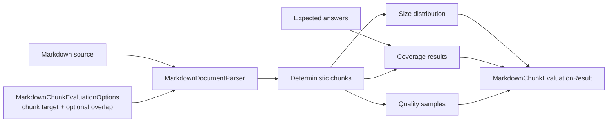

# Markdown Chunk Evaluation

## Purpose

Markdown chunk evaluation gives callers deterministic feedback while tuning chunking options. It reports chunk-size distribution, expected-answer coverage, and review samples without embeddings, a database, or a hosted indexer.

## Flow



## Behaviour

- `MarkdownChunkEvaluator.Evaluate` parses Markdown with the configured chunking options and returns one evaluation result.
- `AnalyzeDocument` accepts an already parsed `MarkdownDocument` when callers want to reuse parser output.
- `MarkdownChunkingOptions.ChunkOverlapTokenTarget` is opt-in and carries whole trailing blocks into the next chunk without splitting code blocks, tables, HTML blocks, or other Markdig block boundaries.
- Chunk budget estimates treat Han ideographs, Japanese kana, Korean Hangul, CJK symbols, and fullwidth forms as denser token ranges than Latin text.
- Coverage checks whether expected answer text appears in at least one deterministic chunk.
- Empty coverage questions, empty expected answers, inverted token thresholds, and invalid chunk budgets fail explicitly.
- Quality samples are deterministic by seed and include abrupt-start and abrupt-end hints for human review.
- The evaluator is a tuning aid; it is not a semantic search benchmark and does not call `IEmbeddingGenerator`.

## Verification

```bash
dotnet test --solution MarkdownLd.Kb.slnx --configuration Release -- --treenode-filter "/*/*/MarkdownChunkEvaluationFlowTests/*"
dotnet test --solution MarkdownLd.Kb.slnx --configuration Release
```
