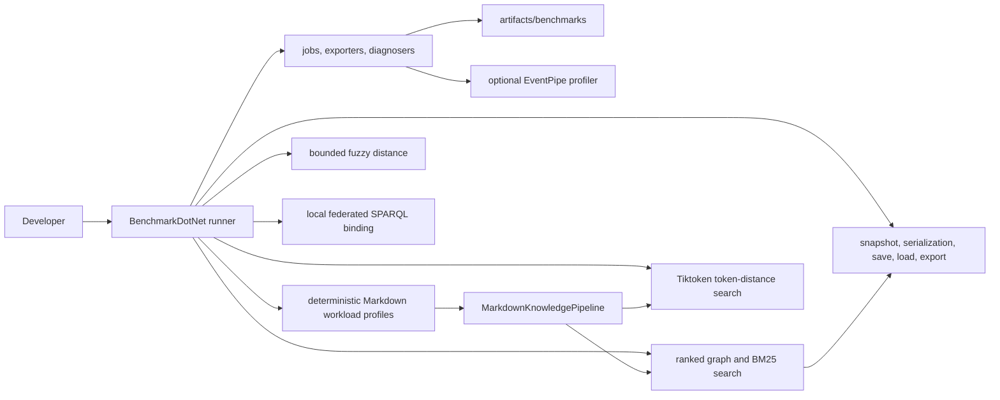

# Performance Benchmarks

Markdown-LD Knowledge Bank keeps correctness tests and performance measurements separate. TUnit flow tests prove behaviour; BenchmarkDotNet measures runtime, allocation, scaling, and profiler traces for the hot paths.

## Benchmark Boundaries



The benchmark project is `benchmarks/MarkdownLd.Kb.Benchmarks`. It references the production library, but production and test projects do not reference it.

## Suites

| Suite | Measures |
| --- | --- |
| `FuzzyEditDistanceBenchmarks` | Bounded bit-vector/banded edit distance against a naive Levenshtein baseline for short typo and long affix-heavy tokens. |
| `GraphBuildBenchmarks` | Markdown source to in-memory graph build time across named workload profiles. |
| `GraphSearchBenchmarks` | Graph-ranked search, BM25, BM25 fuzzy matching, schema search, focused search, and local federated schema search. |
| `TiktokenSearchBenchmarks` | Exact token-distance search and fuzzy query correction over long-document and multilingual token-heavy graphs. |
| `GraphPersistenceBenchmarks` | Snapshot creation, Turtle/JSON-LD serialization, Mermaid/DOT export, in-memory store save/load, and file save/load. |
| `GraphLifecycleBenchmarks` | One broad build/search/save/load/export lifecycle benchmark for the complete suite. |

## Workload Profiles

Benchmark parameters use named workload profiles instead of raw document-count ranges.

| Profile | Shape | Why it exists |
| --- | --- | --- |
| `ShortDocuments` | 250 compact runbook-like Markdown documents. | Normal knowledge-base retrieval and persistence pressure. |
| `LongDocuments` | 80 long recovery playbooks with repeated sections. | Long body and chunk-scan pressure without pretending the main variable is file count. |
| `LargeCorpus` | 1000 compact documents. | Scale pressure for graph build, snapshot, serialization, save, and load paths. |
| `TokenizedMultilingual` | 250 token-heavy multilingual/CJK documents. | Tiktoken and fuzzy query-correction behaviour on non-trivial tokenization input. |
| `FederatedRunbooks` | 250 SPARQL/service/runbook documents. | Local federated schema-search and service-binding query plans. |

## Commands

```bash
dotnet run --project benchmarks/MarkdownLd.Kb.Benchmarks -c Release -- --list flat
dotnet run --project benchmarks/MarkdownLd.Kb.Benchmarks -c Release -- --filter "*FuzzyEditDistanceBenchmarks*"
dotnet run --project benchmarks/MarkdownLd.Kb.Benchmarks -c Release -- --filter "*GraphBuildBenchmarks*"
dotnet run --project benchmarks/MarkdownLd.Kb.Benchmarks -c Release -- --filter "*GraphSearchBenchmarks*"
dotnet run --project benchmarks/MarkdownLd.Kb.Benchmarks -c Release -- --filter "*TiktokenSearchBenchmarks*"
dotnet run --project benchmarks/MarkdownLd.Kb.Benchmarks -c Release -- --filter "*GraphPersistenceBenchmarks*"
dotnet run --project benchmarks/MarkdownLd.Kb.Benchmarks -c Release -- --filter "*GraphLifecycleBenchmarks*"
```

`MarkdownLdBenchmarkConfig` writes Markdown, CSV, and full JSON reports to `artifacts/benchmarks/results`. Those files are machine-specific and intentionally ignored by git. If the command does not pass a BenchmarkDotNet job option, the config adds one `Required` job: one launch, two warmup iterations, five measured iterations, and a 100 ms minimum iteration time. It still executes every benchmark case, but avoids multi-hour default auto-tuning runs.

## Measured Metrics

The benchmark configuration is intentionally diagnostic, not just a stopwatch. The default reports collect:

| Metric group | BenchmarkDotNet data | Why it matters |
| --- | --- | --- |
| Latency | `Mean`, `Error`, `StdDev`, `Ratio`, `RatioSD`; full JSON also keeps min, quartiles, max, percentiles, and raw measurements | Shows the cost and distribution of each public path under the same deterministic workload. |
| Allocation and GC | `Allocated`, `Alloc Ratio`, `Gen0`, `Gen1`, `Gen2` | Catches search paths that look acceptable once but become expensive under repeated calls. |
| Threading and contention | `Completed Work Items`, `Lock Contentions` | Highlights SPARQL and federation paths that schedule work or contend while executing query plans. |
| Benchmark shape | corpus profile, query scenario, runtime, platform, JIT, job, iteration counts | Keeps runs explainable and comparable without turning local numbers into a cross-machine contract. |
| Optional profiler traces | EventPipe CPU, GC, or JIT files | Gives the next level of evidence when a benchmark result points at a hot path. |

The build/test/pack validation job stays separate from performance measurement. The PR validation workflow, release workflow, and dedicated benchmark workflow run the complete benchmark suite: fuzzy edit distance, graph build, graph search, Tiktoken search, graph persistence, and graph lifecycle. They run suites as parallel matrix jobs and upload `artifacts/benchmarks/results` as suite-specific `benchmarkdotnet-results-*` artifacts so CI keeps the same performance evidence shape without serializing every suite into one long job.

Optional EventPipe profiling is opt-in:

```bash
MARKDOWN_LD_KB_BENCHMARK_PROFILE=cpu dotnet run --project benchmarks/MarkdownLd.Kb.Benchmarks -c Release -- --filter "*FuzzyEditDistanceBenchmarks*"
MARKDOWN_LD_KB_BENCHMARK_PROFILE=gc dotnet run --project benchmarks/MarkdownLd.Kb.Benchmarks -c Release -- --filter "*GraphSearchBenchmarks*"
MARKDOWN_LD_KB_BENCHMARK_PROFILE=jit dotnet run --project benchmarks/MarkdownLd.Kb.Benchmarks -c Release -- --filter "*TiktokenSearchBenchmarks*"
```

## Current Results

On May 4, 2026, a full local BenchmarkDotNet run on Apple M2 Pro with .NET 10.0.5 wrote Markdown, CSV, and JSON reports to `artifacts/benchmarks/results`.

| Suite | Job | Cases | Result files |
| --- | --- | ---: | --- |
| `FuzzyEditDistanceBenchmarks` | Required | 8 | Markdown, CSV, JSON |
| `GraphBuildBenchmarks` | Required | 4 | Markdown, CSV, JSON |
| `GraphSearchBenchmarks` | Required | 54 | Markdown, CSV, JSON |
| `TiktokenSearchBenchmarks` | Required | 12 | Markdown, CSV, JSON |
| `GraphPersistenceBenchmarks` | Required | 39 | Markdown, CSV, JSON |
| `GraphLifecycleBenchmarks` | Required | 1 | Markdown, CSV, JSON |

The full local pass executed 118 BenchmarkDotNet cases in 5 minutes 41 seconds (`real 341.12s`). CI runs the same cases as six parallel suite jobs so workflow wall-clock is bounded by the slowest suite rather than the sum of all suites.

Graph build now reports named workload profiles:

| Profile | Mean | StdDev | Allocated |
| --- | ---: | ---: | ---: |
| `ShortDocuments` | 44.86 ms | 5.674 ms | 14.87 MB |
| `LongDocuments` | 40.35 ms | 0.326 ms | 14.43 MB |
| `LargeCorpus` | 151.12 ms | 7.836 ms | 58.75 MB |
| `TokenizedMultilingual` | 52.11 ms | 2.936 ms | 17.95 MB |

Graph search exact-query mean time:

| Profile | Ranked graph | BM25 | BM25 fuzzy | Focused | Schema SPARQL | Local federated |
| --- | ---: | ---: | ---: | ---: | ---: | ---: |
| `ShortDocuments` | 1,143.4 μs | 2,502.7 μs | 2,001.8 μs | 2,419.9 μs | 94,421.8 μs | 92,468.8 μs |
| `LongDocuments` | 562.7 μs | 2,973.9 μs | 2,927.1 μs | 957.5 μs | 31,830.7 μs | 37,644.0 μs |
| `FederatedRunbooks` | 1,246.1 μs | 3,128.5 μs | 3,084.4 μs | 3,055.7 μs | 115,050.9 μs | 94,999.6 μs |

Graph search exact-query allocated memory per operation:

| Profile | Ranked graph | BM25 | BM25 fuzzy | Focused | Schema SPARQL | Local federated |
| --- | ---: | ---: | ---: | ---: | ---: | ---: |
| `ShortDocuments` | 2.15 MB | 2.14 MB | 2.85 MB | 3.06 MB | 61.25 MB | 63.24 MB |
| `LongDocuments` | 1.84 MB | 1.84 MB | 3.34 MB | 1.13 MB | 20.54 MB | 22.56 MB |
| `FederatedRunbooks` | 2.31 MB | 2.24 MB | 3.32 MB | 3.27 MB | 61.55 MB | 63.59 MB |

The `ShortDocuments` exact-query diagnostic slice shows the current hot paths:

| Method | Mean | Allocated | Alloc ratio | Gen0 | Gen1 | Gen2 | Work items | Lock contentions |
| --- | ---: | ---: | ---: | ---: | ---: | ---: | ---: | ---: |
| Ranked graph | 1,143.4 μs | 2.15 MB | 1.00x | 265.6250 | 93.7500 | 0 | 0 | 0 |
| BM25 | 2,502.7 μs | 2.14 MB | 1.00x | 250.0000 | 93.7500 | 0 | 0 | 0 |
| BM25 fuzzy | 2,001.8 μs | 2.85 MB | 1.33x | 343.7500 | 125.0000 | 0 | 0 | 0 |
| Focused | 2,419.9 μs | 3.06 MB | 1.42x | 375.0000 | 156.2500 | 0 | 0 | 0 |
| Schema SPARQL | 94,421.8 μs | 61.25 MB | 28.49x | 8500.0000 | 2500.0000 | 500.0000 | 551 | 302.5000 |
| Local federated | 92,468.8 μs | 63.24 MB | 29.41x | 8000.0000 | 2500.0000 | 0 | 552 | 457.0000 |

Allocation, GC, work-item, and lock-contention columns come directly from BenchmarkDotNet diagnosers. Treat ratios and relative pressure inside the same run as the useful signal; local numbers are diagnostics, not release-grade SLA measurements.

Persistence and export on the `LargeCorpus` profile:

| Method | Mean | StdDev | Allocated |
| --- | ---: | ---: | ---: |
| `CreateSnapshot` | 4,602.1 μs | 331.94 μs | 5309.25 KB |
| `SerializeTurtle` | 9,476.2 μs | 901.03 μs | 18499.22 KB |
| `SerializeJsonLd` | 39,060.8 μs | 5,294.24 μs | 21169.34 KB |
| `ExportMermaidFlowchart` | 5,788.7 μs | 598.87 μs | 7318.36 KB |
| `ExportDotGraph` | 5,489.5 μs | 157.45 μs | 7732.92 KB |
| `SaveTurtleToInMemoryStore` | 54,084.4 μs | 9,126.03 μs | 30753.52 KB |
| `SaveJsonLdToInMemoryStore` | 52,641.4 μs | 12,474.49 μs | 33045.69 KB |
| `SaveTurtleToFile` | 55,200.5 μs | 9,026.92 μs | 35571.41 KB |
| `SaveJsonLdToFile` | 70,940.5 μs | 9,814.94 μs | 38284.91 KB |
| `LoadTurtleFromInMemoryStore` | 91,135.1 μs | 41,843.44 μs | 25859.83 KB |
| `LoadJsonLdFromInMemoryStore` | 97,474.2 μs | 15,849.59 μs | 74038.05 KB |
| `LoadTurtleFromFile` | 118,305.1 μs | 8,852.81 μs | 28770.26 KB |
| `LoadJsonLdFromFile` | 163,823.9 μs | 38,682.80 μs | 77317.45 KB |

Broad graph lifecycle:

| Method | Mean | StdDev | Allocated | Gen0 | Gen1 | Gen2 | Work items |
| --- | ---: | ---: | ---: | ---: | ---: | ---: | ---: |
| `BuildSearchSaveLoadAndExport` | 154.3 ms | 31.79 ms | 53.7 MB | 7000.0000 | 2500.0000 | 1000.0000 | 52.0000 |

Tiktoken token-distance search over the token-heavy profiles:

| Profile | Query | Exact | Fuzzy-corrected | Exact allocated | Fuzzy allocated |
| --- | --- | ---: | ---: | ---: | ---: |
| `LongDocuments` | Exact | 145.52 us | 133.94 us | 107.23 KB | 108.34 KB |
| `LongDocuments` | Typo | 193.89 us | 250.10 us | 107.87 KB | 110.17 KB |
| `LongDocuments` | NoMatch | 103.33 us | 103.70 us | 107.18 KB | 108.01 KB |
| `TokenizedMultilingual` | Exact | 101.72 us | 101.71 us | 70.81 KB | 71.95 KB |
| `TokenizedMultilingual` | Typo | 168.86 us | 150.35 us | 71.23 KB | 72.94 KB |
| `TokenizedMultilingual` | NoMatch | 99.07 us | 100.37 us | 70.54 KB | 71.37 KB |

Interpretation: ranked graph, exact BM25, focused search, and Tiktoken token-distance search are the low-latency retrieval paths. Exact BM25 counts only selected query terms with span-based dictionary lookup and pooled per-query statistics instead of building a full term-frequency dictionary for every candidate. Fuzzy BM25 still builds full candidate dictionaries because it must enumerate possible typo matches, so it remains opt-in for typo-tolerant calls. Bounded top-N retention scans list spans before insertion, Tiktoken search keeps cached vector squared magnitudes, and hot dictionaries use by-reference value updates where that avoids temporary lookups. Schema-aware SPARQL and local federation are explainable RDF query paths, but dotNetRDF query-plan execution keeps them materially heavier for repeated low-latency calls. JSON-LD load is the highest persistence cost in the current local run; Turtle load and snapshot/serialization are cheaper. Use ranked graph or exact BM25 search when the caller needs low-latency retrieval, and use schema/federation when caller-visible evidence and graph-shape constraints matter more than raw latency.

The fuzzy edit-distance suite measured the bounded bit-vector/banded path with zero allocated bytes and faster than the naive Levenshtein baseline in every measured scenario, including 381.38x faster for the long-insertion case and 178.03x faster for the long no-match case.
