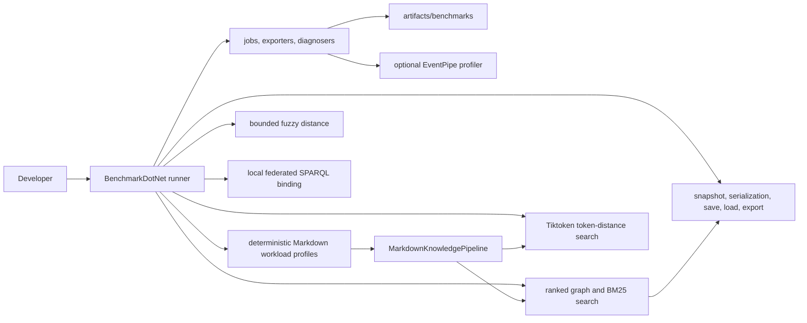

# Performance Benchmarks

Markdown-LD Knowledge Bank keeps correctness tests and performance measurements separate. TUnit flow tests prove behaviour; BenchmarkDotNet measures runtime, allocation, scaling, and profiler traces for the hot paths.

## Benchmark Boundaries



The benchmark project is `benchmarks/MarkdownLd.Kb.Benchmarks`. It references the production library, but production and test projects do not reference it.

## Suites

| Suite | Measures |
| --- | --- |
| `FuzzyEditDistanceBenchmarks` | Bounded bit-vector/banded edit distance against a naive Levenshtein baseline for short typo and long affix-heavy tokens. |
| `GraphBuildBenchmarks` | Markdown source to in-memory graph build time across named workload profiles. |
| `GraphSearchBenchmarks` | Graph-ranked search, BM25, BM25 fuzzy matching, schema search, focused search, and local federated schema search. |
| `TiktokenSearchBenchmarks` | Exact token-distance search and fuzzy query correction over long-document and multilingual token-heavy graphs. |
| `GraphPersistenceBenchmarks` | Snapshot creation, Turtle/JSON-LD serialization, Mermaid/DOT export, in-memory store save/load, and file save/load. |
| `GraphLifecycleSmokeBenchmarks` | One broad build/search/save/load/export lifecycle benchmark for quick sanity checks. |

## Workload Profiles

Benchmark parameters use named workload profiles instead of raw document-count ranges.

| Profile | Shape | Why it exists |
| --- | --- | --- |
| `ShortDocuments` | 250 compact runbook-like Markdown documents. | Normal knowledge-base retrieval and persistence pressure. |
| `LongDocuments` | 80 long recovery playbooks with repeated sections. | Long body and chunk-scan pressure without pretending the main variable is file count. |
| `LargeCorpus` | 1000 compact documents. | Scale pressure for graph build, snapshot, serialization, save, and load paths. |
| `TokenizedMultilingual` | 250 token-heavy multilingual/CJK documents. | Tiktoken and fuzzy query-correction behaviour on non-trivial tokenization input. |
| `FederatedRunbooks` | 250 SPARQL/service/runbook documents. | Local federated schema-search and service-binding query plans. |

## Commands

```bash
dotnet run --project benchmarks/MarkdownLd.Kb.Benchmarks -c Release -- --list flat
dotnet run --project benchmarks/MarkdownLd.Kb.Benchmarks -c Release -- --filter "*FuzzyEditDistanceBenchmarks*"
dotnet run --project benchmarks/MarkdownLd.Kb.Benchmarks -c Release -- --filter "*GraphBuildBenchmarks*"
dotnet run --project benchmarks/MarkdownLd.Kb.Benchmarks -c Release -- --filter "*GraphSearchBenchmarks*"
dotnet run --project benchmarks/MarkdownLd.Kb.Benchmarks -c Release -- --filter "*TiktokenSearchBenchmarks*"
dotnet run --project benchmarks/MarkdownLd.Kb.Benchmarks -c Release -- --filter "*GraphPersistenceBenchmarks*"
dotnet run --project benchmarks/MarkdownLd.Kb.Benchmarks -c Release -- --filter "*GraphLifecycleSmokeBenchmarks*" --job Dry
```

`MarkdownLdBenchmarkConfig` writes Markdown, CSV, and full JSON reports to `artifacts/benchmarks/results`. Those files are machine-specific and intentionally ignored by git. If the command does not pass a BenchmarkDotNet job option, the config adds one local diagnostic `ShortRun` job. If the command passes `--job`, `--job=...`, or `-j`, the config does not add another job, so `--job Dry` remains one dry job rather than a duplicated dry-plus-short run.

## Measured Metrics

The benchmark configuration is intentionally diagnostic, not just a stopwatch. The default reports collect:

| Metric group | BenchmarkDotNet data | Why it matters |
| --- | --- | --- |
| Latency | `Mean`, `Error`, `StdDev`, `Ratio`, `RatioSD`; full JSON also keeps min, quartiles, max, percentiles, and raw measurements | Shows the cost and distribution of each public path under the same deterministic workload. |
| Allocation and GC | `Allocated`, `Alloc Ratio`, `Gen0`, `Gen1`, `Gen2` | Catches search paths that look acceptable once but become expensive under repeated calls. |
| Threading and contention | `Completed Work Items`, `Lock Contentions` | Highlights SPARQL and federation paths that schedule work or contend while executing query plans. |
| Benchmark shape | corpus profile, query scenario, runtime, platform, JIT, job, iteration counts | Keeps runs explainable and comparable without turning local numbers into a cross-machine contract. |
| Optional profiler traces | EventPipe CPU, GC, or JIT files | Gives the next level of evidence when a benchmark result points at a hot path. |

The PR validation workflow runs `FuzzyEditDistanceBenchmarks` as a mandatory smoke benchmark and uploads `artifacts/benchmarks/results` as the `benchmark-smoke` artifact. The dedicated benchmark workflow runs the full suite manually or on the weekly schedule and uploads the complete `benchmarkdotnet-results` artifact. Broader graph, Tiktoken, and federation runs stay outside mandatory PR validation because they are intentionally heavier and machine-sensitive.

Optional EventPipe profiling is opt-in:

```bash
MARKDOWN_LD_KB_BENCHMARK_PROFILE=cpu dotnet run --project benchmarks/MarkdownLd.Kb.Benchmarks -c Release -- --filter "*FuzzyEditDistanceBenchmarks*"
MARKDOWN_LD_KB_BENCHMARK_PROFILE=gc dotnet run --project benchmarks/MarkdownLd.Kb.Benchmarks -c Release -- --filter "*GraphSearchBenchmarks*"
MARKDOWN_LD_KB_BENCHMARK_PROFILE=jit dotnet run --project benchmarks/MarkdownLd.Kb.Benchmarks -c Release -- --filter "*TiktokenSearchBenchmarks*"
```

## Current Results

On May 3, 2026, local BenchmarkDotNet runs on Apple M2 Pro with .NET 10.0.5 wrote Markdown, CSV, and JSON reports to `artifacts/benchmarks/results`.

| Suite | Job | Cases | Result files |
| --- | --- | ---: | --- |
| `FuzzyEditDistanceBenchmarks` | ShortRun | 8 | Markdown, CSV, JSON |
| `GraphBuildBenchmarks` | ShortRun | 4 | Markdown, CSV, JSON |
| `GraphSearchBenchmarks` | ShortRun | 54 | Markdown, CSV, JSON |
| `TiktokenSearchBenchmarks` | ShortRun | 12 | Markdown, CSV, JSON |
| `GraphPersistenceBenchmarks` | ShortRun | 39 | Markdown, CSV, JSON |
| `GraphLifecycleSmokeBenchmarks` | Dry | 1 | Markdown, CSV, JSON |

Graph build now reports named workload profiles:

| Profile | Mean | StdDev | Allocated |
| --- | ---: | ---: | ---: |
| `ShortDocuments` | 9.548 ms | 0.0298 ms | 14.70 MB |
| `LongDocuments` | 7.544 ms | 0.0149 ms | 14.35 MB |
| `LargeCorpus` | 59.453 ms | 12.7272 ms | 58.08 MB |
| `TokenizedMultilingual` | 12.433 ms | 0.0508 ms | 17.77 MB |

Graph search exact-query mean time:

| Profile | Ranked graph | BM25 | BM25 fuzzy | Focused | Schema SPARQL | Local federated |
| --- | ---: | ---: | ---: | ---: | ---: | ---: |
| `ShortDocuments` | 1.198 ms | 1.673 ms | 1.988 ms | 2.016 ms | 48.157 ms | 51.551 ms |
| `LongDocuments` | 0.449 ms | 1.987 ms | 1.975 ms | 0.638 ms | 12.698 ms | 15.186 ms |
| `FederatedRunbooks` | 1.327 ms | 2.024 ms | 2.038 ms | 2.255 ms | 41.309 ms | 61.614 ms |

Graph search exact-query allocated memory per operation:

| Profile | Ranked graph | BM25 | BM25 fuzzy | Focused | Schema SPARQL | Local federated |
| --- | ---: | ---: | ---: | ---: | ---: | ---: |
| `ShortDocuments` | 2.37 MB | 3.07 MB | 3.06 MB | 3.27 MB | 60.47 MB | 62.32 MB |
| `LongDocuments` | 1.91 MB | 3.46 MB | 3.46 MB | 1.21 MB | 20.26 MB | 22.21 MB |
| `FederatedRunbooks` | 2.53 MB | 3.53 MB | 3.53 MB | 3.48 MB | 60.75 MB | 62.75 MB |

The `ShortDocuments` exact-query diagnostic slice shows the current hot paths:

| Method | Mean | Allocated | Alloc ratio | Gen0 | Gen1 | Gen2 | Work items | Lock contentions |
| --- | ---: | ---: | ---: | ---: | ---: | ---: | ---: | ---: |
| Ranked graph | 1.198 ms | 2.37 MB | 1.00x | 296.8750 | 107.4219 | 0 | 0 | 0 |
| BM25 | 1.673 ms | 3.07 MB | 1.29x | 384.7656 | 142.5781 | 0 | 0 | 0 |
| BM25 fuzzy | 1.988 ms | 3.06 MB | 1.29x | 375.0000 | 156.2500 | 0 | 0 | 0 |
| Focused | 2.016 ms | 3.27 MB | 1.38x | 406.2500 | 179.6875 | 0 | 0 | 0 |
| Schema SPARQL | 48.157 ms | 60.47 MB | 25.49x | 8400.0000 | 1800.0000 | 400.0000 | 551 | 305.2000 |
| Local federated | 51.551 ms | 62.32 MB | 26.27x | 8500.0000 | 2000.0000 | 333.3333 | 552 | 314.5000 |

Allocation, GC, work-item, and lock-contention columns come directly from BenchmarkDotNet diagnosers. Treat ratios and relative pressure inside the same run as the useful signal; ShortRun is a fast diagnostic pass, not a release-grade SLA measurement.

Persistence and export on the `LargeCorpus` profile:

| Method | Mean | StdDev | Allocated |
| --- | ---: | ---: | ---: |
| `CreateSnapshot` | 4.527 ms | 0.008 ms | 5.31 MB |
| `SerializeTurtle` | 9.203 ms | 0.088 ms | 18.07 MB |
| `SerializeJsonLd` | 13.157 ms | 0.086 ms | 20.31 MB |
| `ExportMermaidFlowchart` | 5.850 ms | 0.006 ms | 7.15 MB |
| `ExportDotGraph` | 6.351 ms | 0.066 ms | 7.55 MB |
| `SaveTurtleToFile` | 29.853 ms | 0.122 ms | 34.74 MB |
| `SaveJsonLdToFile` | 38.144 ms | 1.436 ms | 37.02 MB |
| `LoadTurtleFromFile` | 35.983 ms | 0.373 ms | 28.10 MB |
| `LoadJsonLdFromFile` | 99.980 ms | 2.262 ms | 75.32 MB |

Tiktoken token-distance search over the semantic profiles:

| Profile | Query | Exact | Fuzzy-corrected | Exact allocated | Fuzzy allocated |
| --- | --- | ---: | ---: | ---: | ---: |
| `LongDocuments` | Exact | 298.1 us | 301.9 us | 212.24 KB | 212.99 KB |
| `LongDocuments` | Typo | 350.4 us | 393.0 us | 212.88 KB | 216.13 KB |
| `LongDocuments` | NoMatch | 254.3 us | 257.7 us | 212.19 KB | 213.41 KB |
| `TokenizedMultilingual` | Exact | 219.4 us | 220.5 us | 139.18 KB | 140.13 KB |
| `TokenizedMultilingual` | Typo | 246.2 us | 267.8 us | 139.59 KB | 142.02 KB |
| `TokenizedMultilingual` | NoMatch | 200.3 us | 184.3 us | 138.91 KB | 140.06 KB |

Interpretation: ranked graph, BM25, BM25 fuzzy, focused search, and Tiktoken token-distance search are the low-latency retrieval paths. The current BM25 implementation keeps exact and fuzzy allocation close by sharing the same tokenizer, dictionary shape, bounded top-N match retention, stack-backed short-token edit-distance masks, and pooled long-token fallback rows. Tiktoken search keeps bounded top-N candidates and updates TF-IDF dictionary values without temporary key arrays. Fuzzy BM25 still costs more CPU on typo-heavy queries and should stay opt-in. Schema-aware SPARQL and local federation are explainable RDF query paths, but dotNetRDF query-plan execution keeps them materially heavier for repeated low-latency calls. JSON-LD load is the highest persistence cost in the current local run; Turtle load and snapshot/serialization are cheaper. Use ranked graph or BM25 search when the caller needs low-latency retrieval, and use schema/federation when caller-visible evidence and graph-shape constraints matter more than raw latency.

The fuzzy edit-distance suite measured the bounded bit-vector/banded path with zero allocated bytes and faster than the naive Levenshtein baseline in every measured scenario, including 374.48x faster for the long-insertion case and 172.49x faster for the long no-match case.
