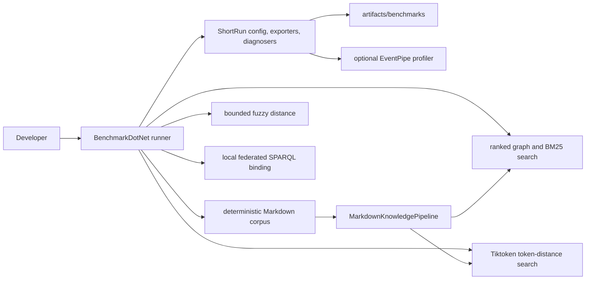

# Performance Benchmarks

Markdown-LD Knowledge Bank keeps correctness tests and performance measurements separate. TUnit flow tests prove behaviour; BenchmarkDotNet measures runtime, allocation, scaling, and profiler traces for the hot paths.

## Benchmark Boundaries



The benchmark project is `benchmarks/MarkdownLd.Kb.Benchmarks`. It references the production library, but production and test projects do not reference it.

## Suites

| Suite | Measures |
| --- | --- |
| `FuzzyEditDistanceBenchmarks` | Bounded bit-vector/banded edit distance against a naive Levenshtein baseline for short typo and long affix-heavy tokens. |
| `GraphBuildBenchmarks` | Markdown source to in-memory graph build time across generated corpus sizes. |
| `GraphSearchBenchmarks` | Graph-ranked search, BM25, BM25 fuzzy matching, schema search, focused search, and local federated schema search. |
| `TiktokenSearchBenchmarks` | Exact token-distance search and fuzzy query correction over Tiktoken-built corpus graphs. |

## Commands

```bash
dotnet run --project benchmarks/MarkdownLd.Kb.Benchmarks -c Release -- --list flat
dotnet run --project benchmarks/MarkdownLd.Kb.Benchmarks -c Release -- --filter "*FuzzyEditDistanceBenchmarks*"
dotnet run --project benchmarks/MarkdownLd.Kb.Benchmarks -c Release -- --filter "*GraphBuildBenchmarks*"
dotnet run --project benchmarks/MarkdownLd.Kb.Benchmarks -c Release -- --filter "*GraphSearchBenchmarks*"
dotnet run --project benchmarks/MarkdownLd.Kb.Benchmarks -c Release -- --filter "*TiktokenSearchBenchmarks*"
```

`MarkdownLdBenchmarkConfig` writes Markdown, CSV, and full JSON reports to `artifacts/benchmarks/results`. Those files are machine-specific and intentionally ignored by git.

The PR validation workflow runs `FuzzyEditDistanceBenchmarks` as a mandatory smoke benchmark and uploads `artifacts/benchmarks/results` as the `benchmark-smoke` artifact. The dedicated benchmark workflow runs the full suite manually or on the weekly schedule and uploads the complete `benchmarkdotnet-results` artifact. Broader graph, Tiktoken, and federation runs stay outside mandatory PR validation because they are intentionally heavier and machine-sensitive.

Optional EventPipe profiling is opt-in:

```bash
MARKDOWN_LD_KB_BENCHMARK_PROFILE=cpu dotnet run --project benchmarks/MarkdownLd.Kb.Benchmarks -c Release -- --filter "*FuzzyEditDistanceBenchmarks*"
MARKDOWN_LD_KB_BENCHMARK_PROFILE=gc dotnet run --project benchmarks/MarkdownLd.Kb.Benchmarks -c Release -- --filter "*GraphSearchBenchmarks*"
MARKDOWN_LD_KB_BENCHMARK_PROFILE=jit dotnet run --project benchmarks/MarkdownLd.Kb.Benchmarks -c Release -- --filter "*TiktokenSearchBenchmarks*"
```

## Current Results

On May 3, 2026, the local ShortRun pass completed 83 BenchmarkDotNet cases and wrote Markdown, CSV, and JSON reports to `artifacts/benchmarks/results`.

| Suite | Cases | Result files |
| --- | ---: | --- |
| `FuzzyEditDistanceBenchmarks` | 8 | Markdown, CSV, JSON |
| `GraphBuildBenchmarks` | 3 | Markdown, CSV, JSON |
| `GraphSearchBenchmarks` | 54 | Markdown, CSV, JSON |
| `TiktokenSearchBenchmarks` | 18 | Markdown, CSV, JSON |

The graph build suite measured 1.169 ms for 25 generated documents, 9.873 ms for 250 documents, and 70.672 ms for 1000 documents on the local Apple M2 Pro run.

The graph search suite measured exact-query ranked graph search at 0.111 ms for 25 documents, 1.225 ms for 250 documents, and 8.907 ms for 1000 documents. Exact-query BM25 measured 0.197 ms, 2.251 ms, and 16.187 ms for the same sizes; opt-in BM25 fuzzy measured 0.234 ms, 2.663 ms, and 17.939 ms.

The Tiktoken search suite measured exact token-distance search at 15.04 us for 25 documents, 61.65 us for 100 documents, and 146.74 us for 250 documents. Fuzzy-corrected typo queries measured 24.99 us, 75.74 us, and 184.64 us for the same sizes.

The fuzzy edit-distance suite measured the bounded bit-vector/banded path faster than the naive Levenshtein baseline in every measured scenario, including 363.53x faster for the long-insertion case and 127.92x faster for the long no-match case.
