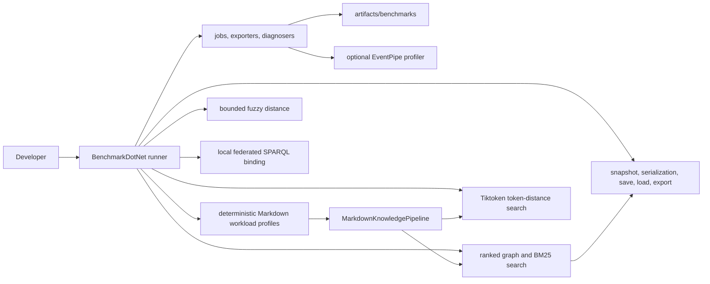

# Performance Benchmarks

Markdown-LD Knowledge Bank keeps correctness tests and performance measurements separate. TUnit flow tests prove behaviour; BenchmarkDotNet measures runtime, allocation, scaling, and profiler traces for the hot paths.

## Benchmark Boundaries



The benchmark project is `benchmarks/MarkdownLd.Kb.Benchmarks`. It references the production library, but production and test projects do not reference it.

## Suites

| Suite | Measures |
| --- | --- |
| `FuzzyEditDistanceBenchmarks` | Bounded bit-vector/banded edit distance against a naive Levenshtein baseline for short typo and long affix-heavy tokens. |
| `GraphBuildBenchmarks` | Markdown source to in-memory graph build time across named workload profiles. |
| `GraphSearchBenchmarks` | Graph-ranked search, BM25, BM25 fuzzy matching, schema search, focused search, and local federated schema search. |
| `TiktokenSearchBenchmarks` | Exact token-distance search and fuzzy query correction over long-document and multilingual token-heavy graphs. |
| `GraphPersistenceBenchmarks` | Snapshot creation, Turtle/JSON-LD serialization, Mermaid/DOT export, in-memory store save/load, and file save/load. |
| `GraphLifecycleBenchmarks` | One broad build/search/save/load/export lifecycle benchmark for the complete suite. |

## Workload Profiles

Benchmark parameters use named workload profiles instead of raw document-count ranges.

| Profile | Shape | Why it exists |
| --- | --- | --- |
| `ShortDocuments` | 250 compact runbook-like Markdown documents. | Normal knowledge-base retrieval and persistence pressure. |
| `LongDocuments` | 80 long recovery playbooks with repeated sections. | Long body and chunk-scan pressure without pretending the main variable is file count. |
| `LargeCorpus` | 1000 compact documents. | Scale pressure for graph build, snapshot, serialization, save, and load paths. |
| `TokenizedMultilingual` | 250 token-heavy multilingual/CJK documents. | Tiktoken and fuzzy query-correction behaviour on non-trivial tokenization input. |
| `FederatedRunbooks` | 250 SPARQL/service/runbook documents. | Local federated schema-search and service-binding query plans. |

## Commands

```bash
dotnet run --project benchmarks/MarkdownLd.Kb.Benchmarks -c Release -- --list flat
dotnet run --project benchmarks/MarkdownLd.Kb.Benchmarks -c Release -- --filter "*FuzzyEditDistanceBenchmarks*"
dotnet run --project benchmarks/MarkdownLd.Kb.Benchmarks -c Release -- --filter "*GraphBuildBenchmarks*"
dotnet run --project benchmarks/MarkdownLd.Kb.Benchmarks -c Release -- --filter "*GraphSearchBenchmarks*"
dotnet run --project benchmarks/MarkdownLd.Kb.Benchmarks -c Release -- --filter "*TiktokenSearchBenchmarks*"
dotnet run --project benchmarks/MarkdownLd.Kb.Benchmarks -c Release -- --filter "*GraphPersistenceBenchmarks*"
dotnet run --project benchmarks/MarkdownLd.Kb.Benchmarks -c Release -- --filter "*GraphLifecycleBenchmarks*"
```

`MarkdownLdBenchmarkConfig` writes Markdown, CSV, and full JSON reports to `artifacts/benchmarks/results`. Those files are machine-specific and intentionally ignored by git. If the command does not pass a BenchmarkDotNet job option, the config adds one `Default` job.

## Measured Metrics

The benchmark configuration is intentionally diagnostic, not just a stopwatch. The default reports collect:

| Metric group | BenchmarkDotNet data | Why it matters |
| --- | --- | --- |
| Latency | `Mean`, `Error`, `StdDev`, `Ratio`, `RatioSD`; full JSON also keeps min, quartiles, max, percentiles, and raw measurements | Shows the cost and distribution of each public path under the same deterministic workload. |
| Allocation and GC | `Allocated`, `Alloc Ratio`, `Gen0`, `Gen1`, `Gen2` | Catches search paths that look acceptable once but become expensive under repeated calls. |
| Threading and contention | `Completed Work Items`, `Lock Contentions` | Highlights SPARQL and federation paths that schedule work or contend while executing query plans. |
| Benchmark shape | corpus profile, query scenario, runtime, platform, JIT, job, iteration counts | Keeps runs explainable and comparable without turning local numbers into a cross-machine contract. |
| Optional profiler traces | EventPipe CPU, GC, or JIT files | Gives the next level of evidence when a benchmark result points at a hot path. |

The PR validation workflow and the dedicated benchmark workflow both run the complete benchmark suite: fuzzy edit distance, graph build, graph search, Tiktoken search, graph persistence, and graph lifecycle. Both workflows upload `artifacts/benchmarks/results` as the `benchmarkdotnet-results` artifact so CI always keeps the same performance evidence shape.

Optional EventPipe profiling is opt-in:

```bash
MARKDOWN_LD_KB_BENCHMARK_PROFILE=cpu dotnet run --project benchmarks/MarkdownLd.Kb.Benchmarks -c Release -- --filter "*FuzzyEditDistanceBenchmarks*"
MARKDOWN_LD_KB_BENCHMARK_PROFILE=gc dotnet run --project benchmarks/MarkdownLd.Kb.Benchmarks -c Release -- --filter "*GraphSearchBenchmarks*"
MARKDOWN_LD_KB_BENCHMARK_PROFILE=jit dotnet run --project benchmarks/MarkdownLd.Kb.Benchmarks -c Release -- --filter "*TiktokenSearchBenchmarks*"
```

## Current Results

On May 3, 2026, a full local BenchmarkDotNet run on Apple M2 Pro with .NET 10.0.5 wrote Markdown, CSV, and JSON reports to `artifacts/benchmarks/results`.

| Suite | Job | Cases | Result files |
| --- | --- | ---: | --- |
| `FuzzyEditDistanceBenchmarks` | Default | 8 | Markdown, CSV, JSON |
| `GraphBuildBenchmarks` | Default | 4 | Markdown, CSV, JSON |
| `GraphSearchBenchmarks` | Default | 54 | Markdown, CSV, JSON |
| `TiktokenSearchBenchmarks` | Default | 12 | Markdown, CSV, JSON |
| `GraphPersistenceBenchmarks` | Default | 39 | Markdown, CSV, JSON |
| `GraphLifecycleBenchmarks` | Default | 1 | Markdown, CSV, JSON |

The full local pass executed 118 BenchmarkDotNet cases.

Graph build now reports named workload profiles:

| Profile | Mean | StdDev | Allocated |
| --- | ---: | ---: | ---: |
| `ShortDocuments` | 9.987 ms | 0.2821 ms | 14.7 MB |
| `LongDocuments` | 7.757 ms | 0.0475 ms | 14.35 MB |
| `LargeCorpus` | 47.851 ms | 1.5044 ms | 57.73 MB |
| `TokenizedMultilingual` | 12.499 ms | 0.1466 ms | 17.86 MB |

Graph search exact-query mean time:

| Profile | Ranked graph | BM25 | BM25 fuzzy | Focused | Schema SPARQL | Local federated |
| --- | ---: | ---: | ---: | ---: | ---: | ---: |
| `ShortDocuments` | 1.092 ms | 1.309 ms | 1.626 ms | 2.019 ms | 49.212 ms | 41.243 ms |
| `LongDocuments` | 0.410 ms | 1.155 ms | 1.532 ms | 0.621 ms | 12.940 ms | 14.379 ms |
| `FederatedRunbooks` | 1.176 ms | 1.536 ms | 1.697 ms | 2.082 ms | 41.349 ms | 44.783 ms |

Graph search exact-query allocated memory per operation:

| Profile | Ranked graph | BM25 | BM25 fuzzy | Focused | Schema SPARQL | Local federated |
| --- | ---: | ---: | ---: | ---: | ---: | ---: |
| `ShortDocuments` | 2.17 MB | 2.14 MB | 2.86 MB | 3.08 MB | 60.32 MB | 62.3 MB |
| `LongDocuments` | 1.85 MB | 1.84 MB | 3.39 MB | 1.14 MB | 20.22 MB | 22.22 MB |
| `FederatedRunbooks` | 2.34 MB | 2.32 MB | 3.31 MB | 3.29 MB | 60.65 MB | 62.65 MB |

The `ShortDocuments` exact-query diagnostic slice shows the current hot paths:

| Method | Mean | Allocated | Alloc ratio | Gen0 | Gen1 | Gen2 | Work items | Lock contentions |
| --- | ---: | ---: | ---: | ---: | ---: | ---: | ---: | ---: |
| Ranked graph | 1.092 ms | 2.17 MB | 1.00x | 271.4844 | 91.7969 | 0 | 0 | 0 |
| BM25 | 1.309 ms | 2.14 MB | 0.99x | 267.5781 | 95.7031 | 0 | 0 | 0 |
| BM25 fuzzy | 1.626 ms | 2.86 MB | 1.32x | 357.4219 | 119.1406 | 0 | 0 | 0 |
| Focused | 2.019 ms | 3.08 MB | 1.42x | 382.8125 | 156.2500 | 0 | 0 | 0 |
| Schema SPARQL | 49.212 ms | 60.32 MB | 27.79x | 8000.0000 | 1500.0000 | 250.0000 | 551 | 211.7500 |
| Local federated | 41.243 ms | 62.3 MB | 28.70x | 8400.0000 | 1800.0000 | 200.0000 | 552 | 328.8000 |

Allocation, GC, work-item, and lock-contention columns come directly from BenchmarkDotNet diagnosers. Treat ratios and relative pressure inside the same run as the useful signal; local numbers are diagnostics, not release-grade SLA measurements.

Persistence and export on the `LargeCorpus` profile:

| Method | Mean | StdDev | Allocated |
| --- | ---: | ---: | ---: |
| `CreateSnapshot` | 4.559 ms | 0.008 ms | 5309.45 KB |
| `SerializeTurtle` | 9.261 ms | 0.065 ms | 18499.4 KB |
| `SerializeJsonLd` | 12.484 ms | 0.098 ms | 20793.76 KB |
| `ExportMermaidFlowchart` | 5.985 ms | 0.045 ms | 7319.25 KB |
| `ExportDotGraph` | 6.344 ms | 0.103 ms | 7733.59 KB |
| `SaveTurtleToInMemoryStore` | 28.284 ms | 0.224 ms | 30754.28 KB |
| `SaveJsonLdToInMemoryStore` | 38.182 ms | 0.380 ms | 33048.41 KB |
| `SaveTurtleToFile` | 30.210 ms | 0.163 ms | 35572.86 KB |
| `SaveJsonLdToFile` | 38.853 ms | 0.556 ms | 37909.87 KB |
| `LoadTurtleFromInMemoryStore` | 32.332 ms | 0.206 ms | 25860.44 KB |
| `LoadJsonLdFromInMemoryStore` | 102.065 ms | 1.957 ms | 74038.5 KB |
| `LoadTurtleFromFile` | 34.787 ms | 0.190 ms | 28772.9 KB |
| `LoadJsonLdFromFile` | 98.267 ms | 2.833 ms | 77123.59 KB |

Broad graph lifecycle:

| Method | Mean | StdDev | Allocated | Gen0 | Gen1 | Gen2 | Work items |
| --- | ---: | ---: | ---: | ---: | ---: | ---: | ---: |
| `BuildSearchSaveLoadAndExport` | 45.44 ms | 1.335 ms | 53.51 MB | 6333.3333 | 2000.0000 | 666.6667 | 52.0000 |

Tiktoken token-distance search over the token-heavy profiles:

| Profile | Query | Exact | Fuzzy-corrected | Exact allocated | Fuzzy allocated |
| --- | --- | ---: | ---: | ---: | ---: |
| `LongDocuments` | Exact | 159.8 us | 151.6 us | 107.27 KB | 108.38 KB |
| `LongDocuments` | Typo | 182.5 us | 225.7 us | 107.91 KB | 110.68 KB |
| `LongDocuments` | NoMatch | 115.6 us | 118.1 us | 107.22 KB | 108.33 KB |
| `TokenizedMultilingual` | Exact | 112.0 us | 112.0 us | 70.85 KB | 72.05 KB |
| `TokenizedMultilingual` | Typo | 136.9 us | 165.0 us | 71.27 KB | 73.41 KB |
| `TokenizedMultilingual` | NoMatch | 107.5 us | 106.9 us | 70.58 KB | 71.63 KB |

Interpretation: ranked graph, exact BM25, focused search, and Tiktoken token-distance search are the low-latency retrieval paths. Exact BM25 now counts only selected query terms with span-based dictionary lookup and pooled per-query statistics instead of building a full term-frequency dictionary for every candidate. Fuzzy BM25 still builds full candidate dictionaries because it must enumerate possible typo matches, so it remains opt-in for typo-tolerant calls. Tiktoken search keeps bounded top-N candidates, cached vector squared magnitudes, and dictionary value updates without temporary key arrays. Schema-aware SPARQL and local federation are explainable RDF query paths, but dotNetRDF query-plan execution keeps them materially heavier for repeated low-latency calls. JSON-LD load is the highest persistence cost in the current local run; Turtle load and snapshot/serialization are cheaper. Use ranked graph or exact BM25 search when the caller needs low-latency retrieval, and use schema/federation when caller-visible evidence and graph-shape constraints matter more than raw latency.

The fuzzy edit-distance suite measured the bounded bit-vector/banded path with zero allocated bytes and faster than the naive Levenshtein baseline in every measured scenario, including 368.69x faster for the long-insertion case and 176.19x faster for the long no-match case.
