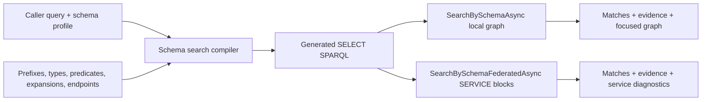
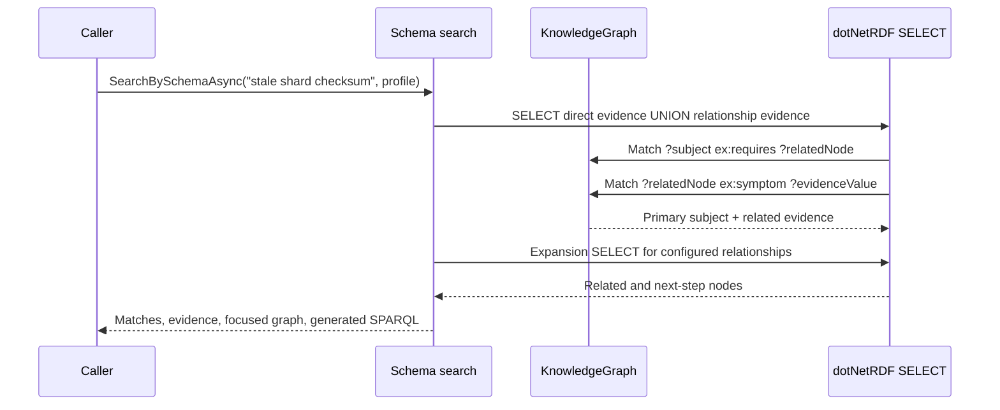

# Schema-Aware SPARQL Search

## Purpose

Schema-aware search is the recommended high-precision search path for caller-defined RDF and JSON-LD shapes. It compiles a `KnowledgeGraphSchemaSearchProfile` into read-only SPARQL, executes that SPARQL over the in-memory graph, and returns matches with evidence that names the predicate, matched literal, related node, and service endpoint when federation is used.

`SearchAsync` remains a sparse compatibility helper for simple `schema:name` / `schema:description` searches. New application search should use `SearchBySchemaAsync`, `SearchBySchemaFederatedAsync`, raw `ExecuteSelectAsync`, or raw `ExecuteFederatedSelectAsync`.

## Scope

In scope:

- local schema-driven search through `SearchBySchemaAsync`
- federated schema-driven search through `SearchBySchemaFederatedAsync`
- custom prefixes, type filters, excluded types, literal evidence predicates, relationship evidence predicates, expansion predicates, and result limits
- exact phrase, all terms, and any term literal matching
- outbound and inbound relationship evidence
- multi-hop relationship predicate paths
- subject facet filters
- generated SPARQL returned to the caller for diagnostics
- structured `Explain` output that mirrors the compiled query profile
- source context evidence from `prov:wasDerivedFrom` triples when present
- focused graph output for local schema search
- deterministic tests using real JSON-LD, dotNetRDF parsing, SPARQL execution, and local federated service bindings

Out of scope:

- automatic embedding/vector fallback
- hosted graph services
- mutation/update SPARQL
- hidden fallback to simple keyword search when a profile is incomplete

## Profile Model



The profile controls the search shape:

- `Prefixes` resolves prefixed names such as `ex:intent` before SPARQL generation.
- `TypeFilters` restricts primary result subjects to concrete RDF types.
- `ExcludedTypes` removes implementation types from primary results.
- `TextPredicates` defines literal predicates that can match directly on the primary subject.
- `RelationshipPredicates` defines edges from the primary subject to related nodes whose literals can make the primary subject match.
- `ExpansionPredicates` defines related and next-step graph neighbors returned with local search.
- `FederatedServiceEndpoints` defines endpoint URIs used to generate `SERVICE` blocks for federated schema search.
- `TermMode` controls exact phrase, all terms, or any term literal matching.
- `FacetFilters` adds required subject predicate/object constraints.

Unknown prefixes fail before execution. A federated profile without service endpoints fails before execution.

## Local JSON-LD Search

```csharp
using ManagedCode.MarkdownLd.Kb.Pipeline;

var graph = await KnowledgeGraph.LoadJsonLdFromFileAsync("/absolute/path/to/preprocessed.jsonld");

var profile = new KnowledgeGraphSchemaSearchProfile
{
    Prefixes = new Dictionary<string, string>(StringComparer.Ordinal)
    {
        ["ex"] = "https://kb.example/vocab/",
    },
    TypeFilters = ["ex:Capability"],
    TextPredicates =
    [
        new KnowledgeGraphSchemaTextPredicate("schema:name", Weight: 1.2d),
        new KnowledgeGraphSchemaTextPredicate("ex:intent", Weight: 1.5d),
        new KnowledgeGraphSchemaTextPredicate("skos:prefLabel", Weight: 1.1d),
    ],
    RelationshipPredicates =
    [
        new KnowledgeGraphSchemaRelationshipPredicate(
            "ex:requires",
            ["ex:symptom", "skos:prefLabel"],
            Weight: 0.9d),
    ],
    ExpansionPredicates =
    [
        new KnowledgeGraphSchemaExpansionPredicate("ex:requires", KnowledgeGraphSchemaSearchRole.Related, Score: 0.8d),
        new KnowledgeGraphSchemaExpansionPredicate("ex:next", KnowledgeGraphSchemaSearchRole.NextStep, Score: 0.7d),
    ],
    MaxResults = 5,
    MaxRelatedResults = 3,
    MaxNextStepResults = 3,
};

var result = await graph.SearchBySchemaAsync("restore cache", profile);

foreach (var match in result.Matches)
{
    Console.WriteLine(match.Label);
    Console.WriteLine(match.Evidence[0].PredicateId);
    Console.WriteLine(match.Evidence[0].MatchedText);
}

Console.WriteLine(result.GeneratedSparql);
Console.WriteLine(result.Explain.TermMode);
Console.WriteLine(result.Matches[0].Evidence[0].SourceContexts.Count);
```

This path searches custom JSON-LD predicates such as `ex:intent` and `ex:symptom`. The generated SPARQL is visible so callers can inspect exactly what the profile asked the graph to do. If matched subjects or related evidence nodes carry `prov:wasDerivedFrom`, evidence includes source context so the caller can explain which document or preprocessing artifact produced the match.

## Relationship Evidence And Expansion



Relationship evidence lets a source node match because a configured related node contains the literal evidence. Expansion then returns configured related and next-step nodes so the caller can show a compact graph around the match instead of a flat list.

Relationship evidence can be outbound, inbound, or multi-hop through `PredicatePath`:

```csharp
new KnowledgeGraphSchemaRelationshipPredicate("ex:requires", ["skos:prefLabel"])
{
    PredicatePath = ["ex:requires", "ex:owner"],
}
```

Facet filters constrain the primary subject:

```csharp
FacetFilters =
[
    new KnowledgeGraphSchemaFacetFilter("ex:category", "https://kb.example/categories/runbook"),
]
```

## Focused Search

`SearchFocusedAsync` accepts `KnowledgeGraphFocusedSearchOptions.SchemaSearchProfile`. When supplied, focused search uses `SearchBySchemaAsync` for primary matching and keeps the existing focused result shape:

```csharp
var focused = await graph.SearchFocusedAsync(
    "stale shard checksum",
    new KnowledgeGraphFocusedSearchOptions
    {
        SchemaSearchProfile = profile,
        MaxPrimaryResults = 1,
        MaxRelatedResults = 2,
        MaxNextStepResults = 2,
    });
```

Use this when an existing UI already consumes `KnowledgeGraphFocusedSearchResult` but the primary match logic must be schema-driven SPARQL.

## Federated Schema Search

```csharp
var policyGraph = await KnowledgeGraph.LoadJsonLdFromFileAsync("/absolute/path/to/policy.jsonld");
var runbookGraph = await KnowledgeGraph.LoadJsonLdFromFileAsync("/absolute/path/to/runbook.jsonld");

var federatedProfile = profile with
{
    FederatedServiceEndpoints =
    [
        new Uri("https://kb.example/services/policy"),
        new Uri("https://kb.example/services/runbook"),
    ],
};

var options = new FederatedSparqlExecutionOptions
{
    AllowedServiceEndpoints =
    [
        new Uri("https://kb.example/services/policy"),
        new Uri("https://kb.example/services/runbook"),
    ],
    LocalServiceBindings =
    [
        new FederatedSparqlLocalServiceBinding(new Uri("https://kb.example/services/policy"), policyGraph),
        new FederatedSparqlLocalServiceBinding(new Uri("https://kb.example/services/runbook"), runbookGraph),
    ],
};

var federated = await graph.SearchBySchemaFederatedAsync("restore cache", federatedProfile, options);

Console.WriteLine(federated.GeneratedSparql);
Console.WriteLine(federated.ServiceEndpointSpecifiers[0]);
```

The generated query uses SPARQL `SERVICE` blocks. The same allowlist and local service binding policy used by raw federated SPARQL applies here. Local bindings stay network-free; remote endpoints remain explicit and allowlisted.

Federated schema search returns primary matches and evidence from the service endpoints. It does not currently build a local focused graph from remote results because remote graph neighborhoods may not exist in the root graph.

For more raw and schema-aware federation examples, including local multi-graph bindings, `ASK`, remote endpoint profiles, allowlist patterns, and failure handling, see [Federated SPARQL Execution](FederatedSparqlExecution.md).

## JSON-LD Preprocessing Contract

External preprocessors can emit any parseable JSON-LD. To participate in schema-aware search, emit:

- stable subject IRIs
- concrete RDF types used by `TypeFilters`
- literal predicates named by `TextPredicates`
- relationship predicates named by `RelationshipPredicates`
- optional expansion predicates for related and next-step graph output
- prefixes that the host maps in `KnowledgeGraphSchemaSearchProfile.Prefixes`

The preprocessor may be the built-in Markdown pipeline, an `IChatClient` extraction run, or an external batch job. The runtime only requires valid JSON-LD and an explicit schema search profile.

## Contract And Introspection

Use `KnowledgeGraphBuildProfile` when graph creation and graph search should travel together. The pipeline returns `MarkdownKnowledgeBuildResult.Contract`, which includes the selected search profile, the actual schema description, and validation diagnostics.

Use `graph.DescribeSchema(profile.Prefixes)` for external JSON-LD and `graph.ValidateSchemaSearchProfile(profile)` before exposing a profile to users.

## Verification

```bash
dotnet test --solution MarkdownLd.Kb.slnx --configuration Release -- --treenode-filter "/*/*/SchemaAwareSearchFlowTests/*" --no-progress
```

Covered scenarios:

- simple compatibility search misses custom JSON-LD predicates while schema-aware SPARQL finds them
- direct custom predicate evidence
- related-node evidence through a configured relationship
- focused search routing through a schema profile
- federated schema search through allowlisted local `SERVICE` bindings
- no-match behavior
- unknown prefix rejection
- graph contract and schema validation flows
- all-terms, inbound relationship, property path, and facet behavior
- focused graph export
