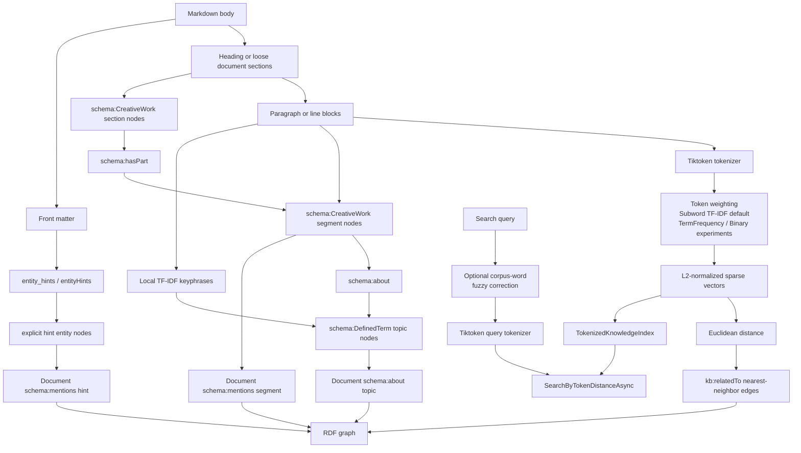

# Tiktoken Graph Extraction

## Purpose

Tiktoken graph extraction is an explicit experimental mode for building a local graph from Markdown text when the caller chooses not to use `IChatClient`.

It uses Tiktoken token IDs as lexical/subword signals. It does not create semantic embeddings.

## Flow

## Behavior

- `MarkdownKnowledgeExtractionMode.Tiktoken` must be selected explicitly.
- Markdown headings create section-aware graph structure when present.
- Headingless Markdown and loose pre-heading text still receive a section node, labeled from the document title.
- Paragraphs or non-empty lines become segment nodes.
- Section nodes and segment nodes use `schema:CreativeWork`.
- Topic/keyphrase nodes use `schema:DefinedTerm`.
- Explicit front matter `entity_hints` / `entityHints` entries become named graph entities in Tiktoken mode and keep `sameAs` links when present.
- Front matter entity hint IDs use stable hashes so non-ASCII labels do not collapse through ASCII slugging.
- Documents and sections connect to contained graph parts with `schema:hasPart`.
- Documents connect to explicit entity hint nodes with `schema:mentions`.
- Documents and segments connect to local topics with `schema:about`.
- `TiktokenKnowledgeGraphOptions.Weighting` selects the local token weighting mode.
- The default weighting is `SubwordTfIdf`, fitted over the current build corpus and reused for query vectors.
- `TiktokenKnowledgeGraphOptions.MaxTopicLabelsPerSegment`, `MaxTopicPhraseWords`, and `MinimumTopicWordLength` tune local topic extraction.
- `TermFrequency` preserves the first raw count baseline.
- `Binary` is an experimental presence/absence baseline that ignores repeated counts.
- The source document is connected to each segment node with `schema:mentions`.
- Nearby segment vectors are connected with `kb:relatedTo`.
- `KnowledgeGraph.SearchByTokenDistanceAsync` searches the in-memory token index attached to graphs built in Tiktoken mode.
- `TokenDistanceSearchOptions.EnableFuzzyQueryCorrection` optionally expands absent query words with close corpus vocabulary terms before Tiktoken query encoding.
- Fuzzy query correction is word-level and corpus-local; it does not compute edit distance over model-specific Tiktoken IDs.
- Exact token-distance search remains the default.
- Calling token-distance search on a non-Tiktoken graph fails explicitly.

## Research Summary

The chosen default follows the direction from [Multilingual Search with Subword TF-IDF](https://arxiv.org/abs/2209.14281): use subword tokenization plus TF-IDF so retrieval does not depend on manually curated tokenization, stop-word lists, or stemming rules. In this library, the subword units are Tiktoken token IDs from `Microsoft.ML.Tokenizers`.

Other options reviewed:

- [SPLADE v2](https://arxiv.org/abs/2109.10086) supports the broader point that sparse lexical representations remain strong in retrieval, but SPLADE requires a neural model and is too heavy for the current core fallback.
- [Sentence-BERT](https://arxiv.org/abs/1908.10084), [MiniLM](https://arxiv.org/abs/2002.10957), and [Language-agnostic BERT Sentence Embedding](https://arxiv.org/abs/2007.01852) point to the right future path for semantic and cross-lingual retrieval, but they require model weights and a runtime. That belongs behind a future optional embedding adapter, not inside the current core pipeline.
- BM25-style ranking remains a future candidate for a separate scoring backend. It is not used in this pass because the current graph relation model is Euclidean vector distance over normalized sparse vectors.
- TextRank, YAKE/RAKE-style local keyword scoring, char n-gram TF-IDF, and clustering were reviewed as next-layer candidates. The implemented slice is smaller: structure-aware segmentation plus local TF-IDF keyphrase topic nodes. This gives named graph vertices without adding a model runtime or language-specific stop-word lists.

## Test Matrix

The flow tests use clean English, Ukrainian, French, and German Markdown bodies with 10 lines each. Russian fixtures are intentionally absent. Each language has 10 same-language queries. Cross-language checks run translated-topic queries against a different-language graph and verify that pure token-ID vectors do not pretend to provide translation semantics.

| Case | Required top-1 hits |
| --- | --- |
| English source, English queries | at least 8 of 10 |
| Ukrainian source, Ukrainian queries | at least 8 of 10 |
| French source, French queries | at least 8 of 10 |
| German source, German queries | at least 8 of 10 |
| Cross-language translated-topic queries | at most 3 hits across sampled cross-language checks |
| TermFrequency, Binary, and SubwordTfIdf English baselines | at least 8 of 10 each |
| Structured corpus graph | document/section/segment/topic graph has `schema:hasPart` and `schema:about` edges |
| Non-ASCII topic graph | Ukrainian and French topic labels remain readable and distinct |
| Headingless notes | document-title section node contains the loose text segments |
| Explicit entity hints | `entity_hints` preserve label, type, `sameAs`, and non-ASCII hash IDs |
| Fuzzy query correction | typo-heavy queries and corpus-side misspellings improve over exact token-distance search while remaining opt-in |
| Fuzzy query performance | long corpus vocabulary correction stays below the local regression budget |

These thresholds intentionally validate lexical language dependence instead of semantic translation ability.

## Verification

- `dotnet test --solution MarkdownLd.Kb.slnx --configuration Release -- --treenode-filter "/*/*/TiktokenKnowledgeGraphFlowTests/*"`
- `dotnet test --solution MarkdownLd.Kb.slnx --configuration Release`
